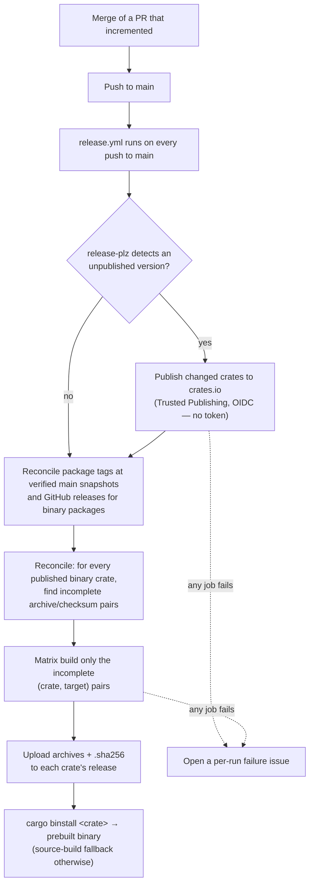

# Release automation

This chapter describes how releases work in this repository (tracking issue
[#297](https://github.com/folo-rs/folo/issues/297)). Releasing to crates.io and
shipping `cargo-binstall`-consumable prebuilt binaries is driven from CI on merge
to `main`. Version increments land in the pull request that causes them; see
[`release-versioning.md`](release-versioning.md).

## Meta

* **Open this when**: implementing or debugging automated releases, the
  crates.io/OIDC publish flow, the prebuilt-binary matrix, the `cargo-binstall`
  asset-naming contract, or a publish that hit crates.io rate limits.
* **Cross-links**: [`release-versioning.md`](release-versioning.md) (how versions
  are decided and enforced), [`git-workflow.md`](git-workflow.md) (contributor
  pull-request conventions), [`build-and-tooling.md`](build-and-tooling.md)
  (`just` recipes), [`.github/workflows/design.md`](../.github/workflows/design.md)
  (the bench matrix this reuses), [`RELEASING.md`](../RELEASING.md) (first
  publish, emergency manual publish, required GitHub configuration).

## The flow

A pull request that changes released content increments the affected packages.
Merge to `main` is the release. Everything after that is automatic.



CI automates the *publish* and *binary* halves. Version numbers are decided in
the pull request, with `cargo-semver-checks` as a floor — see
[`release-versioning.md`](release-versioning.md).

### `verify-semver-checks` canary

`just verify-semver-checks` proves that `cargo-semver-checks` can actually run
before the `increment-versions` skill or the CI `semver-checks` job trusts it.
When the tool *fails to run* — classically an installed cargo-semver-checks too
old for the toolchain's rustdoc JSON format ("unsupported rustdoc format v…") —
a broken tool must never be read as "no breaking changes". The canary runs
cargo-semver-checks on one small package compared against its own `HEAD`, so the
two sides are byte-identical when that canary package is untouched. If the work
tree edits the canary package, a failure can instead be a genuine SemVer finding;
the diagnostic names that case.

## What ships a binary (derived, never hardcoded)

The set of published binary crates is **derived**, so new tools are covered
automatically and hardcoding can never let one slip through. A package is a
publishable binary crate iff it is publishable **and** has exactly one `bin`
target. The target name is carried separately from the package name through the
build matrix. Today that set is:

| Crate                       | Binary                      | Notes                                              |
| --------------------------- | --------------------------- | -------------------------------------------------- |
| `cargo-bench-history`       | `cargo-bench-history`       | Slow to build from source (Azure SDK), so the one that benefits most from a prebuilt binary. |
| `cargo-bench-history-faker` | `cargo-bench-history-faker` | Unsupported test-support engine; published only so sibling repos can validate `cargo-bench-history` end to end (and fetch it via `cargo binstall`). No stable API or CLI. |
| `cargo-detect-package`      | `cargo-detect-package`      | Small, fast to build.                              |
| `cargo-freeze-deps`         | `cargo-freeze-deps`         | Small, fast to build.                              |
| `cargo-release-plan`        | `cargo-release-plan`        | Small, fast to build.                              |
| `dure`                      | `dure`                      | Windows-only, so it restricts its release targets (see [Per-crate targets](#per-crate-targets)). |

`cargo-bench-history-stress` has a binary but is `publish = false`, so the
derivation correctly excludes it.

The `mimalloc` global allocator is orthogonal to distribution and is applied to
every binary regardless of whether it is published (tracked separately in
[#304](https://github.com/folo-rs/folo/issues/304)).

## The `release.yml` workflow

A single workflow, triggered on `push: branches: [main]`, holds four jobs.
`release-plz release` is idempotent — on a push with no unpublished version it is
a no-op — so the workflow runs on every push to `main` and only acts when a
version increment landed. It also accepts a bare `workflow_dispatch` (no inputs)
that re-runs the same flow to auto-heal missing binaries, as described under
[Robust publishing](#robust-publishing).

Keeping publish and binaries in **one** workflow run is deliberate: a workflow
that creates a tag/release with the default `GITHUB_TOKEN` does not trigger
downstream `on: release` / `on: push: tags` workflows (GitHub suppresses these to
avoid recursion). Driving the binary jobs from within the same run sidesteps that
entirely. New tags use verified, release-equivalent main snapshots so ordinary
publication and missing-tag recovery can use the ambient token. The source identity
contract and the limits of recovery are defined in
[Release-equivalent snapshots](../.github/workflows/design.md#release-equivalent-snapshots).

```yaml
# Illustrative sketch — not a final workflow file.
name: Release
on:
  push:
    branches: [main]
  workflow_dispatch: {}   # bare manual re-trigger; reconciliation auto-heals missing binaries

concurrency:
  group: release-${{ github.ref }}
  cancel-in-progress: false   # never cancel a publish mid-flight

jobs:
  publish: ...
  plan-binaries: ...
  build-binaries: ...
  alert: ...
```

### `publish` — crates.io via Trusted Publishing

crates.io **Trusted Publishing (OIDC)** is the credential model: the job carries
`id-token: write` and no `CARGO_REGISTRY_TOKEN` exists anywhere. `release-plz`
performs the crates.io OIDC token exchange itself, so no long-lived crates.io
token is stored. This matches the repo's OIDC-first posture (the
`bench-history` workflow already federates into Azure the same way). The publisher's
GitHub token is read-only. The committed release-plz configuration disables both
`git_tag_enable` and `git_release_enable`; GitHub writes belong to reconciliation.

```yaml
# Illustrative.
publish:
  if: github.repository == 'folo-rs/folo'   # forks can't federate OIDC
  runs-on: ubuntu-latest
  permissions:
    contents: read    # GitHub writes belong to reconciliation
    id-token: write   # crates.io Trusted Publishing (OIDC)
  timeout-minutes: 270   # covers the retry budget plus a cold-cache setup (see below)
  steps:
    - uses: actions/checkout@v7
      with:
        fetch-depth: 0
    - uses: ./.github/actions/setup-environment
    - name: Verify the checked-in lockfile is consistent
      shell: pwsh
      run: |
        Set-StrictMode -Version Latest
        $ErrorActionPreference = "Stop"
        $PSNativeCommandUseErrorActionPreference = $true
        just verify-lockfile
    - shell: pwsh
      run: |
        Set-StrictMode -Version Latest
        $ErrorActionPreference = "Stop"
        $PSNativeCommandUseErrorActionPreference = $true
        just gh-release
      env:
        GIT_TOKEN: ${{ secrets.GITHUB_TOKEN }}   # read-only forge access
```

Before it publishes or tags anything, `publish` runs a **lockfile-consistency gate**
(`just verify-lockfile`). The whole workspace shares a single `Cargo.lock`, so one entry
that disagrees with its manifest — the classic case being a version bumped in a
`Cargo.toml` without the matching lock entry updated — makes *every* `--locked` build fail.
Publishing is independent of the ordinary validation on that push, so the lockfile must
be checked before publication rather than left to downstream binary builds. The gate runs
`cargo metadata --locked`, which resolves the graph against the committed lockfile and exits
non-zero if the lock would need to change, turning that latent failure into an early, actionable
abort — no crate is published and no tag is created. It is **verify-only**: it reads the
checked-in lockfile and never regenerates it (workflows build the committed lockfile verbatim).
The same recipe is runnable locally (`just verify-lockfile`) to catch a stale lock after a manual
version edit, before pushing.

Each step is a thin `pwsh` call into a `just` recipe. The entry points live in
[`justfiles/just_release.just`](../justfiles/just_release.just), which delegates in
turn to the [`scripts/release/ReleaseAutomation.psm1`](../scripts/release/ReleaseAutomation.psm1)
module for registry publication and
[`ReleasePublication.psm1`](../scripts/release/ReleasePublication.psm1) for GitHub
reconciliation. The nonpublished `release-target-check` utility reuses the release
validator rather than duplicating its package-content model in PowerShell.
The module is covered by a Pester suite run via `just test-scripts` (a required CI check); the
suite exercises the real logic against fixture workspaces with `cargo metadata` and real file
I/O, mocking only the tools that would mutate crates.io / GitHub (`release-plz`, `gh`). The
binary jobs downstream do **not** consume any "what was published this run" output: a matrix
driven off that cannot heal a partial failure on a later re-run (release-plz skips the
already-published crate, so it vanishes from the output). Instead the binary jobs
**reconcile** against the actual published state, described next.


### `plan-binaries` — reconcile missing binary assets

Runs after `publish` on every workflow run (not gated on whether anything was
published this run), so a plain re-run or a bare `workflow_dispatch` heals binaries
without republishing.

It **auto-determines** the work by reconciling desired state against actual state,
with no hardcoded or human-supplied crate list. The job:

1. Derives published package/version requests from the successful publisher's
   checked-out source. Each expected tag is `{crate}-v{version}`.
2. Preserves existing tags. For missing tags, fetches and pins current main, then
   verifies a clean disposable checkout with `release-target-check`. The requested
   versions must still be present and satisfy the release-content invariant.
   Writes name that immutable commit; a failed write is retried only when main
   advanced, with a fresh verification and a bounded attempt budget.
3. Creates missing GitHub releases for binary packages with `--verify-tag`, using
   the established references without moving them.
4. Lists each release's assets (`gh release view`) and computes which expected
   per-target archive/checksum pairs are incomplete.
5. Emits exactly the incomplete `(crate, target)` pairs, including each tag's
   resolved `source_sha`, as its `matrix` and `has_binaries` step outputs.

The binary-crate derivation is shared by GitHub release creation and asset planning. In
`cargo metadata --format-version 1` the `publish` field is `null` (publishable to
any registry), `[]` (never publish), or a non-empty registry list, so a crate is a
release candidate when it is publishable (`publish` is `null` or a non-empty list)
**and** owns exactly one `bin` target. CI rejects a package with several binary
targets rather than silently choosing one.

Against the current workspace this yields the crates tabulated above. On a normal
push that just published, every target pair is missing → the whole matrix builds.
On an ordinary push that changed nothing, every archive and checksum exists → the
matrix is empty and `build-binaries` is skipped. On a re-run after a partial
failure, only the incomplete `(crate, target)` pairs are emitted. The upload
action clobbers an existing archive when only its checksum is missing, so retries
always restore the complete pair.

### `build-binaries` — build, package, checksum, upload

Runs when the plan produced any missing pairs. The matrix is precisely those
reconciled `(crate, target)` pairs (`matrix.include`), each carrying its
`tag`/`version` so uploads target the actual release tag, never a reconstructed
guess.

**Standard environment.** These jobs use the shared
[`./.github/actions/setup-environment`](../.github/actions/setup-environment)
composite — the same one every other CI job uses — rather than a bespoke
toolchain setup. Its Rust cache (`shared-key: prerequisites`) is warm across the
repo, so the "extra" tooling it installs is mostly cached, and using the standard
environment keeps release builds identical to the validated CI build rather than
introducing a second, subtly-different build environment.

**Build + package + checksum + upload — `taiki-e/upload-rust-binary-action`.** It
builds the named binary for the target, produces the archive, writes a `.sha256`
sidecar, and uploads both to the release for the given tag. Archives are `.zip`
on **every** platform (`tar: none`, `zip: all`) — `.zip` is universally
extractable, and a single format keeps the `[package.metadata.binstall]` blocks
free of per-OS overrides.

```yaml
# Illustrative.
build-binaries:
  needs: [publish, plan-binaries]
  if: needs.plan-binaries.outputs.has_binaries == 'true'
  strategy:
    fail-fast: false   # one target's failure must not abandon the others' archives
    # The matrix is computed by plan-binaries: one entry per incomplete (crate, target)
    # pair, carrying {name, bin, tag, version, source_sha, triple, os}.
    matrix:
      include: ${{ fromJSON(needs.plan-binaries.outputs.matrix) }}
  runs-on: ${{ matrix.os }}
  permissions:
    contents: write   # upload assets to the release
  steps:
    - uses: actions/checkout@v7
      with:
        ref: ${{ matrix.source_sha }}   # immutable source, independent of the upload label
    - uses: ./.github/actions/setup-environment
    - uses: taiki-e/upload-rust-binary-action@v1
      with:
        bin: ${{ matrix.bin }}
        package: ${{ matrix.name }}
        target: ${{ matrix.triple }}
        archive: ${{ matrix.name }}-v${{ matrix.version }}-$target
        tar: none
        zip: all
        checksum: sha256
        ref: refs/tags/${{ matrix.tag }}
        locked: true
        token: ${{ secrets.GITHUB_TOKEN }}
```

#### Target matrix

Native runners, one per target, no cross-compilation — the `bench-history` matrix's two
x86_64 runners plus the ARM and macOS targets binaries are published for. This table is the
single `triple → runner`
source that `plan-binaries` joins each missing `(crate, target)` pair against to set
its `os`:

| Rust target                 | Runner             |
| --------------------------- | ------------------ |
| `x86_64-unknown-linux-gnu`  | `ubuntu-latest`    |
| `aarch64-unknown-linux-gnu` | `ubuntu-24.04-arm` |
| `x86_64-pc-windows-msvc`    | `windows-latest`   |
| `aarch64-pc-windows-msvc`   | `windows-11-arm`   |
| `aarch64-apple-darwin`      | `macos-latest`     |

GitHub-hosted runners expose `-latest` aliases only for x86_64 Linux/Windows and
for macOS (`macos-latest` is Apple Silicon / arm64). There is **no**
`ubuntu-latest-arm` or `windows-latest-arm` alias, so the ARM Linux/Windows images
must be pinned by version (`ubuntu-24.04-arm`, `windows-11-arm`) — hence the
apparent inconsistency with the x64 rows. Bump the pinned ARM images when newer
ones ship. `x86_64-apple-darwin` (Intel Mac) is intentionally not supported.

#### Per-crate targets

The table above is what a crate gets by default, which suits a portable tool. A
crate that only functions on some platforms names its subset in its manifest:

```toml
[package.metadata.folo]
release-targets = ["x86_64-pc-windows-msvc", "aarch64-pc-windows-msvc"]
```

`plan-binaries` then reconciles that crate against only those targets, so the
release carries no archive whose binary could never run. Without this, a
platform-specific crate would ship installable archives for platforms it does not
support, and `cargo binstall` would report success while installing something
inert. Omitting the key means every target, and is the norm.

A declared triple must be one the table offers. A typo would otherwise produce no
archive for that target and no failure anywhere, so it is rejected twice: `just
validate-binstall` fails the build before merge, and `plan-binaries` throws rather
than planning a short release.

### `alert` — a per-run failure issue

If any of the above jobs fails, a final job opens a GitHub issue **unique to that
run** (title carries the run id), so every failed release is tracked
individually rather than folded into a rolling issue. It uses the `gh` CLI with
`issues: write` and the `ci-failure` label.

```yaml
# Illustrative.
alert:
  needs: [publish, plan-binaries, build-binaries]
  if: failure() && github.repository == 'folo-rs/folo'
  runs-on: ubuntu-latest
  permissions:
    issues: write
  steps:
    - name: Open failure issue for this run
      shell: pwsh
      env:
        GH_TOKEN: ${{ secrets.GITHUB_TOKEN }}
        GH_REPO: ${{ github.repository }}
        RUN_URL: ${{ github.server_url }}/${{ github.repository }}/actions/runs/${{ github.run_id }}
      run: |
        gh label create ci-failure --force *> $null
        gh issue create --label ci-failure `
          --title "Release workflow failed (run ${{ github.run_id }})" `
          --body "A release run failed: $env:RUN_URL"
```

## Robust publishing

crates.io enforces rate limits (strict for brand-new crates, burst-limited for new
versions), and Trusted-Publishing OIDC tokens are short-lived (~30 minutes). The
publish step is built to ride out both without bespoke complexity:

* **Bounded retry.** The `release-plz release` invocation is wrapped in a retry —
  up to **3 attempts, 15 minutes apart**. Each wait refills roughly fifteen
  crates.io tokens. A release throttled for longer than that budget is finished
  by the next push to `main` or by re-running the workflow, which is safe for the
  idempotency reason below. The `publish` job's `timeout-minutes` (270) bounds the
  job as a whole and can cut a retry loop short; release-plz keeps its 45-minute
  `publish_timeout`.
* **Idempotency does the heavy lifting.** Each `release-plz release` run
  re-checks crates.io and publishes only versions not already there. So a retry
  after a rate-limit rejection (or a manual re-run of the whole workflow) resumes
  a partially-published release and finishes it, rather than erroring on the
  crates already up. Retries are therefore always safe.
* **Token expiry is handled by the same loop.** Each attempt performs its own
  OIDC token exchange, so a fresh token is minted per attempt; a publish that
  somehow overruns the ~30-minute token lifetime fails that attempt and the next
  retry proceeds with a new token. This is rare and needs no special handling
  beyond the retry.
* **Binaries after a partial failure — auto-reconciled, no manual crate list.**
  The binary jobs never depend on "what was published *this run*"; `plan-binaries`
  creates missing tags at verified release-equivalent main snapshots and attaches
  binary releases to those tags, then reconciles the
  current published state against uploaded assets (see
  [`plan-binaries`](#plan-binaries--reconcile-missing-binary-assets)). So if a
  crate published but its GitHub release or binaries did not complete, simply
  re-running the workflow — or a bare `workflow_dispatch` — restores the release
  and recomputes the incomplete `(crate, target)` pairs across *all* affected
  crates. The recovery set is always self-determined; there is no per-crate
  dispatch and no human-supplied tag list. `taiki-e` overwrites existing assets,
  so re-uploading restores complete archive/checksum pairs.

Missing-tag recovery requires the requested version to remain available at an
eligible main snapshot. A newer version is not relabeled as the older version;
automatic repair of a superseded version is not guaranteed. Existing tags are
never moved. The version validator continues comparing against version anchors,
independently of the later equivalent commit a GitHub tag may identify.

(Because a GitHub Actions `uses:` step cannot be retried in place, the retry is
implemented as a PowerShell loop inside the `gh-release` recipe that re-runs the
release-plz invocation.)

## release-plz configuration

[`release-plz.toml`](../release-plz.toml) is the publish-half config:

* `git_tag_enable` and `git_release_enable` are both **`false`**. Registry publication
  cannot create references at its potentially historical checkout; the GitHub
  reconciler owns tag selection and binary release creation.
* `git_tag_name = "{{ package }}-v{{ version }}"` is pinned explicitly. This is
  the workspace default, but pinning it freezes the tag format that the
  binstall URLs depend on, so a future release-plz default change cannot silently
  break installs.
* `changelog_update = false`, `publish_timeout = "45m"`, and `allow_dirty = true`.
  Version groups are derived from exact intra-workspace requirements and are not
  release-plz configuration. Group alignment can include `publish = false`
  packages; release-plz still considers only publishable members.

**Binary releases are derived dynamically.** The reconciler discovers publishable
binary packages from Cargo metadata and creates their missing GitHub releases
against established tags. Adding a binary package needs no release-plz override;
library packages receive tags but do not create GitHub release entries.

## The asset-naming contract

The workflow's archive filenames and each crate's `[package.metadata.binstall]`
block must agree exactly, or `cargo binstall` 404s and silently source-builds.
One convention governs both:

| Artifact          | Pattern                                | Example                                                         |
| ----------------- | -------------------------------------- | -------------------------------------------------------------- |
| Git tag / release | `{crate}-v{version}`                   | `cargo-bench-history-v0.1.0`                                    |
| Archive           | `{crate}-v{version}-{target}.zip`      | `cargo-bench-history-v0.1.0-aarch64-apple-darwin.zip`          |
| Checksum sidecar  | `{crate}-v{version}-{target}.sha256`    | `…-aarch64-apple-darwin.sha256`                                |
| Binary in archive | at archive root, `{bin}` (`+ .exe`)    | `cargo-bench-history` / `cargo-bench-history.exe`              |

* The **tag** follows the reconciler's package/version convention. Release-plz uses
  the same pinned `git_tag_name` when recognizing existing releases.
* The **archive base** is `taiki-e`'s `archive:` input,
  `{crate}-v{version}-$target` (the action expands `$target`) — the single source
  of truth for the filename; the binstall blocks mirror it.
* `.zip` on all platforms (`tar: none`, `zip: all`).

### `[package.metadata.binstall]` block

Each published binary crate's `Cargo.toml` carries an identical block. An explicit
`pkg-url` is required: cargo-binstall's auto-detected GitHub paths use
`…/download/v{version}/`, but release-plz tags are package-prefixed
(`{crate}-v{version}`), so auto-detection never finds the asset. A single `.zip`
format means no per-OS override:

```toml
[package.metadata.binstall]
pkg-url = "{ repo }/releases/download/{ name }-v{ version }/{ name }-v{ version }-{ target }.zip"
bin-dir = "{ bin }{ binary-ext }"
pkg-fmt = "zip"
```

`bin-dir` is `{ bin }{ binary-ext }` because `taiki-e` places the binary at the
archive root (`leading-dir` defaults to false); `{ binary-ext }` adds `.exe` on
Windows. The `.sha256` sidecar supports explicit or manual verification; current
`cargo-binstall` versions do not discover checksum sidecars automatically.

The convention table is the contract: any change to it must touch, together,
`taiki-e`'s `archive:` input, the `git_tag_name` pin, and every crate's binstall
block. A new binary crate copies the block above verbatim into its `Cargo.toml`
(the build/upload side is already handled by the derivation). CI enforces this:
`just validate-binstall` fails the build when a publishable binary crate is
missing the block or has let it drift from the contract, so a forgotten or stale
block is caught before release rather than by a user hitting a 404. The same
recipe checks each crate's optional [per-crate targets](#per-crate-targets)
declaration against the workflow's target table.

## Manual publishing

There is one manual publish path and no separate release recipe to maintain:
plain `cargo publish` (per crate, in dependency order). It is used only for
**emergencies** (CI publishing broken) and for the **bootstrap publish** of a
brand-new crate (below). For real releases the expectation is that a manual
publish is immediately followed by a normal release-workflow run. For a binary
crate, that run creates the tag and GitHub release that release-plz skips once
crates.io already has the version, then uploads the prebuilt assets.

### First publish of a new crate

crates.io does not allow Trusted Publishing for a crate that has never been
published (its trusted publisher can only be configured on an existing crate). So
a brand-new crate's **first** version must be published manually with `cargo
publish` (a token login), after which its trusted publisher is configured on
crates.io. Re-run `release.yml` after configuring it; binary crates receive their
GitHub release and prebuilt assets in that run. Subsequent releases go through CI.

`just check-never-published` (the `increment-versions` skill's preflight) checks
each publishable crate against the crates.io sparse index and, for any that does
not yet exist, prints a warning like:

> Warning: `<crate>` has never been published. Its first release must be done
> manually (`cargo publish`); afterwards configure Trusted Publishing for it on
> crates.io and re-publish via the GitHub workflow.

## Prerequisites (one-time)

For the automated flow to function:

* Each published binary crate has a crates.io **Trusted Publisher** configured:
  owner `folo-rs`, repo `folo`, workflow filename `release.yml`. One-time, per
  crate, admin-only. (Every other published crate likewise needs a trusted
  publisher so CI can publish it.)
* No `CARGO_REGISTRY_TOKEN` secret is referenced by `release.yml` — a stray token
  would undercut Trusted Publishing.

## README notes

Each binary crate's README states that `cargo binstall <crate>` installs a
prebuilt binary on supported targets, with a transparent source-build fallback
otherwise.
