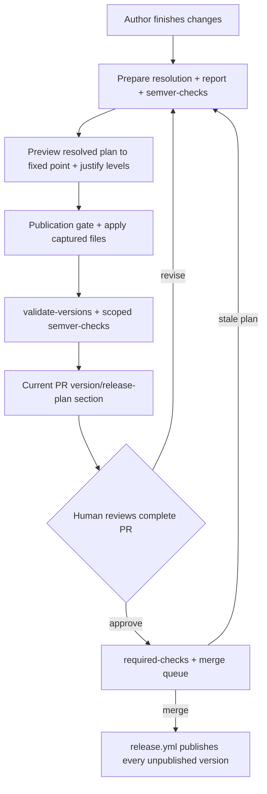

# Release versioning

This chapter is how crate version numbers are decided and enforced. A pull request that
changes released content increments the affected packages; merge publishes them. The
publish half is [`release-automation.md`](release-automation.md).

## Meta

* **Open this when**: preparing a pull request that touches a published package; deciding a
  version increment; debugging `validate-versions`, `cargo-release-plan`, or the
  `increment-versions` skill.
* **Cross-links**: [`release-automation.md`](release-automation.md) (the publish half),
  [`git-workflow.md`](git-workflow.md) (contributor pull-request conventions),
  [`impl-crate-split.md`](impl-crate-split.md) (why version groups exist),
  [`build-and-tooling.md`](build-and-tooling.md) (`just` recipes and script conventions),
  [`RELEASING.md`](../RELEASING.md) (first publish of a new crate, emergency manual publish,
  required GitHub configuration).

## The invariant

> A package is released by incrementing its version. Therefore, on `main`, no publishable
> package has released content that its most recent version increment did not cover.

A pull request that changes a package's released content must also increment that package's
version. The version decision is made in the pull request that causes the release, while the
author still remembers what changed and why.

This chapter uses a small set of terms exactly:

* **Package** — a Cargo package. Version groups and increments are keyed by package name, not
  by crate target.
* **Released content** — the files Cargo would put in the package's `.crate`, defined under
  [Released content](#released-content) below.
* **Anchor** — the commit a package's released content is compared against, defined under
  [The anchor and the rule](#the-anchor-and-the-rule).
* **Version increment** — raising a publishable package's declared version in response to
  released work. This is the release action; there is no separate "bump".
* **Version alignment** — mechanically setting every target in a group to its resolved version;
  this can move non-publishable members without releasing them.
* **Version target** — a tracked workspace member whose declared version the plan may set,
  whether or not Cargo permits publishing it.
* **Version group** — a connected component of version targets linked by exact dependency
  requirements and required to declare the same version.

The invariant has these consequences:

* There is no "prepare a release" step. `release.yml` already publishes any version it finds on
  `main` that crates.io does not have, so a merge *is* a release.
* Version numbers stop being derived purely from tooling. `cargo-semver-checks` supplies a
  *floor* — never the answer. Judgement may always raise an increment above that floor (an
  undetectable behavioural break, a meaningful feature addition, keeping a version group
  aligned), but may never lower it below.

### On a pull request

The author finishes the change, then runs the `increment-versions` skill — or the
`validate-versions` check fails and names that skill, which is enough to continue without
having read this chapter. The skill decides change levels from the evidence, then computes and
applies the complete resolved plan without a separate human approval gate. This applies to every
change level. The author may raise a level above the `cargo-semver-checks` floor; they may not
lower one. Group expansion, requirement rewrites, alignment-only targets, and binary lockfile
effects are resolved before application, which installs the captured state without another
dependency refresh. Human review of the complete PR is the approval step. Merge publishes only
publishable packages.

Every PR description carries a current **Version/release plan** section covering every package
and group the plan reaches, including retained pending increments and necessary dependent/group
movements. It states previous and proposed versions, substantive change levels, and reasons, or
explicitly states that there are no released-content or version changes. Non-publishable targets
are identified as version alignment only, not published. First-publication packages have a
separate maintainer handoff rather than an increment. The presentation contract is in
[`git-workflow.md`](git-workflow.md#versionrelease-plan-section).

Source, release-baseline, group-membership, or decision changes require fresh assessment and an
updated plan and PR section. Human review concerns the final current release, not an earlier plan.
Automatic application preserves SemVer floors, canonical expansion, publication checks, and
the prohibition on publishing from the skill.

## The anchor and the rule

The version increment *is* the release event, so the git repository holds everything needed to
evaluate the invariant.

A package's **anchor** is the most recent commit on the **base branch's first-parent line** in
which its declared version changed. Walking first-parent means each merged pull request counts
as a single step regardless of how it was merged, and reading the anchor off the base branch
rather than off the working branch means a branch's own commits never become anchors.

The rule is then one predicate:

> A package fails if its released content differs between its anchor and the work tree, while
> its declared version has not increased since the anchor.

The predicate has these readings, and both are needed:

* **The version increased on this branch.** The package is being released, and everything on the
  branch ships under the new version. Where in the branch the increment sits is irrelevant, and
  so is how much changes after it — which is what keeps the check stable across review
  iterations.
* **The version did not increase.** The package is not being released, so nothing
  released-relevant may sit past its anchor. This catches the branch's own unaccompanied changes
  *and* content already sitting unreleased on the base branch, which is what makes the check
  cover every publishable package rather than only the ones the pull request touched.

The comparison is on the **parsed `version` field**, not on a
textual diff of the manifest, so reformatting, key reordering and line moves do not register as
increments. And a package's creation commit counts as a version change (absent → present), so a
package added and released in one pull request needs no special handling.

The base revision defaults to `origin/main`. CI passes the release branch's remote-tracking
revision on a `pull_request` or `push` run, and the commit the queue rebased onto
(`merge_group.base_sha`) on a merge-queue run. Using the original pull-request target inside the
queue would let two branches that both incremented `0.6.1 → 0.6.2` both look valid. A stale base
is otherwise safe rather than unsound: it can only move the anchor further back, which reports
more, never less. The check needs full history (`fetch-depth: 0`) and that base revision, and
nothing else — no tags, no merge ref, no network. Tags are not consulted, because tagging is
atomic with neither the merge nor the publish, so an absent tag proves nothing.

### Concurrent pull requests

Two branches cut from the same commit both increment `foo` 0.6.1 → 0.6.2. Git merges two
identical single-line edits without a conflict, so without care the second merge lands changed
code under a version crates.io already has, and `release-plz release` skips it.

A merge queue closes this. Each pull request is rebased onto the latest `main` before its
checks run, so once the first has merged, the second's base contains 0.6.2 and its declared
version has *not* increased relative to its anchor — while its content has. The check demands
0.6.3, the skill applies it, and the pull request re-enters the queue.

Requiring branches to be up to date *without* a queue would give the same guarantee and
serialise the author: every competing merge is a manual rebase and a second skill run. The
queue performs the rebase. "Require branches to be up to date" is not used.

The queue can also batch two pull requests that both increment the same package to the same
version into one merge. That lands as one combined release of that version; the invariant
holds. Sequential queue entries still force the second pull request to the next version.

Merging is blocked by a single required status check named `required-checks` (below).
`validate-versions` feeds that fan-in; it is not itself an entry in the GitHub ruleset.

The residual window is a second pull request merging while the first one's publish is still in
flight, or after it failed. The version check cannot see either state: it compares git content
against declared versions, and the first merge is already the new anchor, so the package reads as
released. Recovery comes from the publish half instead. `release.yml` runs on every push to
`main` and `release-plz release` is idempotent, so the next run publishes whatever version
crates.io is still missing. A failed publish is finished by the following merge's run, or by
re-running the workflow.

## Released content

A package's released content is the set of files under its directory that **Cargo would put in
the `.crate`**: git-tracked files, filtered by the manifest's `include`/`exclude`. Cargo uses the
git file list when packaging inside a git repository, so reproducing that rule with `git ls-files`
plus gitignore-style matching (the `ignore` crate) matches what it actually does.

The change set is a `git diff` from the anchor to the work tree, not a listing of the current
tree, because a listing cannot reveal a file that was deleted. The package's directory is
resolved separately at each end from that end's own workspace member list, keyed by package
name, because filtering both ends by the *current* path would report a package that moved from
`packages/foo` to `packages/tools/foo` as unchanged. Relevance is evaluated with each end's own
`include`/`exclude`, so a file that either end would package counts.

Diffing against the work tree rather than a commit means uncommitted edits are visible, which is
the state the skill actually runs in. Untracked files are reported as an advisory and never
counted as changes, since Cargo would not package them either.

`Cargo.lock` is not compared as a released file. Library consumers resolve dependencies in
their own graph, so library-only packages have no lockfile-based release changes regardless of
whether Cargo includes a lockfile in their archive. Examples, benchmarks, tests, and build scripts
do not make a library an installable binary package.

A package with an actual installable binary target, including a mixed library/binary package,
does release its install-time locked dependency closure. The tool compares that closure rather
than the workspace lockfile's bytes, so unrelated dependency movement does not affect the
binary. Normal and build dependencies participate across target platforms; development-only
workspace dependency edges do not. Target discovery and the required lockfile are assessed
independently at the anchor and in the work tree.

A package's `Cargo.toml` is compared as a file, so a comment-only or formatting-only edit to it
counts as a released-content change and forces a publish. This keeps the rule uniform — one
comparison for every file in the package — at the price of an occasional gratuitous release. The
alternative, comparing parsed manifests, is more machinery than the problem deserves.

### What ships

The published crate is the consumer build: `src/`, `README.md` (crates.io renders it), and
package-local `doc/` / `docs/` (compile-time diagrams and similar files `src/` actually
embeds). Everything else — `tests/`, `benches/`, `examples/`, `book/`, `AGENTS.md` — stays
in git. Each publishable package declares that with `include` in `Cargo.toml`. Nothing is
special-cased in the tool, and a reader of `Cargo.toml` can see exactly what is released.

`include` is the allow-list, not `exclude`. A denylist grows every time a new non-source
directory appears; an allow-list does not.

An `include` edit is a change to `Cargo.toml`, which is always released content, so adding
it requires an increment in the same change.

`src/` may compile-time-include files that themselves ship (`doc/`, `docs/`). It must not
embed `tests/`, `benches/` or `examples/`. Shared test inputs belong with the crate that
owns the parser, and callers of that parser use it as a dependency rather than embedding
a second copy.

### Inherited workspace values

Some of what a package publishes lives in the root manifest and is resolved into the published
manifest, changing what consumers see with no file under the package's directory changing. The
root manifest is therefore in scope for a package when a value that package actually inherits
changed between the anchor and the work tree:

* **`[workspace.package]`** — `rust-version`, `edition`, `license`, `repository` and the rest.
  A raised `rust-version` is a consumer-visible change to every inheriting crate.
* **`[workspace.dependencies]`** — a changed requirement alters what an inheriting package
  builds against.

Attribution is per package: the tool reads which keys each package inherits (`.workspace = true`
in its manifest, resolved values from `cargo metadata --no-deps`) and marks only those packages.
A root-manifest edit therefore does not blanket-mark the workspace. It *does* mark every
package that inherits the changed value, and that is the desired outcome: a global change
should republish the world. Group closure and `=`-pin rewrites then follow as usual. The
rate-limit budget already sizes a full-workspace publish; that path is not an accident to
narrow away.

Everything else in the root manifest is out of scope, including **`[workspace.lints]`**. This is
the answer to "how are lints excluded": they are not part of the inherited-value set, so they are
never attributed to any package. Lints are inlined into every published manifest — a thirty-line
source manifest becomes a much larger published one, almost entirely lint configuration — but
Cargo builds registry dependencies with `--cap-lints allow`, so a dependency's lint configuration
cannot affect a consumer's build. Republishing every publishable crate for a lint tweak is not a
trade worth making.

## Version groups

Some packages are one logical unit split across crates for cargo-technical reasons (see
[`impl-crate-split.md`](impl-crate-split.md)) and must always carry the same version.
Dependency declarations are the source of that relationship.

`cargo-release-plan` builds an undirected graph over all tracked workspace members, including
members whose effective Cargo setting disables publication. A member is tracked when Git tracks
its manifest. Untracked and ignored members do not become version targets, although `apply` may
still rewrite their dependency requirements so they do not retain stale references. A valid
exact requirement between two tracked members contributes an edge; each connected component with
multiple members is a version group. Normal, build, and development declarations participate,
including optional dependencies and target-specific tables that are inactive on the current
host. Aliases, local paths, and inherited workspace dependencies resolve to the actual target
package. A same-named registry dependency or path outside the workspace does not join. An unused
workspace dependency or a versionless path dependency creates no edge.

The accepted exact form is a single `=major.minor.patch` comparator, allowing insignificant
whitespace. Partial, prerelease, build, and compound exact requirements between workspace
members are manifest errors. External requirements are unaffected. A compatible dependency
inside a component is valid: every pair of members need not exact-pin each other when another
exact path already connects them.

The legacy `[workspace.metadata.release-plan.groups]` key is rejected, even when empty. Historical
snapshots may still contain it because baseline release evidence must remain readable.

Group members are unique and sorted. The group key is the lexicographically smallest member,
including when that member is non-publishable. It identifies the component rather than naming a
configured relationship, and can change when an earlier-sorting member joins.

**Every member declares the same version.** Consistency is checked against work-tree manifests,
not registry publication state. Members absent from the base revision are exempt from a failing
consistency verdict, but the exemption does not exempt them from alignment.

**Resolution sets every member to the group's resolved version.** This applies whether a
publishable member needs an increment or the group only needs alignment. A non-publishable
member's source changes do not create release work, but its declared version participates in
grouping and alignment. Groups containing only non-publishable members can therefore be aligned
without publishing anything.

**The version base is the highest declared version of every member.** This includes
non-publishable and base-absent members, so alignment never lowers a version. A release increment
raises that base by the highest assessed level required by a publishable member. When simple
alignment would rewrite released content under an already-published version, the group advances
instead; that safety test applies only to publishable members.

Resolved group versions are plain `major.minor.patch` triplets so exact requirements remain valid.
If the highest declared version has a prerelease or build suffix, generated alignment advances to
a higher plain version; an explicit non-plain group target is rejected before any manifest write.

A proposed plan may name any tracked member and expands to the full component. The expanded plan
names every version target whose declared version resolution sets, including unchanged leaders
and non-publishable members. The complete artifact also captures resolved files and the original
inputs, so applying it cannot silently widen the release set or introduce uncaptured lockfile
effects.

Publication remains a subset of version planning. A new publishable member needs the manual
first-publication handoff described under [Package status](#package-status). A non-publishable
helper never does. `release-plz.toml` does not declare groups or make alignment-only targets
publishable.

## Package status

| Status            | Condition                                                | Verdict  |
| ----------------- | -------------------------------------------------------- | -------- |
| `pending-release` | version increased since anchor                           | pass     |
| `needs-increment` | version unchanged, released content changed since anchor | **fail** |
| `unchanged`       | version unchanged, nothing released-relevant changed     | pass     |

`pending-release` is the state of a package the pull request is publishing. It stays passing
however much the branch changes afterwards, because all of it ships under the new version.

Group consistency is a separate, group-level verdict rather than a package status: a publishable
package can have unreleased changes *and* belong to an inconsistent group, and both are reported.

Packages with publication disabled receive no status, anchor, released-content diff, dependency
change level, or SemVer assessment. They still appear as version targets and participate in group
membership, consistency, version bases, expansion, and alignment.

Whether a crate has ever reached crates.io is a different question, answered by the existing
`check-never-published` recipe. crates.io Trusted Publishing cannot perform a crate's first
publish, so a new crate needs one manual `cargo publish` as documented in
[`RELEASING.md`](../RELEASING.md). The skill's preflight runs that recipe as a best-effort,
workspace-wide advisory. After the plan is expanded, `check-increment-published` fails closed
unless every publishable package the plan reaches is already published; non-publishable targets
are skipped. First-publish is not folded into `apply`, because the OIDC publisher cannot perform
it. The version check itself does not change: a never-published crate with a version increment is
`pending-release`.

The check fails closed on a shallow or truncated history: if the anchor walk reaches the end of
available history without finding a version change, that is an error, not a pass. Otherwise a
change in checkout behaviour would silently disable enforcement.

## The tool: `cargo-release-plan`

The `cargo-release-plan` Cargo subcommand in `packages/cargo-release-plan` implements the rule
above. Its internal architecture, classification details, command-line surface and report schema
are documented by the package itself, in its
[README](../packages/cargo-release-plan/README.md),
[design](../packages/cargo-release-plan/docs/design.md) and
[implementation guide](../packages/cargo-release-plan/docs/implementation.md). This chapter
covers only what the release process depends on.

The process depends on classification being **offline and deterministic**. It uses only `git` and
`cargo metadata --no-deps` — it never contacts crates.io, resolves a dependency graph or runs a
compiler. That is what lets the check run unconditionally on every pull request in seconds
without flaking on network conditions. Expensive and networked analysis — `cargo-semver-checks` —
stays outside this path, where it can be scoped independently.

A non-gating `--verify-packaging` mode cross-checks the tool's relevance rules against
`cargo package --list` on a clean tree, so a divergence between the tool's rules and Cargo's real
behaviour is caught by CI rather than by a missed release.

Resolution is separate from classification. Explicit preparation performs the workflow's
intended `cargo update --offline --workspace` refresh before semantic grading. Prospective
preview resolves proposed version and requirement edits under the same policy. Neither is a
blanket third-party update, and neither is hidden in `report` or `check`.

**`report`** writes a revision-4 `report.json` plus a unified diff per publishable package with
unreleased changes — literally "everything in this package that is not yet released". Its
`packages` array contains publishable release assessments, while the required
`non_publishable_packages` array contains only each non-publishable target's name, declared
version, and optional group. The `groups` object covers the union and records complete sorted
membership, consistency, and the highest declared member version. The skill reads the report to
propose release levels and alignment; `validate-versions` selects SemVer targets only from
publishable assessments.

Alongside each publishable package's status the report carries `dependencies` and `dependents`,
because version decisions **cascade**. A package's own diff identifies only the roots; the
increment set grows from there. `many_cpus` pins `many_cpus_impl` exactly, so incrementing the
impl package forces a manifest edit in the shell package, which is itself a released-content
change requiring its own increment. Beyond that mechanical propagation, an exposed dependency's
breaking change is usually a breaking change in its dependent too, unless analysis shows the
broken API is not re-exposed. Deciding each package independently in one pass is wrong; the graph
makes the required ordering explicit.

**`check`** exits non-zero on any package with unreleased changes or any inconsistent group,
printing one actionable line per offence: what changed, what the anchor was, which group members
are dragged along, and how to run the skill. `--format github` adds workflow annotations. This is
what `validate-versions` runs.

**`expand`** resolves proposed version choices structurally without running Cargo resolution.
The guided workflow instead uses **`preview`** to complete that expansion against the prepared
inputs, resolve a disposable prospective workspace, and classify the result against the pinned
release baseline. It continues internally until the plan covers its own version, requirement,
group, and binary lockfile consequences. Existing sufficient increments remain sufficient;
iterations do not accumulate another increment for the same change.

**`apply`** takes a resolved plan, sets each package's version, rewrites every intra-workspace
requirement that must follow, and installs the captured lockfile. Manifest edits preserve comments
and layout. The captured files and original input snapshot are validated before writes; apply
does not resolve dependencies or add targets. The fully applied state is accepted idempotently,
but stale or partly modified inputs require inspection and fresh preparation rather than an
unplanned refresh.

Lockfile maintenance applies even in an all-library workspace: version rewrites still need a
consistent lockfile for `--locked` commands. Relevance is a different question, and those lockfile
changes never create library-only release reasons.

The `increment-versions` skill invokes this through `just apply-release-plan`.

The separate change-level decisions document remains at schema revision 1. Non-publishable
version targets never receive change-level decisions.

Owning this step rather than delegating to `cargo set-version` or `release-plz set-version` is
deliberate: the `=`-pin and version-group rules are workspace-specific, and the plan file is a
reviewable, testable artifact.

Hermetic unit and integration tests cover the versioning model across content, grouping,
dependency, manifest and repository-history behaviour; the scenarios live in the package's
`tests/integration/`.

## The `increment-versions` skill

`.github/skills/increment-versions/SKILL.md`. It is invoked when a pull request is ready to
merge, or when the `validate-versions` check fails. The check's failure annotation names the
skill and the recipe, so a failed job is a sufficient prompt.

Mechanics live in `just` recipes, per the repository rule that logic worth testing must not live
in prose; the skill carries the judgement. It decides the change level from the evidence without
asking for separate approval. Everything following from that level is included in the complete
resolved plan before application: group expansion, requirement rewrites, and lockfile resolution
effects. Verification checks the captured state rather than routinely discovering another
release set.

1. **Preflight.** Run the `cargo-semver-checks` canary and the workspace-wide,
   best-effort `just check-never-published` advisory. When cargo-semver-checks fails to *run* —
   classically an installed copy too old for the toolchain's rustdoc JSON format — the result must
   never be read as "no breaking changes". `verify-semver-checks` is the canary for the skill and
   for the CI `semver-checks` job. Before application, `check-increment-published` performs the exact
   fail-closed publication check over the expanded plan before anything is applied.
2. **Prepare and collect.** `just release-prepare <dir>` prepares offline dependency resolution,
   records its inputs, writes the release report, and then runs
   `cargo semver-checks --all-features` for affected publishable packages that declare a
   consumer contract, capturing both.

   `--all-features` is used because gated API is still public API, and a breaking change behind a
   feature flag is invisible to a default-feature run.

   Target selection matches CI: a changed private implementation package selects the public
   consumer-contract member of its version group, while packages with no consumer contract are
   omitted. The plan separately propagates a breaking change through public workspace
   dependencies, including packages whose own files did not initially change.
3. **Propose.** Walk the publishable release-assessment graph in topological order and, per
   package: take the `cargo-semver-checks` floor, read the package's diff, and decide a level.
   Expand derived version groups across all version targets and propagate requirements. Preview
   the prospective resolution to a fixed point, then inspect its additional binary dependency
   evidence. Raise semantic levels and preview again if the resolved changes require it, before
   applying the plan. The final compatibility build uses the prospective workspace's source,
   manifest versions, lockfile, and Cargo configuration; a read-only comparison rejects mutations
   to those captured inputs before application. Non-publishable source changes receive no level;
   their version movement is mechanical alignment. Levels follow Cargo's compatibility rule
   rather than plain semantic versioning: the leftmost non-zero component acts as the major
   component, so a breaking change to a `0.x` package is a *minor* increment, a breaking change
   to a `1.x` or later package is a *major* one, and a `0.0.z` package has no compatible
   increment at all.

   Cargo features need a manual pass, because `--all-features` compares only the maximal API
   surfaces and cannot speak for consumers that enable a subset. Putting an existing public item
   behind a new `cfg(feature = ...)` gate is breaking even though both sides of an all-features
   comparison still contain it, and even when the new feature is on by default; so is removing a
   feature or the API it gated. Review the diff of `[features]` tables and of `cfg(feature = ...)`
   attributes directly and raise the level accordingly.
4. **Present.** Prepare the PR's **Version/release plan** section, one row per version group
   and per ungrouped package, naming every member. Show previous versions at release anchors,
   proposed versions, substantive levels, and reasons, including prospective resolution,
   dependent, and group movements. Retained pending increments remain visible. Explain levels
   above the SemVer floor. Supporting local artifact citations stay in working evidence rather
   than the PR. State explicitly when there are no release or version changes, and identify
   first-publication handoffs separately. Non-publishable helpers are alignment-only, with
   current declared versions as their alignment starting points. No approval pause follows.
5. **Apply and verify.** Confirm the evidence and release baseline are current, then
   `just check-increment-published <expanded>`, then
   `just apply-release-plan <expanded>`, then `just verify-lockfile`, then re-run `check` and the
   scoped `cargo semver-checks` to confirm the result, and write the summary into the pull request
   description. The publication gate checks only publishable expanded targets. Changed preparation
   inputs require fresh evidence and a regenerated plan before applying.
   Further changes may follow the increment without invalidating it. The plan is not committed:
   the check verifies manifest state, not intent, so a plan file in the repository would be inert
   churn. Reconcile the PR section with final evidence; human review and merge approve the
   complete PR.

## The GitHub check

Validation includes a `merge_group` trigger so the queue actually runs the workflow. A required
check that never fires as `merge_group` is a failed check, and the queue never merges. Merge-queue
runs use the same pruned job set as pull requests; `push` to `main` remains the full backstop.
Delta analysis on a queue run uses `merge_group.base_sha` (the commit the queue rebased onto),
not a freshly fetched `origin/main`, so scoping cannot drift from the version check's base.

The Validation concurrency group (`github.head_ref || github.ref`) distinguishes
queue entries: `head_ref` is empty there and `github.ref` is the unique queue ref. The
close-companion stays pull-request-only.

### `validate-versions`

The `validate-versions` job in `validation.yml`. Its inputs are git history and manifests, not
Cargo packages, so
per the workflow conventions it runs **unconditionally**. `cargo-delta`'s changed-package scoping
must not be applied to it — the whole point is to catch packages the current pull request did not
touch.

```yaml
validate-versions:
  runs-on: ubuntu-latest
  outputs:
    semver_targets: ${{ steps.check.outputs.semver_targets }}
  steps:
    - uses: actions/checkout@v7
      with:
        # A truncated clone can hide the commit that last changed a version, which
        # would report that package as unchanged.
        fetch-depth: 0
    - uses: ./.github/actions/setup-environment
    - id: check
      env:
        RELEASE_PLAN_BASE: ${{ github.event.merge_group.base_sha || format('origin/{0}', github.event.repository.default_branch) }}
      run: just validate-versions
      shell: pwsh
```

The recipe is a thin wrapper over `cargo release-plan check --base <sha> --format github`, which
also emits `semver_targets` for the next job. The PowerShell side stays thin — it invokes the
tool, writes the step output, and owns the valid-empty skip — because the classification logic is
the Rust tool's job and is tested there. The job joins `alert`'s `needs:` list and the
`required-checks` fan-in.

The baseline is the tip of the branch releases are made from, which is deliberately *not* the
branch a pull request targets. A stacked pull request targets an unreleased parent, and anchoring
on it would read that parent's pending increment as a release and hide the parent's unreleased
changes. A merge-queue entry is the exception, because the queue has already rebased it onto a
real release-branch commit. Locally, leaving `RELEASE_PLAN_BASE` unset falls through to the
tool's own default of `origin/main`; in CI the expression always yields a value.

A failing check prints one actionable line per offence and names the skill. That is the entire
recovery path — the author does not have to reconstruct a plan from this chapter. Copilot is
assumed available; there is no non-skill command that writes a plan.

### `required-checks`

`main` is protected. The merge queue's only required status check is `required-checks`.

GitHub's required-checks field is a **string match on the check name**. That match cannot
express "this matrix job, but only the legs that actually ran", and it cannot see a check that
was skipped rather than posted. A job with both `strategy.matrix` and a job-level `if:` that
evaluates false never expands the matrix, so contexts such as `test-x64 (ubuntu-latest)` stay
on `Expected — Waiting for status to be reported` forever if they are listed as required.
Dynamically generated names have the same problem.

The ruleset therefore requires **only** `required-checks`. That job is a fan-in: `if: always()`,
`needs:` every merge-blocking job in Validation (including `validate-versions` and
`semver-checks`), succeeds when every dependency reports `success` or an allowed `skipped`, and
fails on `failure`, `cancelled`, or any other result. Unconditional gates may not skip. Advisory
jobs stay off that list. `alert` stays off it — it files issues on a failed push to `main`, it is
not a merge gate.

The job's GitHub check name is the literal `required-checks`, so the ruleset string is stable.
When a new merge-blocking job is added to Validation it is added to this `needs:` list; it is
never added to the GitHub ruleset. Matrix jobs that can skip via a job-level `if:` can only be
made required through this fan-in.

[`.github/workflows/design.md`](../.github/workflows/design.md) and the workflow `AGENTS.md`
carry the maintenance rule.

### `semver-checks`

`cargo-semver-checks` is too expensive to run workspace-wide on every pull request — a full run
means rustdoc for both baseline and current across every consumer-contract package, and the
`cbh_*` family is slow to build. In CI it is therefore scoped to `semver_targets`: the packages
with a supported consumer contract that carry unreleased content changes. That set is narrower
than what a merge publishes, because published implementation and test-support packages declare
themselves private and have no consumer contract to compare, and it is not limited to the current
pull request, because a package whose increment landed in an earlier pull request still carries
unreleased content. It runs with `--all-features`, for the same reason the skill does. Group
closure means this set is not always small, so the job runs in parallel with the rest of
validation rather than gating it. An empty `semver_targets` is a successful skip, not a
workspace-wide comparison.

It runs with `if: !cancelled()` on `needs: [validate-versions]`, so a failing version check still
surfaces insufficient-increment findings in the same round trip rather than hiding them behind a
second push, while a cancelled run stops here instead of holding a runner. `always()` is reserved
for the `required-checks` fan-in, where classifying failed and cancelled dependencies is the
job's entire purpose.

`cargo-release-plan` checks that an increment *happened*; `cargo-semver-checks` checks that it was
*big enough* — it compares against the latest crates.io release and fails when the declared version
is an inadequate increment. Neither substitutes for the other. The canary preflight guards this
job as well.



## Relationship to release-plz

Version increments are applied by `just apply-release-plan` (the `increment-versions`
skill's wrapper over `cargo-release-plan apply`). `verify-semver-checks` is the skill's
and the CI `semver-checks` job's canary.

`release-plz release` is the publish half. It is idempotent, and nothing downstream of it
reads release-plz state — `plan-binaries` reconciles against `cargo metadata` and
`gh release view`. Its `git_tag_name = "{{ package }}-v{{ version }}"` remains pinned because
the `cargo binstall` asset URLs derive from it, but tags carry no meaning for versioning.

## Publish volume and rate limits

Every merge that touches a published package publishes it, and group closure multiplies that:
a one-line change in any publishable `cbh_*` crate aligns the full
`cargo-bench-history` group and publishes its publishable members. A change to an inherited
workspace value publishes every publishable package that inherits it. Long publish runs —
including a full-workspace republish — are therefore expected by design, not an anomaly to be
engineered away.

crates.io throttles publishing with a per-user token bucket, and the applicable limit is the one
for **new versions of existing crates**: a burst of 30 with one token refilled per minute. (The
much tighter new-crate limit — burst 5, one per ten minutes — does not apply here, because Trusted
Publishing cannot perform a crate's first publish, so bootstrapping a new crate is a manual step
outside this flow.) A full-workspace reconciliation can therefore require roughly one minute per
crate after the initial burst, while any single version-group release fits inside the burst.

`release-plz release` is idempotent — it re-checks the registry and skips already-published
versions — so a throttled run resumes rather than restarting. The retry around it is **three**
attempts, fifteen minutes apart, and each wait refills roughly fifteen tokens. A release
throttled beyond that budget is not lost: the next push to `main` runs the workflow again and
publishes whatever is still missing, and the workflow can also be re-run directly.

The retry budget is deliberately modest because the loop cannot tell a throttled publish from a
deterministic one — a bad manifest or a rejected package fails identically on every attempt, and
each additional attempt costs a fifteen-minute wait before the failure surfaces. Reconciliation
by re-running is cheap; burning a job on a failure that cannot succeed is not.

The `publish` job's `timeout-minutes` bounds the job as a whole rather than being derived from
the retry budget, so it can end a pathological run early. That is a clean failure with the usual
`ci-failure` issue, and the same idempotent re-run finishes the release.

Because group consistency is defined on declared versions, an intermediate part-published state
never fails the check while a run is working through it.

## Reuse outside this repository

The tool is an ordinary published Cargo subcommand — binstall metadata, trusted publisher, no
folo-specific behaviour compiled in. Group membership comes from exact dependency declarations
and packaging from each crate's `include`, so another workspace adopts it by declaring the
intended exact relationships and pointing a check at `cargo release-plan check`.

The skill and the `just` recipes stay local. The skill is the part most entangled with local
conventions.
