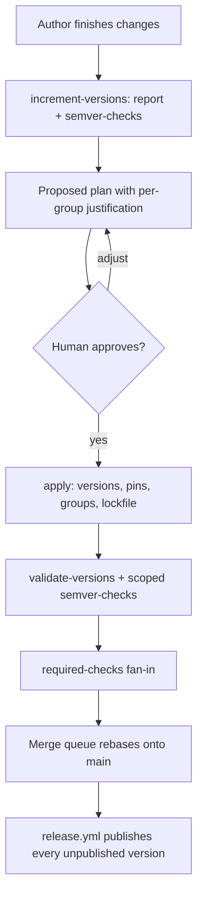

# Release versioning

This chapter is how crate version numbers are decided and enforced. A pull request that
changes released content increments the affected packages; merge publishes them. The
publish half is [`release-automation.md`](release-automation.md).

## Meta

* **Open this when**: preparing a pull request that touches a published package; deciding a
  version increment; debugging `validate-versions`, `cargo-release-plan`, or the
  `increment-versions` skill.
* **Cross-links**: [`release-automation.md`](release-automation.md) (the publish half),
  [`git-workflow.md`](git-workflow.md) (contributor pull-request conventions),
  [`impl-crate-split.md`](impl-crate-split.md) (why version groups exist),
  [`build-and-tooling.md`](build-and-tooling.md) (`just` recipes and script conventions),
  [`RELEASING.md`](../RELEASING.md) (first publish of a new crate, emergency manual publish,
  remaining GitHub settings).

## The invariant

> A package is released by incrementing its version. Therefore, on `main`, no publishable
> package has released content sitting past its most recent version increment.

A pull request that changes a package's released content must also increment that package's
version. The version decision moves from an occasional, batched, after-the-fact activity into
the pull request that causes it, while the author still remembers what changed and why.

Two consequences follow directly:

* There is no "prepare a release" step. `release.yml` already publishes any version it finds on
  `main` that crates.io does not have, so a merge *is* a release.
* Version numbers stop being derived purely from tooling. `cargo-semver-checks` supplies a
  *floor* — never the answer. Judgement may always raise an increment above that floor (an
  undetectable behavioural break, a meaningful feature addition, keeping a version group
  aligned), but may never lower it below.

### On a pull request

The author finishes the change, then runs the `increment-versions` skill — or the
`validate-versions` check fails and names that skill, which is enough to continue without
having read this chapter. The skill proposes one increment *level* per version group and per
ungrouped package. The author may raise a level above the `cargo-semver-checks` floor; they
may not lower one. Group membership, `=`-pin rewrites and the lockfile are applied without a
second question. Merge publishes.

## The anchor and the rule

The version increment *is* the release event, so the git repository holds everything needed to
evaluate the invariant.

A package's **anchor** is the most recent commit on the **base branch's first-parent line** in
which its declared version changed. Walking first-parent means each merged pull request counts
as a single step regardless of how it was merged, and reading the anchor off the base branch
rather than off the working branch means a branch's own commits never become anchors.

The rule is then one predicate:

> A package fails if its released content differs between its anchor and the work tree, while
> its declared version has not increased since the anchor.

It has two readings, and both are needed:

* **The version increased on this branch.** The package is being released, and everything on the
  branch ships under the new version. Where in the branch the increment sits is irrelevant, and
  so is how much changes after it — which is what keeps the check stable across review
  iterations.
* **The version did not increase.** The package is not being released, so nothing
  released-relevant may sit past its anchor. This catches the branch's own unaccompanied changes
  *and* content already sitting unreleased on the base branch, which is what makes the check
  cover every publishable package rather than only the ones the pull request touched.

Two implementation details matter. The comparison is on the **parsed `version` field**, not on a
textual diff of the manifest, so reformatting, key reordering and line moves do not register as
increments. And a package's creation commit counts as a version change (absent → present), so a
package added and released in one pull request needs no special handling.

The base revision defaults to `origin/main`. CI passes an explicit SHA: the pull request's
base on a `pull_request` run, the commit the queue rebased onto (`merge_group.base_sha`) on a
merge-queue run. Using the original pull-request base inside the queue would let two branches
that both incremented `0.6.1 → 0.6.2` both look valid. A stale base is otherwise safe rather
than unsound: it can only move the anchor further back, which reports more, never less. The
check needs full history (`fetch-depth: 0`) and that base SHA, and nothing else — no tags, no
merge ref, no network. Tags are not consulted, because tagging is atomic with neither the
merge nor the publish, so an absent tag proves nothing.

### Concurrent pull requests

Two branches cut from the same commit both increment `foo` 0.6.1 → 0.6.2. Git merges two
identical single-line edits without a conflict, so without care the second merge lands changed
code under a version crates.io already has, and `release-plz release` skips it.

A merge queue closes this. Each pull request is rebased onto the latest `main` before its
checks run, so once the first has merged, the second's base contains 0.6.2 and its declared
version has *not* increased relative to its anchor — while its content has. The check demands
0.6.3, the skill applies it, and the pull request re-enters the queue.

Requiring branches to be up to date *without* a queue would give the same guarantee and
serialise the author: every competing merge is a manual rebase and a second skill run. The
queue performs the rebase. "Require branches to be up to date" is not used.

The queue can also batch two pull requests that both increment the same package to the same
version into one merge. That lands as one combined release of that version; the invariant
holds. Sequential queue entries still force the second pull request to the next version.

Merging is blocked by a single required status check named `required-checks` (below).
`validate-versions` feeds that fan-in; it is not itself an entry in the GitHub ruleset.

The residual window is a second pull request merging while the first one's publish is still in
flight. Nothing is lost even then: because the rule covers every publishable package, the next
pull request to run reports it and it goes out one merge later. The cost is that a later pull
request is asked to resolve drift it did not cause. That is inherent to a check that reports what
must be released rather than who caused it, and the skill makes resolving it cheap.

## Released content

A package's released content is the set of files under its directory that **Cargo would put in
the `.crate`**: git-tracked files, filtered by the manifest's `include`/`exclude`. Cargo uses the
git file list when packaging inside a git repository, so reproducing that rule with `git ls-files`
plus gitignore-style matching (the `ignore` crate) matches what it actually does.

The change set is a `git diff` from the anchor to the work tree, not a listing of the current
tree, because a listing cannot reveal a file that was deleted. The package's directory is
resolved separately at each end from that end's own workspace member list, keyed by package
name, because filtering both ends by the *current* path would report a package that moved from
`packages/foo` to `packages/tools/foo` as unchanged. Relevance is evaluated with each end's own
`include`/`exclude`, so a file that either end would package counts.

Diffing against the work tree rather than a commit means uncommitted edits are visible, which is
the state the skill actually runs in. Untracked files are reported as an advisory and never
counted as changes, since Cargo would not package them either.

`Cargo.lock` is not released content, even though every published crate carries one — pure
libraries included. What ships is not the workspace lockfile but a per-package lockfile that Cargo
derives when it builds the archive, narrowed to that package's own dependency closure. It is
therefore not a function of the package's source: it moves whenever anything in that closure is
updated, and the workspace lockfile it derives from is shared by every member, so counting it
would mark the whole workspace unreleased on any dependency update. Consumers ignore a
dependency's lockfile in any case.

A package's `Cargo.toml` is compared as a file, so a comment-only or formatting-only edit to it
counts as a released-content change and forces a publish. This keeps the rule uniform — one
comparison for every file in the package — at the price of an occasional gratuitous release. The
alternative, comparing parsed manifests, is more machinery than the problem deserves.

### What ships

The published crate is the consumer build: `src/`, `README.md` (crates.io renders it), and
package-local `doc/` / `docs/` (compile-time diagrams and similar files `src/` actually
embeds). Everything else — `tests/`, `benches/`, `examples/`, `book/`, `AGENTS.md` — stays
in git. Each publishable package declares that with `include` in `Cargo.toml`. Nothing is
special-cased in the tool, and a reader of `Cargo.toml` can see exactly what is released.

`include` is the allow-list, not `exclude`. A denylist grows every time a new non-source
directory appears; an allow-list does not.

An `include` edit is a change to `Cargo.toml`, which is always released content, so adding
it requires an increment in the same change.

`src/` may compile-time-include files that themselves ship (`doc/`, `docs/`). It must not
embed `tests/`, `benches/` or `examples/`. Shared test inputs belong with the crate that
owns the parser, and callers of that parser use it as a dependency rather than embedding
a second copy.

### Inherited workspace values

Some of what a package publishes lives in the root manifest and is resolved into the published
manifest, changing what consumers see with no file under the package's directory changing. The
root manifest is therefore in scope for a package when a value that package actually inherits
changed between the anchor and the work tree:

* **`[workspace.package]`** — `rust-version`, `edition`, `license`, `repository` and the rest.
  A raised `rust-version` is a consumer-visible change to every inheriting crate.
* **`[workspace.dependencies]`** — a changed requirement alters what an inheriting package
  builds against.

Attribution is per package: the tool reads which keys each package inherits (`.workspace = true`
in its manifest, resolved values from `cargo metadata --no-deps`) and marks only those packages.
A root-manifest edit therefore does not blanket-mark the workspace. It *does* mark every
package that inherits the changed value, and that is the desired outcome: a global change
should republish the world. Group closure and `=`-pin rewrites then follow as usual. The
rate-limit budget already sizes a full-workspace publish; that path is not an accident to
narrow away.

Everything else in the root manifest is out of scope, including **`[workspace.lints]`**. This is
the answer to "how are lints excluded": they are not part of the inherited-value set, so they are
never attributed to any package. Lints are inlined into every published manifest — a thirty-line
source manifest becomes a 260-line published one, almost entirely lint configuration — but Cargo
builds registry dependencies with `--cap-lints allow`, so a dependency's lint configuration
cannot affect a consumer's build. Republishing forty-four crates for a lint tweak is not a trade
worth making.

## Version groups

Some packages are one logical unit split across crates for cargo-technical reasons (see
[`impl-crate-split.md`](impl-crate-split.md)) and must always carry the same version: the
`linked*` family, `many_cpus`/`many_cpus_impl`, `nm`/`nm_impl`, `nm_otel`/`nm_otel_impl`, and the
`cargo-bench-history` family with its `cbh_*` crates and faker.

Three rules govern them.

**Every member declares the same version, checked on the versions declared in the manifests.**
This is a statement about the work tree only. It deliberately says nothing about what has been
published: `release-plz release` publishes one crate at a time, so a sixteen-member group is
routinely part-published for minutes while a run works through it or waits out a rate limit. A
rule that also demanded matching publish state would turn an ordinary throttled release into a
repository-wide failing check until it finished.

**If any member needs an increment, all members increment**, including members with no changes of
their own. Otherwise the group's versions diverge the first time only part of it changes.
If `nm_impl` has unreleased changes and `nm` does not, incrementing `nm_impl` obliges `nm`.
The set of packages the check requires an increment for is therefore the changed set closed under
grouping.

**The new version is the highest version declared by any member, raised by the highest level any
member requires.** Members are consistent by the first rule, so this is normally unambiguous;
taking the maximum is what recovers the group if a member ever lags.

Members that have never been published are exempt from the consistency rule. A new crate cannot
be published before it merges, so requiring it to already match would make adding a member to a
group unresolvable.

Group membership lives in `[workspace.metadata.release-plan]` in the root `Cargo.toml`.
`release-plz.toml` does not declare version groups.

## Package status

| Status               | Condition                                                | Verdict  |
| -------------------- | -------------------------------------------------------- | -------- |
| `releasing`          | version increased since anchor                           | pass     |
| `unreleased-changes` | version unchanged, released content changed since anchor | **fail** |
| `released`           | version unchanged, nothing released-relevant changed     | pass     |

`releasing` is the state of a package the pull request is publishing. It stays passing however
much the branch changes afterwards, because all of it ships under the new version.

Group consistency is a separate, group-level verdict rather than a package status: a package can
have unreleased changes *and* belong to an inconsistent group, and both are reported.

Packages with `publish = false` are excluded entirely.

Whether a crate has ever reached crates.io is a different question, answered by the existing
`check-never-published` recipe. crates.io Trusted Publishing cannot perform a crate's first
publish, so a new crate needs one manual `cargo publish` as documented in
[`RELEASING.md`](../RELEASING.md). The skill's preflight runs that recipe and **stops** if any
crate in the increment set has never been published — first-publish is not folded into
`apply`, because the OIDC publisher cannot perform it. The version check itself does not
change: a never-published crate with a version increment is `releasing`.

The check fails closed on a shallow or truncated history: if the anchor walk reaches the end of
available history without finding a version change, that is an error, not a pass. Otherwise a
change in checkout behaviour would silently disable enforcement.

## The tool: `cargo-release-plan`

The `cargo-release-plan` Cargo subcommand in `packages/cargo-release-plan` follows the shape of
`cargo-detect-package` and `cargo-freeze-deps`: `src/main.rs` strips the injected `release-plan`
argv element and delegates to a library whose `run()` integration tests call directly, `clap`
derive parsing in `src/cli.rs`, an `ohno` error boundary in `src/errors.rs`, `mimalloc` global
allocator, and a `[package.metadata.binstall]` block.

Git is reached by shelling out to `git`, as `cbh_git` already does; there is no `git2` or `gix`
anywhere in this workspace.

### Offline and deterministic

The tool uses only `git` and `cargo metadata --no-deps`. It never contacts crates.io, never
resolves a dependency graph and never runs a compiler. The check therefore finishes in seconds,
cannot flake on network conditions, and is reproducible from a fixture repository in tests.

Expensive and networked analysis — `cargo-semver-checks` — stays outside this path, where it can
be scoped independently.

A non-gating `--verify-packaging` mode cross-checks the tool's relevance rules against
`cargo package --list` on a clean tree, so a divergence between the tool's rules and Cargo's real
behaviour is caught by CI rather than by a missed release.

### `report`

```
cargo release-plan report --out-dir <dir> [--base <rev>] [--manifest-path <p>] [--verbose]
```

Writes `<dir>/report.json` plus one `<dir>/diffs/<package>.patch` per package with unreleased
changes — a unified diff from the anchor to the work tree, which is literally "everything in this
package that is not yet released".

```json
{
  "schema_version": 1,
  "head": "9f3c…",
  "packages": [
    {
      "name": "nm_impl",
      "declared_version": "0.1.43",
      "group": "nm",
      "status": "unreleased-changes",
      "anchor": { "commit": "1a2b…", "version": "0.1.43" },
      "changed": [
        { "path": "src/hashing.rs", "change": "modified", "source": "package" },
        { "path": "Cargo.toml", "change": "modified", "source": "package" },
        { "field": "workspace.dependencies.folo_utils.version", "source": "inherited" }
      ],
      "stat": { "files": 4, "insertions": 26, "deletions": 10 },
      "diff_path": "diffs/nm_impl.patch",
      "dependencies": [{ "name": "folo_utils", "req": "0.1.10", "exact_pin": false }],
      "dependents": ["nm"]
    }
  ],
  "groups": {
    "nm": { "members": ["nm", "nm_impl"], "consistent": true, "version": "0.1.43" }
  }
}
```

`dependencies` and `dependents` are present because version decisions **cascade**. A package's own
diff identifies only the roots; the increment set grows from there. `many_cpus` pins
`many_cpus_impl = "=2.4.14"`, so incrementing the impl crate forces a manifest edit in the shell
crate, which is itself a released-content change requiring its own increment. Beyond that
mechanical propagation, an exposed dependency's breaking change is usually a breaking change in
its dependent too, unless analysis shows the broken API is not re-exposed. Deciding each package
independently in one pass is wrong; the graph makes the required ordering explicit.

### `check`

```
cargo release-plan check [--base <rev>] [--manifest-path <p>] [--format text|github]
```

Exits non-zero on any package with unreleased changes or any inconsistent group, printing one
actionable line per offence: what changed, what the anchor was, which group members are dragged
along, and how to run the skill. `--format github` adds workflow annotations.

### `apply`

```
cargo release-plan apply --plan <plan.json> [--dry-run]
```

Applies an approved plan: sets each package's `version`, rewrites every intra-workspace dependency
requirement that must follow — in particular the `=` pins — and expands group members. Manifests
are edited structurally with `toml_edit`, preserving comments and layout, exactly as
`cargo-freeze-deps` does; the whole edit set is computed before anything is written, so a failure
never leaves manifests half-updated. The workspace lockfile is refreshed afterwards, because
`--locked` builds and the `check-frozen` job would otherwise fail on stale path-dependency
versions. The lockfile is not released content, so refreshing it cannot re-trigger the check.

The `increment-versions` skill invokes this through `just apply-release-plan`.

Owning this step rather than delegating to `cargo set-version` or `release-plz set-version` is
deliberate: the `=`-pin and version-group rules are workspace-specific, and the plan file is a
reviewable, testable artifact.

### Testing

Unit tests cover anchor resolution, group verdicts, packaging-rule matching, inherited-value
attribution and plan expansion. Integration tests live in `tests/integration/` and build fixture
repositories with the hermetic helper in `fixture.rs` (pinned identity, no signing, no autogc).
Fixtures cover an
increment placed early in a branch with further changes after it, unreleased content already
present on the base branch, group closure with an unpublished member, `=`-pin propagation, a
deleted packaged file, a path dropped from `include`, a moved package directory, a
workspace-inherited field change, a manifest reformatted without a version change, a merge commit
on the base branch's first-parent line, and a shallow history.

## The `increment-versions` skill

`.github/skills/increment-versions/SKILL.md`. It is invoked when a pull request is ready to
merge, or when the `validate-versions` check fails. The check's failure annotation names the
skill and the recipe, so a failed job is a sufficient prompt.

Mechanics live in `just` recipes, per the repository rule that logic worth testing must not live
in prose; the skill file carries the judgement. The only judgement it asks for is the increment
*level*. Everything that follows from a chosen level — group expansion, `=`-pin rewrites, the
lockfile refresh, `just verify-lockfile` — is applied without a second question: skipping a
group member diverges the group, skipping a pin leaves a stale `=` requirement, and skipping
the lockfile fails `--locked` builds.

1. **Preflight.** Run the `cargo-semver-checks` canary and `just check-never-published`. A
   `cargo-semver-checks` that fails to *run* — classically one too old for the toolchain's rustdoc
   JSON format — must never be read as "no breaking changes". `verify-semver-checks` is the
   canary for the skill and for the CI `semver-checks` job. A never-published crate in the
   increment set is a stop, not a bump.
2. **Collect.** `just release-report <dir>` runs `cargo release-plan report` and then
   `cargo semver-checks --workspace --all-features`, capturing both.

   `--all-features` is used because gated API is still public API, and a breaking change behind a
   feature flag is invisible to a default-feature run.

   Semver checking is workspace-wide, not restricted to changed packages, and the reason is worth
   stating so nobody later "optimises" it away: a package's public API can break without any of
   its own files changing. If `bar` makes a breaking change and `foo` re-exports a `bar` type,
   `foo`'s API breaks too, and `foo`'s requirement on `bar` must move — which is itself a manifest
   change requiring an increment.
3. **Propose.** Walk the workspace dependency graph in topological order and, per package: take
   the `cargo-semver-checks` floor, read the package's diff, and decide a level. Expand version
   groups, propagate `=` pins, and re-check that the expansion did not create new work. Every
   crate here is `0.x` or `1.x`, so under Cargo's semantics a breaking change to a `0.x` crate is
   a *minor* increment.
4. **Present.** One table for the human, **one row per version group and per ungrouped
   package** — not one row per crate. A version group is one decision, regardless of how many
   members it has. Each row shows current version, proposed version, level, the floor
   `cargo-semver-checks` reported, the members the level will apply to, and a one-line
   justification citing the actual change.
   Where the proposal exceeds the floor, the reason is stated explicitly — that is the entire
   point of the exercise. Diffs stay on disk and are cited by path rather than pasted, since one
   package's unreleased changes can run to thousands of lines.
5. **Apply, on approval.** `just apply-release-plan`, then `just verify-lockfile`, then re-run
   `check` and the scoped `cargo semver-checks` to confirm the result, and write the summary into
   the pull request description. Further changes may follow the increment without invalidating
   it. The plan is not committed: the check verifies manifest state, not intent, so a plan file
   in the repository would be inert churn.

## The GitHub check

Validation includes a `merge_group` trigger so the queue actually runs the workflow. A required
check that never fires as `merge_group` is a failed check, and the queue never merges. Merge-queue
runs use the same pruned job set as pull requests; `push` to `main` remains the full backstop.
Delta analysis on a queue run uses `merge_group.base_sha` (the commit the queue rebased onto),
not a freshly fetched `origin/main`, so scoping cannot drift from the version check's base.

The Validation concurrency group (`github.head_ref || github.ref`) distinguishes
queue entries: `head_ref` is empty there and `github.ref` is the unique queue ref. The
close-companion stays pull-request-only.

### `validate-versions`

The `validate-versions` job in `validation.yml`. Its inputs are git history and manifests, not
Cargo packages, so
per the workflow conventions it runs **unconditionally**. `cargo-delta`'s changed-package scoping
must not be applied to it — the whole point is to catch packages the current pull request did not
touch.

```yaml
validate-versions:
  runs-on: ubuntu-latest
  outputs:
    semver_targets: ${{ steps.check.outputs.semver_targets }}
  steps:
    - uses: actions/checkout@v7
      with:
        # A truncated clone can hide the commit that last changed a version, which
        # would report that package as unchanged.
        fetch-depth: 0
    - uses: ./.github/actions/setup-environment
    - id: check
      env:
        RELEASE_PLAN_BASE: ${{ github.event.merge_group.base_sha || format('origin/{0}', github.event.repository.default_branch) }}
      run: just validate-versions
      shell: pwsh
```

The recipe is a thin wrapper over `cargo release-plan check --base <sha> --format github`, which
also emits `semver_targets` for the next job. The PowerShell side stays thin — it invokes the
tool, writes the step output, and owns the valid-empty skip — because the classification logic is
the Rust tool's job and is tested there. The job joins `alert`'s `needs:` list and the
`required-checks` fan-in.

The baseline is the tip of the branch releases are made from, which is deliberately *not* the
branch a pull request targets. A stacked pull request targets an unreleased parent, and anchoring
on it would read that parent's pending increment as a release and hide the parent's unreleased
changes. A merge-queue entry is the exception, because the queue has already rebased it onto a
real release-branch commit. Locally, leaving `RELEASE_PLAN_BASE` unset falls through to the
tool's own default of `origin/main`; in CI the expression always yields a value.

A failing check prints one actionable line per offence and names the skill. That is the entire
recovery path — the author does not have to reconstruct a plan from this chapter. Copilot is
assumed available; there is no non-skill command that writes a plan.

### `required-checks`

`main` is protected. The merge queue's only required status check is `required-checks`.

GitHub's required-checks field is a **string match on the check name**. That match cannot
express "this matrix job, but only the legs that actually ran", and it cannot see a check that
was skipped rather than posted. A job with both `strategy.matrix` and a job-level `if:` that
evaluates false never expands the matrix, so contexts such as `test-x64 (ubuntu-latest)` stay
on `Expected — Waiting for status to be reported` forever if they are listed as required.
Dynamically generated names have the same problem.

The ruleset therefore requires **only** `required-checks`. That job is a fan-in: `if: always()`,
`needs:` every merge-blocking job in Validation (including `validate-versions` and
`semver-checks`), succeeds when every dependency reports `success` or an allowed `skipped`, and
fails on `failure`, `cancelled`, or any other result. Unconditional gates may not skip. Advisory
jobs stay off that list. `alert` stays off it — it files issues on a failed push to `main`, it is
not a merge gate.

The job's GitHub check name is the literal `required-checks`, so the ruleset string is stable.
When a new merge-blocking job is added to Validation it is added to this `needs:` list; it is
never added to the GitHub ruleset. Matrix jobs that can skip via a job-level `if:` can only be
made required through this fan-in.

[`.github/workflows/design.md`](../.github/workflows/design.md) and the workflow `AGENTS.md`
carry the maintenance rule.

### `semver-checks`

`cargo-semver-checks` is too expensive to run workspace-wide on every pull request — a full run
means rustdoc for both baseline and current across forty-four packages, and the `cbh_*` family is
slow to build. In CI it is therefore scoped to `semver_targets`: the packages with a supported
consumer contract that carry unreleased content changes. That set is narrower than what a merge
publishes, because published implementation and test-support packages declare themselves private
and have no consumer contract to compare, and it is not limited to the current pull request,
because a package whose increment landed in an earlier pull request still carries unreleased
content. It runs with `--all-features`, for the same reason the skill does. Group closure means
this set is not always small, so the job runs in parallel with the rest of validation rather than
gating it. An empty `semver_targets` is a successful skip, not a workspace-wide comparison.

It runs with `if: !cancelled()` on `needs: [validate-versions]`, so a failing version check still
surfaces insufficient-increment findings in the same round trip rather than hiding them behind a
second push, while a cancelled run stops here instead of holding a runner. `always()` is reserved
for the `required-checks` fan-in, where classifying failed and cancelled dependencies is the
job's entire purpose.

`cargo-release-plan` checks that an increment *happened*; `cargo-semver-checks` checks that it was
*big enough* — it compares against the latest crates.io release and fails when the declared version
is an inadequate increment. Neither substitutes for the other. The canary preflight guards this
job as well.



## Relationship to release-plz

Version increments are applied by `just apply-release-plan` (the `increment-versions`
skill's wrapper over `cargo-release-plan apply`). `verify-semver-checks` is the skill's
and the CI `semver-checks` job's canary.

`release-plz release` is the publish half. It is idempotent, and nothing downstream of it
reads release-plz state — `plan-binaries` reconciles against `cargo metadata` and
`gh release view`. Its `git_tag_name = "{{ package }}-v{{ version }}"` remains pinned because
the `cargo binstall` asset URLs derive from it, but tags carry no meaning for versioning.

## Publish volume and rate limits

Every merge that touches a published package publishes it, and group closure multiplies that:
a one-line change in any `cbh_*` crate publishes every member of the `cargo-bench-history`
group. A change to an inherited workspace value publishes every inheriting package. Long
publish runs — including a full-workspace republish — are therefore expected by design, not
an anomaly to be engineered away.

crates.io throttles publishing with a per-user token bucket, and the applicable limit is the one
for **new versions of existing crates**: a burst of 30 with one token refilled per minute. (The
much tighter new-crate limit — burst 5, one per ten minutes — does not apply here, because
Trusted Publishing cannot perform a crate's first publish, so bootstrapping a new crate is a
manual step outside this flow.) A full-workspace reconciliation of 44 crates against a fully
drained bucket therefore costs at most about 44 minutes of waiting, and any single group release
fits inside the burst.

`release-plz release` is idempotent — it re-checks the registry and skips already-published
versions — so a throttled run resumes rather than restarting. The retry around it is **ten**
attempts, fifteen minutes apart: each wait refills roughly fifteen tokens, so ten attempts buy
far more headroom than even a full-workspace release consumes, and the extra attempts cost
nothing when nothing is throttled.

The job timeout cannot simply be set to the arithmetic worst case: GitHub-hosted jobs are
hard-capped at six hours, so `timeout-minutes` is set just below that ceiling (350). This is
deliberate — the job's own timeout then fires first and produces a clean failure with the usual
`ci-failure` issue, instead of the platform killing the run. A release pathological enough to
exhaust that budget is finished by re-running the workflow, which is safe for the same
idempotency reason.

Because group consistency is defined on declared versions, an intermediate part-published state
never fails the check while a run is working through it.

## Reuse outside this repository

The tool is an ordinary published Cargo subcommand — binstall metadata, trusted publisher, no
folo-specific behaviour compiled in. Group definitions come from configuration and packaging
from each crate's `include`, so another workspace adopts it by writing
`[workspace.metadata.release-plan]` and pointing a check at `cargo release-plan check`.

The skill and the `just` recipes stay local. The skill is the part most entangled with local
conventions.
