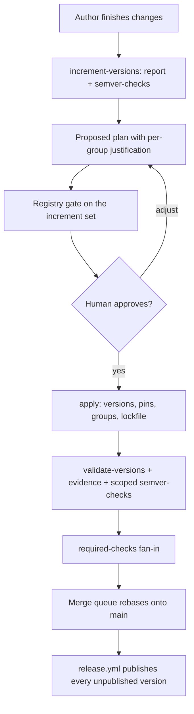

# Release versioning

This chapter owns how crate version numbers are decided and enforced: a package's version
increment happens in the pull request that changes it, and merging that pull request publishes
it. Publication itself belongs to [`release-automation.md`](release-automation.md).

## Meta

* **Open this when**: implementing this design; a pull request is about the versioning process
  itself.
* **In force**: nothing described here is. This chapter is the design of a process that does not
  yet exist; contributors follow [`git-workflow.md`](git-workflow.md) and
  [`RELEASING.md`](../RELEASING.md) until the work described here lands.
* **Cross-links**: [`release-automation.md`](release-automation.md) (the publish half),
  [`git-workflow.md`](git-workflow.md) (contributor rules for pull requests),
  [`impl-crate-split.md`](impl-crate-split.md) (why version groups exist),
  [`build-and-tooling.md`](build-and-tooling.md) (`just` recipes and script conventions).

## The invariant

> A package is released by incrementing its version. Therefore, on `main`, no publishable
> package has released content sitting past its most recent version increment.

A pull request that changes a package's released content must also increment that package's
version. The version decision moves from an occasional, batched, after-the-fact activity into
the pull request that causes it, while the author still remembers what changed and why.

The consequences are:

* There is no "prepare a release" step. `release.yml` already publishes any version it finds on
  `main` that crates.io does not have, so a merge *is* a release.
* Version numbers stop being derived purely from tooling. `cargo-semver-checks` supplies a
  *floor* — never the answer. Judgement may always raise an increment above that floor (an
  undetectable behavioural break, a meaningful feature addition, keeping a version group
  aligned), but may never lower it below.

### On a pull request

The author finishes the change, then runs the `increment-versions` skill — or the
`validate-versions` check fails and names that skill, which is enough to continue without
having read this chapter. The skill proposes one increment *level* per version group and per
ungrouped package. The author may raise a level above the `cargo-semver-checks` floor; they
may not lower one. Group membership, `=`-pin rewrites and the lockfile are applied without a
second question. Merge publishes.

## The anchor and the rule

The version increment *is* the release event, so the git repository holds everything needed to
evaluate the invariant.

A package's **anchor** is the most recent commit on the **base branch's first-parent line** in
which its declared version changed. Each merged pull request contributes exactly one commit to
that line, because `main` accepts only merge-queue merges and squashes; rebase merging is not
used, and must not be, since it replays a branch's own commits onto the base line and would
turn a branch's version bump into an anchor with the branch's later commits sitting past it.
Reading the anchor off the base branch rather than off the working branch means a branch's own
commits never become anchors.

The rule is then one predicate:

> A package fails if its released content differs between its anchor and the work tree, while
> its declared version has not increased since the anchor.

The rule is read in both directions, and both are needed:

* **The version increased on this branch.** The package is being released, and everything on the
  branch ships under the new version. Where in the branch the increment sits is irrelevant, and
  so is how much changes after it — which is what keeps the check stable across review
  iterations. The decision *evidence* is held to a stricter standard, because a later change can
  outdate a judgement even when it cannot outdate the increment; see "Evidence stays bound to the
  content it describes".
* **The version did not increase.** The package is not being released, so no released content
  may sit past its anchor. This catches the branch's own unaccompanied changes
  *and* content already sitting unreleased on the base branch, which is what makes the check
  cover every publishable package rather than only the ones the pull request touched.

The comparison is on the **parsed `version` field**, not on a
textual diff of the manifest, so reformatting, key reordering and line moves do not register as
increments. A package absent from the base tree is classified **new** rather than anchored:
there is no anchor to walk, the whole package is released by the version it declares, and it
passes as `releasing`. Anchor resolution therefore runs only for packages that exist on the base
branch, which is what keeps the fail-closed rule below from rejecting a package added by this
pull request.

The base revision is supplied by the caller and must be the tip of the base branch the merge
lands on. CI passes the event's own value: the pull request's base on a `pull_request` run, the
commit the queue rebased onto (`merge_group.base_sha`) on a merge-queue run. Using the original
pull-request base inside the queue would let two branches that both incremented `0.6.1 → 0.6.2`
both look valid. A stale base is unsound rather than merely noisy: if the base branch moved
`1.1 → 1.2` after the branch was cut, the branch inherits `1.2` while its anchor still reads
`1.1`, and the branch's own unaccompanied changes are then read as that inherited increment's
release. `origin/main` is a local convenience default for a developer machine, where a stale
result costs a re-run; the merge-blocking verdict always comes from the event-supplied base. The
check needs full history (`fetch-depth: 0`) and that base SHA, and nothing else — no tags, no
merge ref, no network. Tags are not consulted, because tagging is atomic with neither the
merge nor the publish, so an absent tag proves nothing.

### Concurrent pull requests

Two branches cut from the same commit both increment `foo` 0.6.1 → 0.6.2. Git merges two
identical single-line edits without a conflict, so without care the second merge lands changed
code under a version crates.io already has, and `release-plz release` skips it.

A merge queue closes this. Each pull request is rebased onto the latest `main` before its
checks run, so once the first has merged, the second's base contains 0.6.2 and its declared
version has *not* increased relative to its anchor — while its content has. The check demands
0.6.3, the skill applies it, and the pull request re-enters the queue.

Requiring branches to be up to date *without* a queue would give the same guarantee and
serialise the author: every competing merge is a manual rebase and a second skill run. The
queue performs the rebase. "Require branches to be up to date" is not used.

The queue can also batch pull requests: a merge group is validated as one candidate against one
base, so two pull requests that both increment the same package to the same version can be
checked together against the pre-merge base and merged together. That is accepted: the batch
lands as a single combined release of that version, containing both changes, and the invariant
holds because the merged content ships under the version that was incremented. Maximum merge
group size is therefore not constrained. Queue entries that are *not* batched are validated
sequentially, and the second is forced to the next version by the rule above.

Merging is blocked by a single required status check named `required-checks` (below).
`validate-versions` feeds that fan-in; it is not itself an entry in the GitHub ruleset.

The residual window is a second pull request merging while the first one's publish run is still
in flight. Recovering that publish is the release workflow's job, not the version check's: runs
are serialised by a concurrency group on `main` and never cancelled mid-flight, and
`release-plz release` re-checks the registry and publishes every version on `main` that
crates.io does not have, so a failed, throttled or superseded run is finished by the next run
or by re-running it. The version check cannot substitute for that: once an increment merges it
becomes the anchor, and the tool never queries the registry, so an unpublished version is
invisible to it. What the check does cover is unreleased *content* that accumulates on `main`
in that window — the next pull request to run reports it, and it is published by the next
merge. The cost is that a later pull request is asked to resolve drift it did not cause. That is
inherent to a check that reports what must be released rather than who caused it, and the skill
makes resolving it cheap.

## Released content

### Release relevance

One rule decides whether something is released content: it is release-relevant when a registry
consumer can build against it or read it. That covers the sources a consumer compiles, the
manifest fields Cargo resolves for them, the `README.md` crates.io renders, and package-local
files that `src/` embeds at compile time or that the package's published documentation needs.
Repository-only material — `tests/`, `benches/`, `examples/`, `book/`, `AGENTS.md` — is not,
because a consumer of the published crate never receives it. The same test decides inherited
manifest values and dependency kinds below.

Deliberate exceptions are stated where they arise: a package's `Cargo.toml` is compared as a
whole file, so any edit to it is release-relevant; and `Cargo.lock` is never release-relevant,
even though an archive carries one.

A package's released content is then the set of git-tracked files under its directory that
**Cargo would put in the `.crate`**: filtered by the manifest's `include`/`exclude`, reproduced
with `git ls-files` plus gitignore-style matching (the `ignore` crate).

Cargo's own packaging walk is not identical: without `include` it starts from the git file list
but also emits matching untracked, non-ignored files, and with `include` it walks the filesystem
directly. The tool deliberately scopes the invariant to tracked content, because an untracked
file cannot merge and therefore cannot be part of what a merge releases. Untracked files that a
package would otherwise package are reported as an advisory so the author commits them before
the version decision, rather than discovering the difference at publish time. The
`--verify-packaging` cross-check runs on a clean tree, where the tool's file list and
`cargo package --list` must agree exactly.

The change set is a `git diff` from the anchor to the work tree, not a listing of the current
tree, because a listing cannot reveal a file that was deleted. The package's directory is
resolved separately at each end from that end's own workspace member list, keyed by package
name, because filtering both ends by the *current* path would report a package that moved from
`packages/foo` to `packages/tools/foo` as unchanged. Relevance is evaluated with each end's own
`include`/`exclude`, so a file that either end would package counts.

Diffing against the work tree rather than a commit means uncommitted edits are visible, which is
the state the skill actually runs in.

`Cargo.lock` is not released content, even though every published crate carries one — pure
libraries included. What ships is not the workspace lockfile but a per-package lockfile that Cargo
derives when it builds the archive, narrowed to that package's own dependency closure. It is
therefore not a function of the package's source: it moves whenever anything in that closure is
updated, and the workspace lockfile it derives from is shared by every member, so counting it
would mark the whole workspace unreleased on any dependency update. Consumers ignore a
dependency's lockfile in any case.

A package's `Cargo.toml` is compared as a file, so a comment-only or formatting-only edit to it
counts as a released-content change and forces a publish. This keeps the rule uniform — one
comparison for every file in the package — at the price of an occasional gratuitous release. The
alternative, comparing parsed manifests, is more machinery than the problem deserves.

### What ships

Applying the relevance rule, the published crate is the consumer build: `src/`, `README.md`
(crates.io renders it), and package-local `doc/` / `docs/` that `src/` embeds at compile time or
that the published documentation needs. A package may add further package-local resources on the
same test — a file a consumer's build or documentation actually requires — and states why in the
`include` entry's comment. Repository-only material stays in git. Each publishable package
declares its selection with `include` in `Cargo.toml`. Nothing is special-cased in the tool, and
a reader of `Cargo.toml` can see exactly what is released.

`include` is the allow-list, not `exclude`. A denylist grows every time a new non-source
directory appears; an allow-list does not.

An `include` edit is a change to `Cargo.toml`, which is always released content, so adding
it requires an increment in the same change.

`src/` may compile-time-include files that themselves ship (`doc/`, `docs/`). It must not
embed `tests/`, `benches/` or `examples/`. Shared test inputs belong with the crate that
owns the parser, and callers of that parser use it as a dependency rather than embedding
a second copy.

### Inherited workspace values

Some of what a package publishes lives in the root manifest and is resolved into the published
manifest, changing what consumers see with no file under the package's directory changing. The
root manifest is therefore in scope for a package when a value that package actually inherits
changed between the anchor and the work tree:

* **`[workspace.package]`** — `rust-version`, `edition`, `license`, `repository` and the rest.
  A raised `rust-version` is a consumer-visible change to every inheriting crate.
* **`[workspace.dependencies]`** — the inherited entry as a whole, not only its version
  requirement. The requirement, `features` and `default-features` are all resolved into the
  published manifest and all change what an inheriting package builds against; the root manifest
  sets `default-features` on every entry and `features` on many, so attributing only the
  requirement would let a feature edit merge unreleased. Attribution covers entries the package
  inherits as a normal or build dependency. An entry inherited only as a dev-dependency is not
  attributed: a consumer never builds dev-dependencies, which is the same downstream-effect test
  that excludes lints below.

Attribution is per package: the tool reads which keys each package inherits (`.workspace = true`
in its manifest, resolved values from `cargo metadata --no-deps`) and marks only those packages.
A root-manifest edit therefore does not blanket-mark the workspace. It *does* mark every
package that inherits the changed value, and that is the desired outcome: a change to an
inherited value is a change to every inheriting package, and each of them is republished. Group
closure and `=`-pin rewrites then follow as usual. The rate-limit budget already sizes a
full-workspace publish; that path is not an accident to narrow away.

Everything else in the root manifest is out of scope, including **`[workspace.lints]`**. This is
the answer to "how are lints excluded": they are not part of the inherited-value set, so they are
never attributed to any package. Lints are inlined into every published manifest — a thirty-line
source manifest becomes a 260-line published one, almost entirely lint configuration — but Cargo
builds registry dependencies with `--cap-lints allow`, so a dependency's lint configuration
cannot affect a consumer's build. Republishing forty-four crates for a lint tweak is not a trade
worth making.

## Version groups

Some packages are one logical unit split across crates for cargo-technical reasons (see
[`impl-crate-split.md`](impl-crate-split.md)) and must always carry the same version: the
`linked*` family, `many_cpus`/`many_cpus_impl`, `nm`/`nm_impl`, `nm_otel`/`nm_otel_impl`, and the
`cargo-bench-history` family with its `cbh_*` crates and faker.

The rules governing them are the following.

**Every member declares the same version, checked on the versions declared in the manifests.**
This is a statement about the work tree only. It deliberately says nothing about what has been
published: `release-plz release` publishes one crate at a time, so a sixteen-member group is
routinely part-published for minutes while a run works through it or waits out a rate limit. A
rule that also demanded matching publish state would turn an ordinary throttled release into a
repository-wide failing check until it finished.

**If any member needs an increment, all members increment**, including members with no changes of
their own. Otherwise the group's versions diverge the first time only part of it changes.
`nm_impl` has unreleased changes today and `nm` does not, so incrementing `nm_impl` obliges `nm`.
The set of packages the check requires an increment for is therefore the changed set closed under
grouping — the **increment set**, the packages a release run publishes.

**The new version is the highest version declared by any member, raised by the highest level any
member requires.** Members are consistent by the first rule, so this is normally unambiguous;
taking the maximum is what recovers the group if a member ever lags.

Consistency is a statement about declared versions in the work tree, so a member added by this
pull request simply declares the group's version like any other member. No publication-state
exemption exists, and none could be evaluated by an offline check in any case.

Group membership moves from `release-plz.toml` to `[workspace.metadata.release-plan]` in the root
`Cargo.toml`. release-plz applies `version_group` only in its `update` and `release-pr` commands,
so once `release-plz update` is gone those keys do nothing while still looking authoritative —
which is how two sources of truth start to diverge. They are deleted.

## Package status

| Status               | Condition                                                    | Verdict  |
| -------------------- | ------------------------------------------------------------ | -------- |
| `releasing`          | version increased since anchor, or package is new            | pass     |
| `unreleased-changes` | version not increased, released content changed since anchor | **fail** |
| `unchanged`          | version not increased, no released content changed           | pass     |

A version that *decreases* is not a separate status: the decrease is itself a `Cargo.toml` edit,
so the package has released content past its anchor without an increase and fails as
`unreleased-changes`.

`releasing` is the state of a package the pull request is publishing. It stays passing however
much the branch changes afterwards, because all of it ships under the new version. `unchanged`
describes the package's relationship to its anchor only; whether the declared version exists on
crates.io is a separate question, answered below.

Group consistency is a separate, group-level verdict rather than a package status: a package can
have unreleased changes *and* belong to an inconsistent group, and both are reported.

Packages with `publish = false` are excluded entirely.

Whether a crate has ever reached crates.io is answered by a registry query rather than by any
package status, and it is asked only of the crates a run is about to publish. crates.io Trusted
Publishing cannot create a crate — a trusted publisher can only be configured on a crate that
already exists — so a new crate's first version
is published by an authenticated manual `cargo publish` as documented in
[`RELEASING.md`](../RELEASING.md), and every later version uses the workflow's short-lived OIDC
credentials. That bootstrap is a crates.io platform limitation and the one gap in this design's
short-lived-credential model, recorded as such rather than as an intended credential workflow; if
crates.io gains OAuth or another federated path for crate creation, the bootstrap moves to it.
The skill therefore gates on that answer once its increment set exists, as described below, and
**stops** rather than bumping; first publish is not folded into `apply`, because the OIDC
publisher cannot perform it. The version check itself does not change: a never-published crate
with a version increment is `releasing`.

The check fails closed on a shallow or truncated history: if the anchor walk for a package that
exists on the base branch reaches the end of available history without finding a version change,
that is an error, not a pass. Otherwise a change in checkout behaviour would silently disable
enforcement.

## The tool: `cargo-release-plan`

A new Cargo subcommand in `packages/cargo-release-plan`.

### The command contract

`report`, `check` and `apply` are the interface other consumers — the skill, CI recipes, other
workspaces — depend on: their arguments, exit semantics, artifact paths, the fields of
`report.json` and of a plan file, the variants a change record may take, and the meaning of
`schema_version`. Both artifacts are specified below, `report.json` under `report` and the plan
under `apply`. `schema_version` is incremented when a field's meaning changes or a field is
removed; adding an optional field does not increment it. Everything below the contract — crate
layout, the git adapter, the TOML editor, the fixture harness — is implementation detail and may
change without a schema change. That boundary is what makes the tool safely reusable while its
internals stay free to move.

Implementation follows the shape of `cargo-detect-package` and `cargo-freeze-deps`: `src/main.rs`
strips the injected `release-plan` argv element and delegates to a library whose `run()`
integration tests call directly, `clap` derive parsing in `src/cli.rs`, an `ohno` error boundary
in `src/errors.rs`, `mimalloc` global allocator, and a `[package.metadata.binstall]` block. Git
is reached by shelling out to `git`, as `cbh_git` already does; there is no `git2` or `gix`
anywhere in this workspace and this design does not introduce one.

### Offline and deterministic

The tool uses only `git` and `cargo metadata --no-deps`. It never contacts crates.io, never
resolves a dependency graph and never runs a compiler. The check therefore finishes in seconds,
cannot flake on network conditions, and is reproducible from a fixture repository in tests.

Expensive and networked analysis — `cargo-semver-checks` — stays outside this path, where it can
be scoped independently.

A non-gating `--verify-packaging` mode cross-checks the tool's relevance rules against
`cargo package --list` on a clean tree, so a divergence between the tool's rules and Cargo's real
behaviour is caught by CI rather than by a missed release.

### `report`

```
cargo release-plan report --out-dir <dir> [--base <rev>] [--manifest-path <p>] [--verbose]
```

Writes `<dir>/report.json` plus one `<dir>/diffs/<package>.patch` for every package whose released
content differs between its anchor and the work tree — a unified diff from the anchor to the work
tree, which is everything in the package that the anchor's version does not already carry.

That set is deliberately not limited to `unreleased-changes`. A `releasing` package needs the same
diff, because the level chosen for it is judged from exactly that content, and the version may
already have been raised — by an earlier `apply`, by a rerun on a branch under review, or by hand.
Withholding the diff from those packages would leave the skill unable to evaluate the very
decisions it is responsible for. Only an `unchanged` package has no diff, and its `diff_path` is
absent.

```json
{
  "schema_version": 1,
  "base": "7d10…",
  "head": "9f3c…",
  "packages": [
    {
      "name": "nm_impl",
      "declared_version": "0.1.43",
      "group": "nm",
      "status": "unreleased-changes",
      "anchor": { "commit": "1a2b…", "version": "0.1.43" },
      "changed": [
        { "path": "src/hashing.rs", "change": "modified", "source": "package" },
        { "path": "Cargo.toml", "change": "modified", "source": "package" },
        { "field": "workspace.dependencies.folo_utils.version", "source": "inherited" },
        { "field": "workspace.dependencies.folo_utils.features", "source": "inherited" }
      ],
      "stat": { "files": 4, "insertions": 26, "deletions": 10 },
      "diff_path": "diffs/nm_impl.patch",
      "content_digest": "b41f…",
      "dependencies": [{ "name": "folo_utils", "req": "0.1.10", "exact_pin": false }],
      "dependents": ["nm"]
    },
    {
      "name": "many_cpus",
      "declared_version": "2.4.16",
      "group": "many_cpus",
      "status": "releasing",
      "anchor": { "commit": "3c4d…", "version": "2.4.15" },
      "changed": [{ "path": "src/lib.rs", "change": "modified", "source": "package" }],
      "stat": { "files": 2, "insertions": 8, "deletions": 1 },
      "diff_path": "diffs/many_cpus.patch",
      "content_digest": "0ae7…",
      "dependencies": [{ "name": "many_cpus_impl", "req": "=2.4.16", "exact_pin": true }],
      "dependents": []
    }
  ],
  "groups": {
    "nm": { "members": ["nm", "nm_impl"], "consistent": true, "version": "0.1.43" },
    "many_cpus": {
      "members": ["many_cpus", "many_cpus_impl"],
      "consistent": true,
      "version": "2.4.16"
    }
  }
}
```

A change record is tagged by `source` and carries only that variant's fields: a `package` record
has `path` and `change`, an `inherited` record has `field`. No record carries both, and a
consumer selects on `source` rather than probing for present keys.

`content_digest` is a digest over the package's released content in the work tree — the
release-relevant paths and their contents, plus the inherited values the package resolves — and it
is what lets a decision be bound to the material it was judged from. It is derived from the same
relevance rules as the diff, so it moves exactly when a republish-worthy change does and stays put
for unrelated edits elsewhere in the workspace. It is reported for every package, including
`unchanged` ones.

`dependencies` and `dependents` are present because version decisions **cascade**. A package's own
diff identifies only the roots; the increment set grows from there. `many_cpus` pins
`many_cpus_impl = "=2.4.14"`, so incrementing the impl crate forces a manifest edit in the shell
crate, which is itself a released-content change requiring its own increment. Beyond that
mechanical propagation, an exposed dependency's breaking change is usually a breaking change in
its dependent too, unless analysis shows the broken API is not re-exposed. Deciding each package
independently in one pass is wrong; the graph makes the required ordering explicit.

### `check`

```
cargo release-plan check [--base <rev>] [--manifest-path <p>] [--format text|github]
```

Exits non-zero on any package with unreleased changes or any inconsistent group, printing one
actionable line per offence: what changed, what the anchor was, which group members are included
by group expansion, and how to run the skill. `--format github` adds workflow annotations.

### `apply`

```
cargo release-plan apply --plan <plan.json> [--dry-run]
```

Applies an approved plan: sets each package's `version`, rewrites every intra-workspace dependency
requirement that must follow — in particular the `=` pins — and expands group members.

#### The plan file

The plan is part of the command contract, so its shape is normative rather than an internal
detail. It states absolute target versions and records what the decision was made against.

```json
{
  "schema_version": 1,
  "report": {
    "base": "7d10…",
    "head": "9f3c…",
    "digests": { "nm": "d92c…", "nm_impl": "b41f…" }
  },
  "packages": [
    {
      "name": "nm_impl",
      "from": "0.1.43",
      "to": "0.1.44",
      "level": "minor",
      "origin": "judgement",
      "justification": "New public `Hasher` constructor; semver-checks floor was patch."
    },
    {
      "name": "nm",
      "from": "0.1.43",
      "to": "0.1.44",
      "level": "minor",
      "origin": "group-closure"
    }
  ]
}
```

`origin` distinguishes a level a human approved (`judgement`) from one that follows mechanically
(`group-closure`, `pin-propagation`), so the evidence shows which entries were decided and which
were derived. `justification` is present on `judgement` entries and carries the reason the level
was chosen; the mechanical origins do not need one.

`report.digests` maps each planned package to the `content_digest` the report gave it when the
plan was produced. Together with `report.base` it is the plan's applicability statement: it says
which content this plan is a decision about.

A parsed plan is not yet an applicable plan. `apply` accepts one only after the following hold,
and rejects it before a byte is written otherwise, so an invalid, stale or partial plan cannot
reach the filesystem:

* `schema_version` is one this binary understands.
* Every named package resolves to a publishable workspace member, and its `from` equals that
  member's currently declared version.
* Every `to` is an increase from the corresponding `from` under semver ordering.
* Every version group that any named package belongs to is named in full, at one common `to`.
* `=`-pin rewrites and the resulting dependent edits are complete, and the full edit set has been
  computed.
* `report.base` is the base the plan was derived against, and every digest in `report.digests`
  matches the work tree's current `content_digest` for that package. A mismatch means the released
  content moved after the decision, so the plan no longer describes what would be published, and
  the correct response is a fresh skill run rather than a forced apply.

Manifests are then edited structurally with `toml_edit`, preserving comments and layout, exactly
as `cargo-freeze-deps` does. A filesystem failure part-way through
the writes is reported with the files already written; re-running `apply` with the same plan is
safe, because a plan states absolute target versions rather than relative increments. The
workspace lockfile is refreshed afterwards, because `--locked` builds and the `check-frozen` job
would otherwise fail on stale path-dependency versions. The lockfile is not released content, so
refreshing it cannot re-trigger the check.

Owning this step rather than delegating to `cargo set-version` or `release-plz set-version` is
deliberate: the `=`-pin and version-group rules are workspace-specific, this is where the bugs
that motivated the redesign live, and the plan file becomes a reviewable, testable artifact.

### Testing

Unit tests cover anchor resolution, group verdicts, packaging-rule matching, inherited-value
attribution, content-digest stability, and plan expansion and applicability. Integration tests
build fixture repositories in `tempfile::tempdir()` and drive `run()` directly, using the hermetic
`run_git` helper pattern from
`cargo-bench-history`'s test harness (pinned identity, no signing, no autogc). Fixtures exercise
representative branch histories, packaging and package-layout variations, group and dependency
propagation, inherited-metadata attribution, and incomplete history — that is, one fixture per
behaviour the sections above define, rather than a catalogue fixed by this document.

## The `increment-versions` skill

`.github/skills/increment-versions/SKILL.md` — the repository's first skill. It is invoked when a
pull request is ready to merge, or when the `validate-versions` check fails. The check's failure
annotation names the skill and the recipe, so a failed job is a sufficient prompt.

Mechanics live in `just` recipes, per the repository rule that logic worth testing must not live
in prose; the skill file carries the judgement. The only judgement it asks for is the increment
*level*. Everything that follows from a chosen level — group expansion, `=`-pin rewrites, the
lockfile refresh, `just verify-lockfile` — is applied without a second question: skipping a
group member diverges the group, skipping a pin leaves a stale `=` requirement, and skipping
the lockfile fails `--locked` builds.

1. **Preflight the analysis.** Run the `cargo-semver-checks` canary. A `cargo-semver-checks` that
   fails to *run* — classically one too old for the toolchain's rustdoc JSON format — must never
   be read as "no breaking changes". This is the failure mode the current `verify-semver-checks`
   recipe guards against, and the guard survives the removal of `release-plz update`. Registry
   state is not consulted here; there is nothing yet to consult it about.
2. **Collect.** `just release-report <dir>` runs `cargo release-plan report` and then
   `cargo semver-checks --workspace --all-features`, capturing both.

   `--all-features` is used because gated API is still public API, and a breaking change behind a
   feature flag is invisible to a default-feature run.

   Semver checking is workspace-wide, not restricted to changed packages, and the reason is worth
   stating so nobody later "optimises" it away: a package's public API can break without any of
   its own files changing. If `bar` makes a breaking change and `foo` re-exports a `bar` type,
   `foo`'s API breaks too, and `foo`'s requirement on `bar` must move — which is itself a manifest
   change requiring an increment.
3. **Propose.** Walk the workspace dependency graph in topological order and, per package: take
   the `cargo-semver-checks` floor, read the package's diff, and decide a level. Expand version
   groups, propagate `=` pins, and re-check that the expansion did not create new work. The result
   is this run's increment set.

   How a level becomes a version follows Cargo's compatibility rules, which depend on the
   package's current major version: for a `0.x` package a breaking change is a *minor* increment,
   while for a package at `1.0.0` or above it is a *major* one. The workspace holds packages of
   both kinds — `many_cpus` and its impl crate are `2.x` — so the mapping is read from each
   package's declared version rather than assumed.
4. **Gate on registry presence.** With the increment set known, query crates.io for each package
   in it. This step cannot run earlier: before collection and proposal there is no set to scope
   the query to, and a workspace-wide sweep answers a different question.

   A package in the set that has never been published is a **stop**, not a bump, because the OIDC
   publisher cannot create a crate. An inconclusive lookup is also a stop: anything that is not a
   definite "this crate exists" or "this crate does not exist" — a network failure, an
   unexpected response, a rate-limited query — is an error, because treating it as "probably
   published" would carry the run into an `apply` whose publish cannot happen. The existing
   workspace-wide never-published sweep is advisory and warns rather than stops, so it does not
   serve as this gate. The query lives in the recipe layer, not in `cargo-release-plan`, which
   never contacts the network.

   The stop is cleared by the manual first publish described above, after which the run starts
   again.
5. **Present.** One table for the human, **one row per version group and per ungrouped
   package** — not one row per crate. A version group is one decision, regardless of how many
   members it has. Each row shows current version, proposed version, level, the floor
   `cargo-semver-checks` reported, the members the level will apply to, and a one-line
   justification citing the actual change.
   Where the proposal exceeds the floor, the reason is stated explicitly — that is the entire
   point of the exercise. Diffs stay on disk and are cited by path rather than pasted, since one
   package's diff can run to thousands of lines.
6. **Apply, on approval.** `cargo release-plan apply`, then `just verify-lockfile`, then re-run
   `check` and the scoped `cargo semver-checks` to confirm the result, and write the summary into
   the pull request description. The summary persists the decision evidence, not just the
   outcome: the approved per-group and per-package levels, the `cargo-semver-checks` floor for
   each and the stated reason wherever judgement raised it, the group expansion and `=`-pin
   rewrites that followed, and the result of each post-apply verification command. That is what
   lets a reviewer reconstruct the version decision after the interactive run has ended. The plan
   is not committed: the check verifies manifest state, not intent, so a plan file in the
   repository would be inert churn.

### Evidence stays bound to the content it describes

An approved level is a judgement about a specific body of released content. Left unbound, it goes
stale the moment that content moves: a behavioural break added after approval — one
`cargo-semver-checks` cannot see, which is exactly the case this design exists to catch — would
merge under a level approved before it existed, while `cargo release-plan check` passed because
*some* increment had happened. The check detects that a version increased; it does not and cannot
judge whether the increase was large enough.

The binding is the `content_digest` the report computes. The summary records it per releasing
package, in a machine-readable block, alongside the approved levels, floors and reasons, and the
plan carries the same digests as its applicability statement. A change to a releasing package's
released content changes the digest, so the recorded evidence no longer describes what would
merge, and the skill is run again. A rerun is cheap and usually confirms the level, refreshing the
digest and the summary rather than moving the version — which is why the stability property above
survives: what a late edit invalidates is the evidence, not the increment.

Freshness is enforced mechanically rather than by convention. A step in `validate-versions`
recomputes each releasing package's digest from the checkout and compares it with the block in the
pull request description; a missing block for a releasing package, or a digest that does not
match, fails the job and names the skill. That step runs on `pull_request` events, where the pull
request body is unambiguous. The merge queue needs no equivalent: content reaches `main` only with
its own increment, so a base that moved a releasing package's released content also moved that
package's anchor, and the version rule itself then demands a fresh increment and therefore a fresh
run. The recomputed digests and `report.json` are written to the job summary and uploaded as an
artifact, so a mismatch is diagnosable from the run alone rather than by reproducing it locally.

## The GitHub check

Validation grows a `merge_group` trigger so the queue actually runs the workflow. A required
check that never fires as `merge_group` is a failed check, and the queue never merges. Merge-queue
runs use the same pruned job set as pull requests; `push` to `main` remains the full backstop.
Delta analysis on a queue run uses `merge_group.base_sha` (the commit the queue rebased onto),
not a freshly fetched `origin/main`, so scoping cannot drift from the version check's base.

The existing Validation concurrency group (`github.head_ref || github.ref`) already distinguishes
queue entries: `head_ref` is empty there and `github.ref` is the unique queue ref. The
close-companion stays pull-request-only.

### `validate-versions`

A new job in `validation.yml`. Its inputs are git history and manifests, not Cargo packages, so
per the workflow conventions it runs **unconditionally**. `cargo-delta`'s changed-package scoping
must not be applied to it — the whole point is to catch packages the current pull request did not
touch.

```yaml
validate-versions:
  runs-on: ubuntu-latest
  permissions:
    contents: read
    pull-requests: read   # the evidence step reads the pull request description
  outputs:
    releasing: ${{ steps.check.outputs.releasing }}
  steps:
    - uses: actions/checkout@v7
      with:
        fetch-depth: 0   # anchors are found by walking the base branch's version history
    - uses: ./.github/actions/setup-environment
    - id: check
      env:
        RELEASE_PLAN_BASE: ${{ github.event.pull_request.base.sha || github.event.merge_group.base_sha }}
      run: just validate-versions
      shell: pwsh
    - id: evidence
      if: github.event_name == 'pull_request'
      env:
        GH_TOKEN: ${{ github.token }}
        PR_NUMBER: ${{ github.event.pull_request.number }}
      run: just validate-release-evidence
      shell: pwsh
```

The recipe is a thin wrapper over `cargo release-plan check --base <sha> --format github`, which
also emits the set of packages this pull request releases, for the next job. On a push to `main`
`RELEASE_PLAN_BASE` is empty and the tool falls through to `origin/main`, which is the branch
under test: the checkout is the base branch itself, so the default is the fresh base the anchor
walk requires. The evidence recipe is a comparison of two digest lists — the tool's and the pull
request's — and no classification logic moves into PowerShell: deciding statuses and computing
digests is the Rust tool's job and is tested there. The job joins `alert`'s `needs:` list and the
`required-checks` fan-in.

A failing check prints one actionable line per offence and names the skill. That is the entire
recovery path — the author does not have to reconstruct a plan from this chapter. Copilot is
assumed available, and no non-skill command writes a plan.

That dependency is deliberate. The judgement the skill performs — choosing an increment level
above a mechanical floor and justifying it — is the one part of this process a tool cannot decide,
so a second interface for it would either duplicate that judgement or degrade into an unjustified
rubber stamp on the tool's floor, which is exactly the failure mode this design removes. The
mechanical half stays reachable regardless: `report`, `check` and `apply` are ordinary commands
with a documented plan format, so an interrupted session resumes without losing state. An agent
outage therefore delays merging pull requests that release a package; it does not strand work,
and the accepted response is to wait rather than to maintain a parallel decision path.

### `required-checks`

`main` is protected. The merge queue's only required status check is `required-checks`.

GitHub's required-checks field is a **string match on the check name**. That match cannot
express "this matrix job, but only the legs that actually ran", and it cannot see a check that
was skipped rather than posted. A job with both `strategy.matrix` and a job-level `if:` that
evaluates false never expands the matrix, so contexts such as `test-x64 (ubuntu-latest)` stay
on `Expected — Waiting for status to be reported` forever if they are listed as required.
Dynamically generated names have the same problem.

The ruleset therefore requires **only** `required-checks`. That job is a fan-in: `if: always()`,
`needs:` every merge-blocking job in Validation (including `validate-versions` and the scoped
semver-checks job), succeeds when every dependency succeeded or was skipped, and fails on
failure, cancelled, or any other result. Advisory jobs stay off that list. `alert` stays off
it — it files issues on a failed push to `main`, it is not a merge gate.

The job's GitHub check name is the literal `required-checks`, so the ruleset string is stable.
When a new merge-blocking job is added to Validation it is added to this `needs:` list; it is
never added to the GitHub ruleset. Matrix jobs that can skip via a job-level `if:` can only be
made required through this fan-in.

[`.github/workflows/design.md`](../.github/workflows/design.md) and the workflow `AGENTS.md`
carry the maintenance rule.

### `semver-checks`

`cargo-semver-checks` is too expensive to run workspace-wide on every pull request — a full run
means rustdoc for both baseline and current across forty-four packages, and the `cbh_*` family is
slow to build. In CI it is therefore scoped to the packages this pull request releases, minus
crates that declare no supported public surface. That omission is metadata-driven, not a
judgement call at scoping time: a crate is skipped only where the workspace records that it has no
consumer-visible API, which today is the `doc(hidden)` `_impl` crates. Shell crates stay in scope
even when only their re-exported dependency changed, because their public API is exactly what the
dependency exposes. It runs with `--all-features`, for the same reason the skill does. Group
closure means this set is not always small, so the job runs in parallel with the rest of
validation rather than gating it.

It runs with `if: always()` on `needs: [validate-versions]`, so a failing version check still
surfaces insufficient-increment findings in the same round trip rather than hiding them behind a
second push.

`cargo-release-plan` checks that an increment *happened*; `cargo-semver-checks` checks that it was
*big enough* — it compares against the latest crates.io release and fails when the declared version
is an inadequate increment. Neither substitutes for the other. The canary preflight guards this
job as well.

What this evidence establishes has bounds, and they are what makes it a *floor* rather than a
proof of compatibility. The baseline is the latest release on crates.io, so API introduced by a
merge whose publish is still in flight is not in the baseline, and an all-features run proves
nothing about feature topology — a newly added gate or a removed feature-to-feature edge is
invisible to it even though a consumer's existing feature selection can stop compiling. Both are
cases where judgement raises the level above the floor, which is the reviewable step this design
is built around. Widening the mechanical evidence to a full matrix of every crate against both
the registry and the queued base, with feature-topology analysis, is not proposed: the cost is
several rustdoc runs per crate per pull request, and the residual cases are rare and visible to
the author who wrote them.



## Relationship to release-plz

`release-plz update` is dropped. It runs only from `just prepare-release` on a developer machine;
nothing in CI calls it. With it go `prepare-release` itself, the `version_group` keys in
`release-plz.toml`, and the framing of `verify-semver-checks` as a release preflight (the recipe
survives, repurposed as the skill's and the semver job's canary).

`release-plz release` remains the publish half and keeps its behaviour: it is idempotent, and
nothing downstream of it reads release-plz state — `plan-binaries` reconciles against
`cargo metadata` and `gh release view`. Its `git_tag_name = "{{ package }}-v{{ version }}"` remains
pinned because the `cargo binstall` asset URLs derive from it, but tags carry no meaning for
versioning. The one publish-side change this design makes is to the retry budget around it, sized
for the publish volume described below.

## Adoption

The check can only be switched on once every publishable package is clean against its anchor.
Batched versioning leaves packages with released content sitting past their last increment;
restricting each crate to its release-relevant content removes those whose only drift is
repository-only files, and the remainder is cleared by catch-up increments that `release.yml`
publishes.

Adoption takes an **exclusive lock** on the repository: no other pull requests merge while the
process is switched over. That lets the packaging changes, the catch-up increments, the tool, the
fan-in job, the ruleset and the merge queue land in one window, so no other branch is asked to
satisfy a rule that `main` itself does not yet meet. Ordering inside that window is fixed by two
constraints: an `include` edit is itself a manifest change, so allow-lists and their increments
land together; and the merge queue plus the `required-checks` ruleset land last, once
`cargo release-plan check` is clean on `main`. The repository's merge methods are restricted to
squashes and merge commits in the same window, because the anchor definition depends on each
merged pull request contributing one commit to `main`'s first-parent line. Contributor
documentation ([`git-workflow.md`](git-workflow.md), [`RELEASING.md`](../RELEASING.md)) is
inverted as the lock is released.

`cargo-release-plan` itself is first published by hand before the merge that introduces it with
`publish = true`, for the crate-creation reason above. There is no `publish = false` staging
crate.

## Publish volume and rate limits

Every merge that touches a published package publishes it, and group closure multiplies that:
a one-line change in any `cbh_*` crate publishes all sixteen members of the `cargo-bench-history`
group. A change to an inherited workspace value publishes every inheriting package. Long
publish runs — including a full-workspace republish — are therefore expected by design, not
an anomaly to be engineered away.

crates.io throttles publishing with a per-user token bucket, and the applicable limit is the one
for **new versions of existing crates**: a burst of 30 with one token refilled per minute. (The
much tighter new-crate limit — burst 5, one per ten minutes — does not apply here, because
Trusted Publishing cannot create a crate, so bootstrapping a new crate is a manual step outside
this flow.) These are server-side values that crates.io controls: they are the
`LimitedAction::PublishUpdate` and `LimitedAction::PublishNew` defaults in
[`src/rate_limiter.rs`](https://github.com/rust-lang/crates.io/blob/main/src/rate_limiter.rs)
of `rust-lang/crates.io`, overridable there by deployment configuration, and a live rejection
reports the applicable limit in its error response. Both are checkable without privileged access,
and the budget below must be recomputed from them if either changes. A full-workspace
reconciliation of 44 crates against a fully drained bucket costs at most about 44 minutes of
waiting, and any single group release fits inside the burst.

`release-plz release` is idempotent — it re-checks the registry and skips already-published
versions — so a throttled run resumes rather than restarting. The retry around it is widened from
three attempts to **ten**, keeping the fifteen-minute spacing: each wait refills roughly fifteen
tokens, so ten attempts provide more retry capacity than even a full-workspace release consumes,
and the extra attempts cost nothing when nothing is throttled.

The job timeout is raised accordingly, but it cannot simply be set to the arithmetic worst case:
GitHub-hosted jobs are hard-capped at six hours, so `timeout-minutes` is set just below that
ceiling (350). This is deliberate — the job's own timeout then fires first and produces a clean
failure with the usual `ci-failure` issue, instead of the platform killing the run. A release
pathological enough to exhaust that budget is finished by re-running the workflow, which is safe
for the same idempotency reason.

Because group consistency is defined on declared versions, an intermediate part-published state
never fails the check while a run is working through it.

## Reuse outside this repository

The tool is an ordinary published Cargo subcommand from the start — binstall metadata, trusted
publisher, no folo-specific behaviour compiled in. Group definitions come from configuration
and packaging from each crate's `include`, so another workspace adopts it by writing
`[workspace.metadata.release-plan]` and pointing a check at `cargo release-plan check`.

The skill and the `just` recipes stay local. The skill is the part most entangled with local
conventions, and skills are new to this repository; it is extracted once its judgement steps and
plan format have been validated on a representative body of real pull requests, including
multi-package and group-closure cases, without further changes to its interface.
