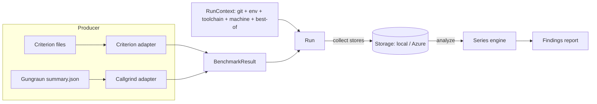

# cargo-bench-history — Design

A Cargo subcommand that maintains a **long-lived history** of benchmark results and
analyzes that history for trends that snapshot / "previous run" tools cannot see:

* slow incremental drift (a scenario that got 30 % slower over a year, 1 % at a time);
* step changes whose approximate location in history becomes visible only in hindsight
  once the noise averages out;
* regressions distinguished from measurement jitter by engine-aware statistics rather
  than a single noisy neighbour.

It stores every result over time (local path or Azure blob), runs in multiple
environments (dev PC, GitHub Actions, ADO), and partitions data only where results are
not otherwise comparable. Its commands are `collect`, `install`, `analyze`, `examine`,
`backfill`, `list`, `prune`, `bless`, and `unbless`.

## 1. Benchmark engines and what they emit

Understanding the producers is mandatory: comparability and parsing both depend on it.
Four engines are supported. The axis that drives the data model is **whether each
measurement carries a confidence interval** (which decides how dispersion is gated). No
engine is exempt from run-to-run noise, and every engine's numbers are machine-dependent
in practice — even simulated instruction counts and allocation figures vary with the host,
because libraries dispatch to different code paths on different microarchitectures — so
every engine is partitioned by machine key (see §3).

* **Criterion** — wall-clock time. Hardware-dependent and noisy. Each measured case
  yields a stable identity (group / function / value) and a point estimate (the
  regression-line slope when Criterion sampled linearly, else the mean) with a standard
  deviation and bootstrap confidence interval. It records no timestamp, commit, machine,
  or package, so the tool supplies all run context.
* **Callgrind (via Gungraun)** — simulated instruction and branch-execution counts.
  Low-noise but not exact: a CPU simulator is low-noise, yet its counts still drift by a
  few percent run to run, and they vary across microarchitectures as libraries dispatch to
  different code paths. Only the build-stable events are tracked — the instruction count
  (`Ir`) and the two branch-execution counts (`Bc`, `Bi`). Gungraun also emits
  cache-simulation counts (`L1hits`/`LLhits`/`RamHits`), the derived `EstimatedCycles`,
  and the branch-misprediction counts (`Bcm`/`Bim`), but those are **not** parsed or
  persisted: at microbenchmark magnitudes they track binary layout rather than the code under
  test, so they cannot be compared across builds (see §8). Its machine-readable summary is the
  one output that must be opted into with an environment variable — the narrow "special need"
  that justifies `collect` existing at all.
* **`alloc_tracker`** — heap allocations (bytes and counts). Not deterministic: warmup and
  buffer-resize allocations are amortized over a Criterion-chosen iteration count, so the
  per-iteration figures jitter, and they too vary with the host's library code paths. It
  prefers a warmup-robust slope and records a bootstrap confidence interval only when the
  operation was measured over several spans.
* **`all_the_time`** — processor (CPU) time. Hardware-dependent and noisy. It records a
  bootstrap confidence interval only when the operation was measured over several spans.

The two workspace-local crates (`alloc_tracker`, `all_the_time`) each auto-emit one flat
JSON file per operation on drop, so they need no opt-in and the operation name alone
identifies the series.

Despite differing in units and noise, all four reduce to the same
shape: *a stable benchmark identity → a set of named numeric metrics*. That shared shape
is the foundation of the model.

## 2. Core concepts and data model



* **Benchmark identity** — the stable identity of a series, an ordered non-empty list of
  string segments. Each engine adapter decides the segments, so the identity type carries
  no engine-specific assumptions about which component is the "group" or the "case".
  Callgrind includes the workspace package (so equally named bench targets in different
  packages do not collide); Criterion and the two measurement crates carry no package —
  Criterion is safe because the workspace crate-prefixes its group ids, and the
  measurement crates identify a series by operation name. Reports render the full form
  with segments joined by `/`. Renaming a benchmark starts a new series.
* **Metric** — a kind plus a value, with optional dispersion (standard deviation and a
  confidence interval) where the engine reports it. Each kind has exactly one unit and
  its own display name, so there is no separate unit or name field. The value is the
  point estimate; for noisy engines it is the regression slope where available, else the
  mean.
* **Run** — one immutable stored file: the run context plus the benchmark results
  produced by one engine in one execution.
* **Observation timestamp** — every run carries a single wall-clock timestamp: when the
  benches ran and were stored. It is **provenance only** and never orders anything. It
  names dirty snapshot files so concurrent snapshots of one commit coexist. The
  benchmarked commit's position on the timeline — and the basis for the `--since`
  cutoff — is its committer date, read from the git graph at analyze time and
  never copied onto the run, so a rebase or amended date can never leave a stale
  timestamp behind. There is deliberately no "effective timestamp" concept and no
  timestamp override.
* **Discriminant set** — `{ engine, target_triple, machine_key }`. Two results are
  comparable exactly when they were measured in the same project and their discriminant
  sets match. The project (workspace identity, configured and defaulting to the
  repository directory name) selects which store is being read, so results from two
  projects never meet; it is not a member of the discriminant set.
* **Machine key** — a stable hardware fingerprint that partitions every engine's data by
  the host it ran on.

## 3. Comparability and storage partitioning

The central tenet: **partition only by what makes results fundamentally incomparable;
record everything else as metadata so the analysis can see its effect over time.**

Two results are comparable exactly when they were measured in the same **project** and
their **discriminant sets** match. A discriminant set is `{ engine, target_triple,
machine_key }`:

* `engine` — different units and semantics never mix.
* `target_triple` — even simulated counts are not comparable across
  architectures (`…-windows-msvc` and `…-windows-gnu` are genuinely different binaries).
* `machine_key` — a stable fingerprint of the host the benchmark ran on; every engine is
  partitioned by it, because every engine's numbers vary with the hardware in practice.

The project — workspace identity, configured and defaulting to the repository directory
name — partitions too, but it sits one level above: it selects which store is being read,
so results from two projects never meet in the first place. That is why it is not part of
the discriminant set.

Deliberately **metadata, not partition** — so a change shows up as a timeline step, which
is the whole point of the tool — are the toolchain versions, OS/libc, commit, branch, and
environment provider. A rustc bump therefore appears as a step in the series rather than
silently forking history.

### 3.1 Target triple and cross-OS (WSL) execution

`target_triple` describes **where the benchmark binary actually ran**, and is always the
triple of the host the tool runs on. There is no override and no per-engine special case:
the tool and the benches it launches always run in the same environment, so the host's
triple is the execution triple. A run under WSL is a Linux benchmark — the tool process
runs inside WSL, the measured binary is the Linux target, and the detected triple is the
Linux one. The golden rule follows directly: run the tool in the same OS context as the
benches (invoke the whole tool inside WSL, not from the Windows side), because
auto-detection at the tool is the only thing keeping each platform's data in its own
series.

### 3.2 On-disk / blob layout

The layout is immutable and append-only-by-new-file, and works identically on a local
filesystem and a blob container (no read-modify-write races in concurrent CI). The key
shape is:

```
<root>/v1/<project>/objects/<engine>/<target_triple>/<machine>/<commit>/
    clean.json                    # ≤1 per commit — the canonical point for a clean tree
    dirty-<observation_unix>.json # 0..N snapshots taken on top of this base commit
```

The project segment selects the enclosing store. Data objects live under that project's
`objects/` subtree so project-level metadata (today the cache-invalidation marker; perhaps
an index later) can sit as a **sibling** without a layout migration and a data listing can
never pick it up.

The segments above the commit — `engine / target_triple / machine` — are the discriminant
set; the commit is a directory, and
**clean vs. dirty is filename semantics** within it. This is dictated by how `analyze`
selects data: storage is not a pre-assembled timeline but is pieced together at query time
by resolving git history into an ordered set of commits and reading each commit's
directory. So the key is indexed by commit and ordering comes from git topology, never
from a timestamp baked into the key.

A clean run maps to the single deterministic key `…/<commit>/clean.json`, so collision
detection rides on the write-once storage contract: a second clean run of the same commit
fails atomically with nothing written, with no separate exists-check round-trip. A dirty
run is keyed by its observation second so successive snapshots coexist. Branch is not a
path component — a commit ID is globally unique, so the same commit on two branches is
one point, and branch selection happens at query time. Each path segment is sanitized so a
stray separator in a value cannot split the key into the wrong number of segments.

*Considered and not adopted:* hoisting the run *kind* into the key path (separate
`runs-clean` / `runs-dirty` / `blessings` prefixes) so a single-kind query could narrow to
one prefix. It is rejected because the cost it targets is already avoided — `analyze`
filters non-admitted candidates from the key alone before any body is fetched — and
because the commit-centric grouping co-locates a commit's clean run, dirty snapshots, and
blessing sidecars under one directory, which is exactly what lets `prune` drop a commit's
whole set and keeps a blessing adjacent to the run it baselines.

### 3.3 Discriminant sets and discriminant filters

A series is only ever built within one discriminant set. Discriminant filters restrict which
sets a query operates on by matching the engine, target triple, and machine key fields.
(Earlier drafts also exposed derived OS / architecture filters; they were removed because
duplicating the target-triple dimension confused users — filter on the triple directly.)

Each discriminant filter is repeatable, unions its values, and accepts the literal `all` to
widen past a dimension. Omitting a filter **auto-detects the current machine**: the triple
defaults to the host triple and the machine key to the host fingerprint, so a bare query
reports *this* machine's data; engine has no machine-derived value, so it defaults to all
engines. Every engine is partitioned by machine key, so a bare query scopes every engine
uniformly to *this* host's fingerprint — nothing rides along across machines, and no set is
exempt from the machine-key filter. A filter that matches several sets yields one report per
set — parallel data sets analyzed individually.

Discriminant-filter matching is **case-insensitive**: engine names and every key segment are
normalized to lowercase, so `Callgrind`, `callgrind`, and `CALLGRIND` name the same engine,
and a triple or machine key differing only in case resolves to one set rather than silently
splitting into two.

The commands divide into **create** and **query** roles. `collect` and `backfill` record
new data into exactly one machine's reality, so they auto-detect their discriminant values;
they reject engine or triple selection and the `all` keyword. Every other command queries
existing data and uses the full repeatable, `all`-aware, auto-detecting discriminant-filter
model.

## 4. Machine key

The goal is a fingerprint equal for pool-equivalent machines and different for genuinely
different hardware; it is **never** keyed on hostname or serial, since cloud pool nodes
differ in name but are equivalent. It hashes the stable, pool-equivalent attributes
available without elevated privileges across platforms — all from the in-workspace
`many_cpus`: the processor and memory-region counts and the distinct processor models
present (a sorted, deduplicated list). Finer signals such as RAM size were left out for
little discriminating value in homogeneous CI pools.

A factor qualifies only if it is a **property of the hardware**, not a reading the same
machine can report differently from one boot to the next. Per-processor speed metrics fail
that test: they are boot-time calibration figures, so an identical runner can produce a
different value after a reboot. The margin needed to do damage is tiny — a GitHub-hosted
ARM64 Windows runner reports all four of its Cobalt 100 processors calibrated at 10678 on
most boots and one of the four at 10681 on others, three units in 10678 — and hashing that
reading fragments one machine's history across several keys, the exact failure the key
exists to prevent. They add no discriminating power either, since the processor model set
already says what the processors are, so they are recorded as provenance (§5) and never
hashed. A machine's speed mix is therefore answered from its stored runs rather than from
its key.

Because the key is persisted and compared across machines and tool versions, it uses a
**fixed** hash (not a seeded/default hasher) over a version-tagged canonical string,
truncated to a compact path segment, and a golden test pins a fixed profile to its digest
so an accidental change to the canonical form is caught. The version tag is what makes a
change to the factor set an explicit, visible fork of stored history rather than a silent
break. The key is computed for every run, because every engine is partitioned by it.

There is no machine-independent partition: every engine — Callgrind instruction counts and
`alloc_tracker` allocations included — is keyed by the host fingerprint, because those
figures vary with the microarchitecture in practice. The string `synthetic` carries no
special meaning; it is an ordinary machine-key value like any other and can be selected by
query-time discriminant filters.

The individual factors behind the fingerprint (the version tag, processor and memory-region
counts, and processor models) are surfaced for debugging: `collect` and the query commands
emit them to standard error under `--verbose`, and the standalone `machine-key` command
prints the key to standard output (with `--verbose` adding the factors to standard error).
Only true factors appear there, so what is
shown is exactly what the key depends on. Where a run's host is probed, those factors, the
resulting fingerprint, and the speed histogram that is deliberately not a factor are also
recorded beside it as write-only provenance (see §5).

## 5. Run context

Captured once per stored run: the observation timestamp (above); the git commit, branch,
and dirty flag (branch is metadata only — query-time topology decides series membership,
and parent lineage and committer date are resolved from a live repo at analyze time rather
than stored); the environment provider, run id, and PR number detected from the
environment (with `Local` a first-class provider alongside the automated ones); the rustc
and cargo versions and the resolved execution triple; and provenance (tool version, schema
version, machine key). Git and environment access go through a small abstraction so the
logic is unit-testable without a real repo or CI.

The context also carries optional **host-hardware provenance** (`context.machine`),
recorded whenever the storing path probed the host: the current fingerprint factors
(processor and memory-region counts, processor models), the per-processor speed histogram,
which is deliberately not one of those factors (§4), and the auto-detected key the factors
hash to. It is **write-only** — nothing reads it back — and exists purely so that a later
change in a machine key can be traced to the specific factor that moved (for example, a
runner pool swapping CPU models). The speed histogram is recorded even though it is not a
factor, because it is the sharpest available evidence of what the host actually was. It
records the auto-detected fingerprint, and is an additive, backward-compatible field, absent
on runs written before it existed and on the
non-`collect` construction sites that do not probe hardware, so its introduction only bumps
the schema version for legibility. Nothing may therefore assume a stored run carries it, nor
that what it carries is the whole of what a key was computed from at the time.

Alongside it the context records the **measurement protocol** the numbers were produced
under: how many repetitions of the whole suite the stored values were reduced from — one for
a plain collection or an import, `N` under `--best-of N` (§7.1). This matters because the
reduction keeps the **minimum** of those samples, and the expected value of a minimum falls
as the sample count rises: changing the count moves the recorded level of *every* benchmark
at once. The count is therefore part of what was measured, a history spanning two counts is
not measuring the same quantity throughout, and without the count stored, such a change of
protocol is indistinguishable after the fact from a change in the code. It is recorded from
the repetitions that actually ran rather than the requested figure, so it can never claim a
repetition that did not happen. Like the hardware provenance it is write-only and additive
(absent on runs written before it existed), and it is deliberately **not** a discriminant:
what a window spanning two counts should mean for detection is a separate question from
being able to see that it happened at all.

## 6. Storage

Storage is modelled as a small async port with two backends. Its object model is the
lowest common denominator of a filesystem and a blob container — flat keys, list-by-prefix,
immutable objects — so both backends implement it with no special-casing upstream. Because
async trait methods are not object-safe, backend selection is a static-dispatch enum rather
than a boxed trait object, and the commands stay backend-agnostic by holding it.

The defining tenet is **write-once immutability**: writing an existing key fails, which is
the basis of the clean-collision refusal. A replacing write is a deliberate escape hatch
(the `--overwrite` path). Delete removes one object and is used only by `prune` and
`unbless`. Per-key immutability is what makes the read-through cache correct.

Stored bodies are **gzip-compressed** at the port boundary by a shared codec both backends
call, so every command hands and receives plain JSON and is unaffected. This is a breaking
format with no migration: a legacy plaintext object fails loudly on read because the gzip
magic never collides with JSON's first byte. The test fake stays plaintext (no test
inspects raw bytes, and it keeps the Miri-driven suite fast).

The two backends:

* **Local filesystem** — root selected at run time (below), created on demand, walked
  iteratively.
* **Azure Blob** — always compiled in, because the tool is installed without feature
  flags and a build-time gate would only hide a backend the user explicitly configured.
  Authentication is **Microsoft Entra ID (OAuth) only**, resolved once and always over
  HTTPS (bearer tokens require TLS); the legacy shared-key and verbatim-SAS modes were
  removed, and a leftover key/token field is now a loud config parse error. In a GitHub
  Actions job configured for federation the credential self-mints a fresh GitHub OIDC
  token on demand for each Entra exchange; otherwise it discovers a local `az login`
  session. Self-minting is load-bearing for multi-hour collection runs: a single federated
  sign-in caches one OIDC assertion that expires within minutes, so a long run's first
  token refresh would otherwise re-submit a dead assertion and be rejected. The chosen
  credential is wrapped in a caching decorator that serializes token acquisition, so a
  concurrent read burst shares one acquisition instead of racing the platform token-cache
  lock. Every per-object blob client shares **one** pooled HTTP transport, so a
  high-concurrency load keeps connections alive across objects instead of paying a fresh
  handshake per object (and exhausting ephemeral ports); the transport keeps automatic
  decompression off, since the storage layer inflates gzip itself.

The Azure backend is exercised in CI two complementary ways: against the **Azurite
emulator** (the default, fork-safe path — Azurite has no real Entra, so it runs in a
signature-free OAuth mode over HTTPS behind a throwaway certificate, with a faked token and
a cert-trusting transport injected through a test seam) and against a **real Storage
account** (which proves real Entra signature validation the emulator cannot, using a fresh
auto-deleted container per test). The network tests self-skip when their backend is not
configured, so a normal run stays green without one.

### 6.1 Selecting a backend

A local-storage path is machine-dependent, so it is never carried in the shared,
version-controlled config file. The config holds only an optional cloud backend (an
externally-tagged table of which at most one may be configured); local storage is chosen
at the command line or environment. A leftover local-storage table from an earlier scheme
is rejected at parse time rather than silently ignored, nudging the user to remove it.

Every storage-backed command takes a `--local` flag and resolves the backend in
precedence: an explicit `--local=<path>`; a bare `--local` meaning "the path in the
storage environment variable" (unset/empty is an error); otherwise the configured cloud
backend; otherwise a configuration error. `--local` thus always overrides a configured
cloud backend. `collect --no-store` is the one exception — it skips selection entirely.
The environment read is isolated behind a thin edge feeding a pure resolver, so the
decision logic is unit-testable without touching the process environment.

### 6.2 Read-through cache for the cloud backend

The read commands (`analyze` / `list` / `prune`) load the whole in-selection history before
reconstructing a series, and against the cloud backend that is one download per object — so
CI re-fetches everything even though almost all of it is identical to the previous run. An
optional on-disk **read-through cache** removes that waste: each run pays the network cost
only for objects it has never seen, and the cache survives between CI runs via the standard
Actions cache.

The cache mirrors fetched object **bodies**, keyed by storage key. It never caches the
**listing**: discovering the current key set is one cheap round-trip whose whole purpose is
to see what is new, so it always goes to the cloud and a freshly stored object is still
found (its body simply misses and falls through). Trusting a cached body forever is sound
because the model is **immutable per key**. Only delete and replacing-write break that, and
both are rare, deliberate administrative actions off the collection hot path.

Invalidation is a small **per-project marker** holding an opaque epoch token, kept as a
sibling of that project's object subtree. Before a load, the reader compares the project's
cloud marker against the epoch its mirror last recorded; on a mismatch it wipes **that
project's** mirrored objects and re-records the epoch. The wipe is deliberately coarse
(drop and re-download once) because mutations are rare, and only whether the token differs
matters — never its value or ordering — so clock skew between runners is harmless. The
marker is maintained by the cloud backend itself, so **every** writer, even a developer's
cache-less `prune`, invalidates other machines' caches: the local cache is a read-side
optimization, the marker a cloud-side correctness contract.

A cache only survives a CI run if that run never mutates an existing object. Collection is
therefore **append-only**: a same-commit re-run is a soft skip (the run still benchmarks
every engine, so a broken benchmark is still caught, but writes nothing) rather than an
overwrite. This keeps the production write path purely additive so it never bumps the
marker, and it makes stored measurements immutable — better history hygiene. Regenerating
data after a harness change stays a deliberate manual overwrite, which legitimately
invalidates caches.

A `--cache <dir>` flag (with an environment fallback) selects the directory on the read
commands. It is meaningful only with the cloud backend, so it **conflicts with `--local`**.
Its one scaling limit is the repository's Actions-cache quota; beyond it the cache degrades
to a partial restore — still correct, just less effective.

*Considered and not adopted:* caching the listing (would hide newly stored objects);
keeping collection on overwrite and detecting create-vs-replace at the backend (adds a
round-trip per write and leaves history mutable); building the cache into the Azure backend
to cache raw wire bytes (cheaper on a miss but not testable with in-memory fakes and
couples concerns — a storage decorator is fake-driven instead).

## 7. Commands

Every option is filed under a named help heading so `--help` reads as a small set of
labelled groups rather than one flat list, and the groups are shared across commands so a
given group looks identical everywhere it appears. The functional groups are environment
and execution, output, benchmark scope, feature selection, discriminant selection, commit
selection, and data filtering. Subjects are bare positional words, never flags: the
`runs|discriminants|blessings` selector for `list`, prefixes for `bless`, commits for
`prune`, and the range endpoints for `backfill`. A bare `list` with no subject is an error
that names the three.

### 7.1 `collect`

`collect` invokes the workspace's benches with `cargo bench` and harvests whichever
engines produced output — there is no engine configuration. It enables the combined
environment every supported engine needs (only Callgrind needs an opt-in variable; the
others auto-emit) and then inspects each output tree to see which engines actually ran.
Off-Linux the Callgrind benches compile to no-ops and simply produce nothing, so no OS
logic is needed in the tool.

The tool also pins an **absolute** target directory into the bench environment, because
cargo runs each benchmark binary with its working directory set to the owning package, so a
relative target path would be resolved there by an engine that honours it and scatter
output away from the workspace-rooted harvest. Harvest is scoped to files modified at or
after the run start, so stale cases from earlier runs are never re-ingested and whatever
subset actually ran is exactly what is stored.

`--best-of N` reruns the whole suite `N` times (default `1`) and stores, per metric, the
**minimum** observed value. Benchmark interference on a shared CI runner is one-sided — it
only ever makes a case *slower* — and the runs are spaced apart in wall-clock time (each
`cargo bench` takes many seconds), so a transient slowdown is unlikely to hit the same case
in every run; the minimum discards it. The winning sample is stored **wholesale** (its own
confidence interval travels with it), so a stored result may blend metrics selected from
different physical runs — accepted, since each metric is judged on its own timeline. Because
the runs must be reducible metric-by-metric, every run must measure the **same set of cases
and the same metrics per case**; any cross-run mismatch is a hard error that fails the whole
collection rather than being papered over. The stored run takes its observation time and
dirty-snapshot key from the **first** run's start (the git/toolchain/hardware context is
probed once, after the runs, and does not change between them), and any non-zero `cargo
bench` exit still aborts fail-fast. `N == 1` reproduces a plain single run. Two caveats
remain: a runner that is slow for the *entire* job is not corrected by the minimum, and
Callgrind's deterministic counts make min-of-N a (costly) no-op for that engine — but the
single `cargo bench` interface cannot select engines, so both are accepted.

Because the reduction keeps the minimum, `N` is part of the measurement protocol rather than
a mere performance knob: raising or lowering it shifts the recorded level of every benchmark
at once. Every stored run therefore records the count it was reduced from (§5), so which
protocol produced a value stays recoverable from the stored data. Under `--verbose` the same
fact is spelled out per engine, next to the per-metric list of samples and the one that was
kept.

`collect` always persists — there is no separate publish step (`--no-store` runs without
writing, for dry runs). A clean point writes the deterministic clean key, refused by
default if it exists (overwrite to replace, or skip-existing to treat it as a success and
write nothing — the append-only mode CI uses). A dirty snapshot coexists with prior
snapshots. An engine that harvests zero cases stores nothing, since an empty set carries no
comparable data. Analysis can account only for series that already exist in history; verifying
that every expected engine produced output is a separate collection-time check.

Scope flags (`--workspace`, `--package`, `--exclude`, `--bench`) and cargo feature flags
translate directly to `cargo bench` arguments, and everything after `--` is forwarded
verbatim. Two non-overlapping partial runs at one commit do **not** merge — each would
write the same clean key and the second collides — so coverage gaps are expected to come
from *different commits* covering different subsets, not from multiple partial runs at one
commit.

Regardless of `--verbose`, `collect` prints a one-line **effective-partition** summary to
stderr naming the storage partition its results land in: the target triple (always the
toolchain host) and the auto-detected machine key every engine is partitioned by. This
makes the otherwise-invisible auto-detected partition self-describing on every run.
`backfill` reuses the same `collect`
path and so emits the line per commit, each reflecting that commit's own probed toolchain.

### 7.2 `install`

Generates a fully commented example config if absent and points the user at it, never
clobbering an existing file. The template documents the optional cloud backend and notes
that local storage is selected at run time (flag or environment), not configured in the
committed file; it carries no engine or machine-key settings, and its next-steps hint
points at `backfill` for seeding an existing repository's history. The file write goes
through a port so the command is testable without touching the filesystem.

### 7.3 `analyze`

`analyze` **pieces a series together at query time from git topology**, so it requires a
resolvable git repository (the current checkout by default, or an explicit path); with no
repo it errors rather than guessing an order. Analyzing a foreign project's data means
checking out that project's repo and pointing `analyze` at it.

Two refs frame the analysis: a **target** (`--context`, default `HEAD`) whose first-parent
history is analyzed, and a **base** (`--base`, default the detected default branch). The
target line is ordered independently because it is the line that `list`, `examine`, and
`prune` display or maintain. That line is divided at its **fork point** — the newest target
commit that is an ancestor of the base ref — into base-side history (at or before the fork
point, contributing **clean points only**) and the branch's own commits (after it,
contributing **clean and dirty** points; a flag drops the dirty ones). When the branch was
rebased onto the base, the fork point is the merge-base itself. When the base was instead
merged into the target, the merge-base sits off the target's first-parent line, so the fork
point is the newest commit the base ref's own first-parent history still shares with the
target line; base-side history is identified and preserved either way. Branch mode's
comparison baseline is separate again: it always comes from the base ref's own first-parent
history, not from this split. An official view remains `--context <default>` (everything is
base, so clean-only), and the "how does my feature fit in" view remains the default (clean
base baseline plus the branch's own clean and dirty snapshots). Membership is purely
topological, so a dirty snapshot taken on a shared base commit is excluded from an official
view until it is committed.

Because the target/base relationship is topological, the merge-base must be knowable. If the
base ref cannot be resolved (no `--base`, no configured or detected default branch), or it shares
no common ancestor with the target — typically a **shallow clone** whose fetched depth stops short
of the branch point, or a checkout that never fetched the base branch — `analyze` **errors**
and points at the fix (deepen the clone with `git fetch --unshallow` / `fetch-depth: 0`, or
pass an explicit `--base`) rather than silently treating the incomplete history as a
base-branch view. The tool has no requirement to support shallow or otherwise anomalous
history; an unknown topology is reported, not guessed around. A merge-base that is resolved
but sits off the target first-parent line is supported: the fork point still divides the
target line, and the base ref supplies the comparison window directly.

There is one carve-out to the clean-only base rule, for the common "first impressions"
case where a user runs `analyze` on the base branch with uncommitted changes (for instance
an untracked config file, so every stored run landed as a dirty snapshot on the base tip).
When the **working tree is currently dirty** and the target tip is base-side, that tip's
dirty snapshots are admitted — they are the user's in-flight work, not stale leftovers —
and the report ends with a warning that the data is ephemeral and suggests switching to a
branch to persist history. The exception is limited to the tip and a flag overrides it.

Series are ordered by git topology; runs on one commit sub-order clean-before-dirty, then
by storage key. The `--since` cutoff drops whole runs older than it by each commit's
committer date (decided from topology before any out-of-window body is fetched); `--since`
defaults to a six-month look-back in history mode, so a scheduled trend watch does not
silently widen as history accumulates; branch mode applies no default, since a branch is
judged against its base ref's recent commits whenever those landed and a window could only
starve that comparison. The cutoff is deliberately one-sided: `--context` already
anchors the newest edge of the timeline (its first-parent context commit and the
ghost-detection reference), so a symmetric `--until` would only re-trim that same edge by
timestamp — a topology-first tool moves the context with `--context` instead — and is
therefore omitted. Positional prefix subjects scope the analysis to benchmarks
whose id starts with a prefix; there is no metric filter, since metrics are an internal
detail users are not expected to know.

`analyze` also drops **ghost benchmarks** — benchmark identities that appear in
the selected data set but have no run at the **context commit** (the resolved `--context`,
`HEAD` by default). In a long-lived project benchmarks are renamed, removed, or replaced, and
re-flagging a change on a benchmark that no longer exists is noise; presence is judged
per discriminant set (a set behind on collection at the context commit legitimately differs
from another) and a present benchmark keeps all its metric-kind series. The filter runs
before detection, so ghosts never contribute p-values to the false-discovery-rate correction.
If a set has no runs at the context commit at all (`HEAD` was never collected or a collect
failed), every benchmark is a ghost and the set analyzes empty with a dedicated
hint — an empty outcome the tool explains rather than guesses
around. Because it changes only which reconstructed series are detected on (not which runs
are selected), the ghost filter is analyze-only and outside the shared selection model (§8.5).

Output toggles select which renderings one analysis pass emits — text to stdout by default,
with file output flags that compose so a single pass can also write Markdown and JSON to
their requested paths; requesting no output at all is an error. Beyond those three canonical
renderings, `analyze` offers two **derived** outputs. A condensed Markdown *summary* serves a
downstream consumer whose body has a hard size limit (the workflow posts it as a rolling
GitHub issue, capped at 65,536 characters). The summary keeps only the most significant
findings and drops the per-discriminant grouping, so it is intentionally lossy;
`--outcome <path>` writes the one stable analysis verdict (`findings`, `clean`,
`insufficient_baseline`, `nothing_in_scope` or `partial`) so automation can select a message
without parsing JSON merely to recover one field. Both are analyze-only, and neither
displaces the full reports, which the workflow attaches alongside the summary.

**Findings never affect the exit code**: the process exits non-zero only when the analysis
fails to *run*. A finding is advisory. The JSON report carries both `outcome` and the
backward-compatible `notable` flag (`true` exactly for `findings`), while `--outcome` exposes
the former directly to lightweight automation. Execution failure and partial coverage of an
external collection matrix are separate workflow facts that can coexist with any successful
analysis verdict.

Regardless of `--verbose`, every query run (`analyze`, `list`, `prune`, `examine`) prints a
one-line **effective-selection** summary to stderr — the engine, target-triple, and
machine-key discriminant filters (each marked when auto-detected), the resolved base branch,
and the `--since` cutoff — so the user always sees what was actually searched, not just what
they typed. The `bless` / `unbless` mutation commands print the same line, naming the
discriminant filters and the context commit they act at (defaulted to `HEAD` unless
`--context` is given; `bless` also names its base branch), so a manual acceptance states
exactly which partition and commit it touched. Two empty outcomes also explain themselves in
the stdout report without verbose diagnostics: when discriminant-matching runs were stored
but none entered the analysis the hint breaks down why, and when the effective (possibly
auto-detected) partition holds no runs at all the hint names that partition and suggests
widening it. A zero-run outcome is thus never mistaken for "no data", and an auto-detected
partition that quietly missed is never mistaken for an empty project.

Packaging this `collect → analyze → report` flow as a reusable, Marketplace-published
GitHub Action for other repositories — its shape, binary distribution, configuration
surface, and hosting — is designed in [`reusable-action.md`](reusable-action.md) (issue
#284).

### 7.4 `backfill`

`backfill` reconstructs history by checking out each commit in a range and running
`collect` for it — bootstrapping an existing repository's timeline, filling the gaps a
heterogeneous machine pool leaves in a per-machine series, and also the convenient path for
ad-hoc evaluation over a span of commits. The range endpoints are inclusive positional
subjects naming the oldest and newest commit of a first-parent mainline span; the tool first
verifies both endpoints resolve and that the start is a first-parent ancestor of the end,
then derives the range purely from the end's history — so backfilling does not depend on the
current checkout or branch.

Within that range commits are processed **newest-first**. A long backfill is routinely cut
short — by an operator losing patience or by a CI job ceiling — and the recent end of the
history is what a comparison against the current tip actually reads, so an interrupted run
has already spent its time on the points that matter most. The visible consequence is that
stopping at the first failure stops at the *newest* failing commit.

All work happens inside a dedicated **git worktree** under the temp directory rather than
in the primary checkout, so a dirty primary tree neither blocks backfill nor affects what
is measured (each point benchmarks a specific commit, never the working tree), and an
interruption leaves the user exactly where they were. Between commits the worktree is reset
clean while preserving the ignored build directory for incremental speed.

Because that worktree is a **historical checkout, its own toolchain selection governs its
build**: the toolchain selection the launcher exported into the tool's environment is
dropped for the per-commit bench run, so the toolchain is resolved from the checkout itself —
the pin at that commit when it has one, the local default otherwise — and the recorded `rustc`
provenance (§5) names the compiler that actually ran. `collect` keeps the inherited selection
instead — its checkout *is* the current workspace, where a deliberate toolchain choice by the
caller must be honoured.

The rest of the measurement configuration is **not** reconstructed and cannot be: the
caller's `RUSTFLAGS` and the benchmark scope are caller intent, arriving from the
invocation rather than from the commit, and passing them through is `collect`'s contract
(§7.1) — a general-purpose tool has no way to read a specific project's build configuration
out of a historical worktree. A commit older than the newest change to either is therefore
measured slightly differently from a point collected when it was pushed, which can surface
as a step in the series that no code change explains. This is a limitation to bound by
keeping backfilled ranges recent, not a defect with a fix.

By default, commits that already have a stored result are listed once up front and
**skipped before their benches run**, making backfill resumable and cheap to re-issue;
overwrite regenerates them. That pre-check reads only the **partition this run would write
to** — the target triple and auto-detected machine key this run stores under — because a
different triple or machine key is an independent data set and
must never count as coverage of this one. The partition is resolved **once**, from the
newest checkout in the range, so the pre-check matches every write as long as all the
toolchains in the range resolve to the same host triple; that condition is the price of
letting each worktree govern its own toolchain, the same decision that gives backfilled
points their compiler fidelity. Across engines the pre-check unions rather than intersects:
nothing requires a run to produce every engine (off Linux, Callgrind produces nothing at
all), so a commit with a clean result for only some engines is still skipped, and overwrite
is the way to revisit it. Engine results are stored one at a time, so a run killed inside
that window leaves a partially stored commit that later runs consider complete —
overwriting that one commit is the repair.

A build or bench failure stops by default (or, with a flag, is recorded and skipped
with an end-of-run summary), while infrastructure failures always abort since continuing
cannot produce correct data. `--best-of N` carries through to each commit's `collect`, so a
backfill can apply the same min-of-N noise reduction (§7.1) uniformly across the range.

### 7.5 `list`

`list runs` **previews the exact data set an `analyze` pass would consume**, without running
the analysis, letting a user confirm the commit range and discriminant sets first. The query
commands share selection option meanings through the same pipeline, but not every subject or
command uses identical defaults or admission policies. Selection parameters that are common
to analysis-style data selection stay aligned, and `list` omits only the analysis-only
flags. `list runs` reports, per discriminant set, the run / series / per-commit counts of the
selected runs (each commit's clean/dirty split), oldest-first by topology.

`list discriminants` is a different view: a **discovery catalog** of the sets present in
storage, which requires **no repository** and so ignores the timeline and data-filtering
groups. Because it is a catalog, it is the one query view that does *not* default omitted
discriminant filters to the current machine — with no discriminant filters it lists every
stored partition, so a user can find triples and machine keys they do not already know. `list
blessings` audits blessings (below).

### 7.6 `prune`

`prune` **deletes a chosen portion of the stored data set** — to reclaim storage, discard a
bad run, or drop the ephemeral uncommitted-tree snapshots that evaluation runs leave behind.
It uses the shared selection option meanings and pipeline, then applies prune-specific
defaults and admission rules before removing the selected objects. `prune --dry-run` is
therefore the exact preview of a deletion plan; `list runs` is an analysis preview, not a
prune preview.

A deletion **action is required** — remove clean runs, dirty snapshots, or both, and/or
delete blessing sidecars with `--include-blessings` — so a bare `prune` is an error that
names them. Pruning never touches base-branch history: it walks the selected commits from the
context back to the merge-base with the base and deletes only the context branch's own
commits, preserving the shared base. The prune range is unbounded by default unless `--since`
is supplied. Deleting the base branch's own data set (context resolves onto the base) wipes
the mainline every feature analysis compares against, so it is refused unless a confirming
flag is passed. The base tip's dirty snapshots are admitted **unconditionally**, so a dirty
prune can reclaim ephemeral base-branch snapshots regardless of the current tree state.
Pruning runs never removes a blessing; `--include-blessings` deletes every blessing sidecar
in the selected range — including an orphan on a commit with no recorded run — and may be
given on its own to remove only blessings. A blessing is otherwise removed only by `unbless`.
A dry-run builds the identical plan but skips the deletes.

### 7.7 `bless` / `unbless`

A **blessing** manually accepts an intentional performance change on the base branch so
history analysis stops re-flagging it: sometimes a regression is a deliberate tradeoff, and
without a way to record that, every subsequent `analyze` would keep reporting the same
accepted step forever. Blessing re-baselines the series from the blessed commit forward.

`bless` takes one or more benchmark-id prefixes matched against the qualified identity, so
it is deliberately per-benchmark — accepting the benchmark that caused trouble must not
silently accept every other benchmark that may be trending badly unnoticed. An all-switch
(mutually exclusive with prefixes) accepts every benchmark recorded at the commit. Both
commands operate on a context ref (default `HEAD`), so any commit that resolves can be
(un)blessed, not just the checked-out one. Blessing prefers — but does not require — the
base branch and an existing clean run at the commit. Blessing off the base branch **warns**:
the blessing only takes effect once the commit joins the base branch's first-parent history
(for example after a fast-forward), so a fast-forward merge workflow can legitimately bless a
commit already on a feature branch. Blessing a commit with **no recorded run** also warns
(the commit id is worth double-checking) and synthesizes the target discriminant sets from
the resolved discriminant filters — all four engines when `--engine` is omitted, under the
resolved target triple and machine key — so an intentional change can be accepted *before*
its data is captured; whichever engine's data lands there later is then accepted. This
synthesis needs a concrete target triple and machine key, so a no-data blessing whose triple
or machine-key filter is unconstrained (`all`) is a hard error. The remaining hard errors
are an unresolvable context ref, an undeterminable base branch, and no prefixes without
`--all`. A dirty working tree is allowed (the blessing targets the committed run) but warns.

A blessing is an **append-only sidecar** in each targeted set's commit directory (which need
not yet hold a run), so narrowing one means unbless-then-re-bless the subset to keep.
Capturing or overwriting a run never removes a blessing. `unbless` deletes only the blessings recorded at the context commit;
blessings at later commits stay in effect, so the timeline may remain blessed past the
unblessed commit. `list blessings` audits them — the sidecars at the current commit by
default, or the most recent blessing of every benchmark across the analysis window.

### 7.8 `examine`

`examine` answers the question a finding raises: *which commits actually moved this
number?* Where `analyze` reports that a benchmark's metric shifted and draws a small chart,
`examine` **pivots that chart into a per-commit listing** — a row for every commit of a
single `(benchmark, metric)` series, in git first-parent order, each row pairing the value
with the short commit id and the start of the commit's title. A maintainer reads the values
down the column, spots where one jumps, and reads across to the title to correlate the move
with what that commit changed.

It is a **drill-down sibling of `list runs`**: both are read-only previews over `analyze`'s
exact data-set selection that never analyze, so `examine` reuses that selection pipeline
unchanged. The shared selection options keep the same meanings across `analyze`, `list`,
`prune`, and `examine`, while command-specific defaults and admission policies remain
documented with each command. Like `analyze` it requires a resolvable repository (it needs
first-parent topology to enumerate and order the listed commits and each commit's title to
label them) and repeats the pivot once **per matching discriminant set**, since the same
series can exist under several triples or machine keys.

Two required options name the series, and they are the one place a command names a
**metric**: `--benchmark <qualified-id>` selects exactly one benchmark identity and
`--metric <name>` one metric by its stable name. `analyze` deliberately exposes no metric
filter because a user is not expected to know the internal metric names — but `examine`'s
input is an `analyze` *finding*, which already prints both the benchmark identity and the
metric, so pasting them back in is natural rather than guesswork. An unknown metric name is
rejected up front against the known set. An unknown or unmatched benchmark id is not an error
— whether an id exists is data-dependent — but yields an empty pivot explained by one of two
hints: when no run enters the selection at all, the same "matched no runs" hint `analyze`
gives; when runs enter but none carry the named `(benchmark, metric)` pair, a distinct hint
pointing at the unmatched benchmark id or metric name.

`examine` runs **no detection and no re-baselining** — it has no findings, modes, or
blessings. It lists **every commit** from the earliest one at which any matching
set carries the series through to the analyzed context commit: a commit carrying data contributes a row
per **observation** (clean run before dirty snapshots, each flagged, so a value's provenance
is unambiguous), and a commit carrying none is marked `n/a`. That opening is a union across
the sets, so every set lists the same commits and two of them can be read side by side.
Nothing caps the listing; `--since` bounds it, and `--verbose` states the resolved range.

The three output renderings compose from one pass as everywhere else: the per-commit table
on stdout by default, the same table in Markdown, and a machine-readable JSON form that
mirrors it row for row with full-precision values and each commit's full title — the
50-character title truncation is a readability convenience of the text and Markdown tables,
not of the data — carrying a null value and no clean/dirty flag where a commit has no data.
The text and Markdown renderings **lead each set with the same line chart history-mode
`analyze` draws**, reusing its renderer, so a maintainer sees the shape of the series before
reading the rows beneath it. The chart is not the table: it plots that set's real
observations only and trims its leading gap, so a late-starting set opens its chart after its
table, and beyond the fixed chart width it bins commits into shared columns (§8.6). The table
is the complete listing; the chart is the shape of the series. The line is drawn
**uncolored**, and only when a set has at least two observations. The JSON form carries no
chart (a charting concern the human reports draw from internally, not data a consumer
reconstructs).

### 7.9 `import`

`import` is an **internal, unsupported** command, hidden from `--help` and carrying no
stable interface. It exists so any repository in the organization — not just this one — can
exercise the full storage and analysis pipeline against curated engine output using only
published binaries, pairing with the `cargo-bench-history-faker` engine. It makes **no
assumption that the data is synthetic**: real benchmark output imports identically, so
`import` is simply `collect` with the `cargo bench` run removed.

Concretely, `import` harvests whichever engines already produced output under a **required**
`--target-dir` and stores the result through the exact same finalize-and-store path
`collect` uses — same clean/dirty keying, same clean-key refusal / `--overwrite` /
`--skip-existing` semantics, same dirty-snapshot coexistence, same backend selection. The
one behavioural difference is that the harvest is **ungated**: with no run to time, there is
no freshness cutoff, so every matching file in the tree is ingested rather than only those
modified at or after a run start. That is exactly why `--target-dir` is **required** and
never defaults to `<repo>/target` — an ungated sweep of the default tree would re-ingest
unrelated stale output. By default the run takes real host context just as `collect` does:
it probes the real repository (keying by the current HEAD commit), toolchain, and hardware,
but records a clean point regardless of incidental working-tree changes. `--dirty` explicitly
opts into dirty-snapshot keying.

Three overrides let a caller attribute an imported run to a context other than the current
host. `--target-triple` sets both the storage-partition triple and the recorded toolchain
target triple. The machine partition is always the auto-detected hardware fingerprint.
`--commit` is **resolved
through git** (an unknown commit is a hard error) and keys the run to any existing commit —
typically an ancestor — **without checking it out**, clearing the branch to `None`; this
lets a test attribute a whole synthetic series across history from a single HEAD position.
`--dirty` records the run as a dirty snapshot rather than a clean point. The commit must
still exist: `import` never invents git topology, so real integration testing still requires
a real history.

## 8. Analysis

A series is built per `(discriminant set, benchmark identity, metric)`, ordered by git
first-parent topology. The goal is **high signal-to-noise**: report level shifts and trends
that are real and stay silent on measurement jitter. **No engine is deterministic** — even
Callgrind's simulated counts drift by a few percent run to run, and an `alloc_tracker`
figure amortizes first-touch and buffer-resize allocations over a Criterion-chosen iteration
count, so its per-iteration figure wobbles too. The detector therefore treats every metric as
noisy and never trusts a value as exact.

This surprises people, because re-running Callgrind on one *unchanged* machine often prints
the same count every time — its simulated counter barely notices the machine conditions that
move a timing. What is not fixed is everything feeding it across the commits we compare: a
different OS or CPU-microcode patch level, a different compiler patch release, the compiler's
own run-to-run nondeterministic code-generation choices (inlining, ordering, layout) even at
the same version, and Criterion scheduling a different iteration count when background load
differs (which changes how first-touch and buffer-resize costs are amortized). Any one of these
moves the measured number without the code under test changing, so no metric is reproducible
commit to commit.

For the Callgrind engine this layout-sensitivity is decisive at microbenchmark scale, and it
is why only a subset of its events is persisted. The instruction count (`Ir`) and the two
branch-execution counts (`Bc`, `Bi`) are stable enough to compare across builds: they count
*what the code did*. The cache-simulation counts (`L1hits`/`LLhits`/`RamHits`), the derived
`EstimatedCycles` (a weighted sum of the cache tiers), and the branch-misprediction counts
(`Bcm`/`Bim`) instead reflect *where the code and data landed in memory* — which cache line,
which page, which branch-predictor slot — and so swing by tens of percent between two builds
of identical source. This was confirmed empirically: the same commit measured from two
different checkout paths kept `Ir` and `Bc` bit-for-bit identical while `RamHits`, `Bcm`, and
`EstimatedCycles` all moved. Those six events are therefore never parsed or persisted; a
stored `Run` written before this policy that still lists them is read leniently, dropping the
now-unknown metric kinds rather than failing.

Engines differ only in *how much* dispersion they expose, and the gating adapts per point
rather than per engine. Criterion records a bootstrap confidence interval on every
measurement. The two operation engines (`all_the_time`, `alloc_tracker`) record one only
when the operation was measured over several spans; a single-span operation records its
value alone. Callgrind, and any legacy mean-only file the adapter still tolerates, report
a point without an interval. A point without bounds follows the interval-free gate path;
the other across-commit gates still apply. An interval, when present, is read as an
additional veto that can only *suppress* a candidate the other gates would report (never
create one); the gates' *primary* noise check needs no interval at all: it is the series' own
residual scatter about its fitted model, which covers every engine uniformly.

Every persisted metric is lower-is-better, so a rise is always a regression and a fall an
improvement; there is no per-metric polarity for the analysis to key off.

**Supported series length.** The analysis targets histories of **dozens to a few hundred**
points — the range a benchmark accrues in practice. Two hard bounds frame that range, and
neither is expected to bind in normal use; they exist so the tool degrades predictably at the
extremes instead of behaving unpredictably. Below `MIN_SERIES_POINTS` a series carries too
little evidence to judge and the analysis stays silent. Above `MAX_SERIES_POINTS` (1000) only
the most recent 1000 points are analyzed and older measurements are discarded before analysis;
1000 sits far above any realistic history yet below the length at which the analysis would
lose accuracy, so it binds in neither direction in practice. A consequence of the upper bound
is that a change more than `MAX_SERIES_POINTS` points in the past falls outside the analyzed
window and is treated as settled history rather than a recent regression — which is the
intended reading, since the tool reports *recent* movement. Outside the supported range the
tool is deliberately either silent (too little data) or lossy at the far tail (too much data);
it does not attempt to remain accurate for histories it is not designed to serve.

### 8.1 Findings: change-points and drift

History mode emits two finding *methods* per series, ranked together by descending relative
move:

1. **Change-point (step)** — the primary finding. A single most-likely level shift is
   located with the **Pettitt** nonparametric change-point test, splitting the series into
   a before regime and an after regime. The report names a commit somewhere near that
   split, as an estimate of where the new level begins rather than a claim that that
   commit introduced it. Persistence is built in — both regimes must contain a minimum
   number of points — so a single-commit blip cannot trip it.
2. **Monotonic drift** — a separate finding type for slow trends. A **Mann–Kendall** trend
   test establishes that a monotonic trend exists and a robust **Theil–Sen** slope
   estimates its magnitude.

When both fire on one series, the **better-fitting model wins**: the step and line models
are each scored by their residual, so sharp steps route to the change-point method and
smooth ramps to drift, and the two never double-report one event. A branch-mode finding is a
separate **branch excursion** method (§8.2), because it states that the context value lies outside
the observed current-base range rather than claiming that a change point was located.

### 8.2 Noise-aware gating

Detection applies two kinds of gates. The practical relative and absolute floors are an explicit
actionability check: a move below them stays silent even when the statistics establish that the
measured level moved, because it is not worth a human's attention. The remaining statistical gates
— significance, residual scatter, population separation, and interval vetoes — suppress **noise**:
movement manufactured by measurement or insufficient evidence. They are deliberately *not* a
cause filter. A level shift caused by a runner swap, a toolchain bump, or a hardware refresh is a
genuine move of the measured level and **is reported** when it clears the same evidence and
actionability checks; deciding that its cause makes it acceptable is a human judgement, recorded
with a blessing (§8.6).

The same gates run for every engine; only their inputs differ. A change-point needs a minimum
number of points on **each** side of the split, so a one-off blip on the newest point cannot
flag; a series too short to hold two such regimes is not evaluated at all, since no split in
it could satisfy that floor. In history mode, whether a series meets that minimum in the window
the mode reads is also what makes it a member of the false-discovery family (§8.3).

Pettitt *locates* the split (its analytic p-value is too conservative on short series to gate
on), and a change-point is reported only when all of these hold: a **Mann–Whitney** rank test
finds the two regimes statistically distinguishable; the move clears the
**practical-magnitude floor**, so a statistically-real but trivial wobble stays silent; the
move stands above the series' own **residual scatter** about the fitted step — the
median-absolute-residual gate that is the primary noise check for *every* engine, in place of
trusting a value as exact; and the two regimes are **well-separated populations**, not merely
distinguishable ones. That last gate is an *effect-size* check — the Mann–Whitney
**probability of superiority**, the share of after-vs-before pairs that move in the finding's
direction. It is a deliberate complement to the two robust gates above, which share a **50%
breakdown point**: a *stationary but very noisy* series whose value oscillates between two
levels defeats them, because Pettitt aligns the split with the dominant level on each side,
leaving under half of each regime "off-level" so the median residual collapses toward zero and
the p-value shrinks with sample size regardless of overlap. The probability of superiority
does not drift with sample size, so it stays low (the regimes overlap heavily) and vetoes the
spurious step while leaving every genuine level shift — where it sits near 1.0 — untouched.
Where the points carry confidence intervals, non-overlap of the regime intervals is an
*additional* veto — it can only *suppress* a candidate the other gates would report (declaring
the move noise when the intervals overlap), never manufacture a finding; where they do not,
the residual and separation gates stand alone. The separation gate is required wherever
Pettitt is trusted to identify a regime boundary: the history change-point detector uses it
for reported findings, and branch mode uses the same effect-size gate — at a stricter floor,
for the reasons below — when deciding whether a base-side split is strong enough to define the
current comparison regime.

**Exact significance where feasible.** The Mann–Whitney score above is computed exactly whenever
the number of possible before/after assignments fits in a double-precision integer. The exact
value enumerates every way the combined points could have been divided into groups of the observed
sizes and counts the fraction at least as lopsided as the split seen. Feasibility is decided split
by split: the work grows with the *smaller* side, so a lopsided split can be counted exactly even
in a long history. This matters especially when values repeat — routine for integer instruction
counts — because a large-sample approximation can be badly wrong in either direction there.

Near-balanced splits of long histories exceed the exact counting range and retain the tie- and
continuity-corrected normal score. History mode does not trust that approximate score as an honest
p-value by itself: the selection adjustment in "Multiple-comparison discipline" applies the same
exact-or-normal scorer to the observed ordering and to permutations of that series' actual values.
The final chance level is therefore measured from the score's conditional null distribution,
including the observed tie pattern. Exact scoring is retained where affordable for resolution and
power; conditional calibration is what makes the complete history verdict honest in both scoring
paths.

The residual pool draws only from samples long enough to describe scatter. A sample of a single
point is its own median, so it contributes a residual of exactly zero that says nothing about the
dispersion the point was drawn from and only pulls the pooled median down. Leaving it out keeps
the gate at full strength where it is otherwise weakest: branch mode compares one context commit
against a trailing regime that may be as short as the minimum regime size.

Drift mirrors this: Mann–Kendall establishes the trend, Theil–Sen sizes it, and the total
movement must clear the practical floor and exceed the residual scatter about the fitted
line; the confidence-interval-width gate is applied additionally when intervals are present,
again only able to suppress a candidate and never to create one.

**Judging a context commit.** Branch mode asks a different question — not "did this series
change somewhere" but "is this context commit outside every value recently observed in the
base ref's current regime?" Two properties shape it:

* **A commit is one observation.** Several stored runs at one commit are re-measurements of a
  single build on a single runner, not independent evidence about the base level, so each
  commit's runs collapse to that commit's median before anything is compared. What remains is
  one base observation per commit. The base window is taken from the base ref's own
  first-parent history, anchored at the base ref, and is counted in **commits** for the same reason: a
  run-counted window would shrink to a handful of commits on any repository that records
  several runs each, and would mean a different thing on every repository.

  This collapsing is **branch mode's alone**. History mode reads the series' raw points: its
  testability check counts stored points against the minimum series length, and Pettitt and
  Mann–Whitney rank those same raw points. Where a commit carries several stored runs — a
  re-run, a backfill, repeated dirty snapshots — history mode therefore counts them as
  independent evidence, and a rank test fed replicate values is over-confident by however many
  replicates it was given. On a store that records one run per commit, which is the shape
  continuous integration produces, the two modes see the same data and the asymmetry does not
  arise.
* **One new observation, not a second sample.** The context value is compared with the
  **observed range** from the selected current-base regime. It is an excursion only when it is
  strictly below the lowest observed value or strictly above the highest; equality with an edge is
  inside the range. The reported magnitude is the excess beyond the nearest edge, not a difference
  from an estimated centre. This is a factual statement about the recorded evidence and does not
  manufacture a probability model for the one branch observation.

The base window retains at most the most recent 128 base commits and needs at least ten to judge a
series. With 10–19 commits the complete observed range is used without attempting to locate a
regime boundary: the data can support the basic "outside everything observed" statement, but not
the additional selection needed to throw older evidence away.

With at least 20 commits, branch mode alternates the chronologically ordered observed base levels
between two stable lanes. Assigning by observation order keeps both lanes populated even when
benchmark data exists only on a sparse subset of first-parent commits. The **selector lane** alone
may choose regime boundaries; the **reference lane** is reserved for the report-wide historical
comparison below. Selector observations are searched recursively for supported change points, with
the complete search sharing one declared selection-adjusted error budget. Each search takes the
strongest split in the stretch it is given and then searches both sides of it, because the
strongest split is not always a supported one and a negligible step must not conceal a large
boundary sitting behind it. A stretch that begins and ends at the same level — a base regression
that was later reverted, say — hides the boundary that ends it, because that boundary looks like no
change at all when it is measured against the matching observations further back. The search
therefore finishes by re-examining the stretch that follows the newest boundary it accepted,
against that stretch alone and with the same both-sides search, until no later boundary is left.
Every accepted boundary
must have full regimes on both sides, clear the practical relative and absolute floors, and show
near-complete population separation. The current regime starts at the first selector observation
known to be after the boundary; an interleaved reference observation whose side is ambiguous is
excluded. Taking the newest supported boundary makes the newest supported regime the comparison
regime rather than averaging across older operating conditions.

A strongly separated recent group that is still shorter than a full regime leaves the current
regime **unresolved**. Branch mode withholds that series instead of comparing against a level that
the latest evidence already contradicts. This is distinct from an ordinary short history and is
reported in the coverage census.

No base observation is deleted as an "outlier." A historical extreme is evidence that the current
regime has previously reached that value. If the branch falls inside the resulting observed range,
the tool cannot honestly say it is faster or slower than everything in the current regime, even
when deleting one inconvenient observation would make that statement possible.

Branch mode holds its **relative** floor above history's — a pull-request comment is read by
everyone who touches the branch, so a false alarm there costs more than a missed marginal
move. Both practical floors apply to the excess beyond the observed range edge. The same floors
apply to base-window regime splits: a base-side step too small to justify a branch finding is too
small to justify discarding history. Where the engine reports per-point dispersion, two further
vetoes apply: the context interval must lie beyond every current-regime interval in the finding's
direction, and the excess must clear a multiple of the measurement noise band. Like every
interval-derived check, both can only *suppress* a candidate the observed range would report.

The chance level a finding must clear is **selection-adjusted in history mode**. A history
series is examined by both detectors and at every interior split, so the raw significance of
the split the detectors *chose* overstates how surprising it is; history mode corrects for
that search, and for running two detectors, before applying the gate described in
"Multiple-comparison discipline", so the significance level means what it says. Branch excursions
have no per-series chance level: the report states the observed range and excess, then supplies the
historical report-wide comparison described below. Neither mode reports a "confidence" figure.
History chance levels remain internal decision inputs rather than finding fields; branch mode
does not relabel its historical comparison as certainty.

The **practical-magnitude floor** is a hard threshold below which no finding surfaces,
regardless of engine, direction, mode, or how confidently it was measured. A change too small
to warrant a human's attention is dropped even when the statistics are certain — this is what
keeps a low-noise engine like Callgrind from surfacing sub-threshold trivia. It has two parts,
composed by conjunction so a move must clear both, and **both apply to every metric**: a
**relative floor** (a minimum percentage) and an **absolute floor** in the metric's own units.
The absolute floor expresses what a percentage cannot — the magnitude below which a move is not
worth a human's attention — so its value differs by metric class because those units do: a
handful of instructions is build layout shifting rather than work done, a fraction of a
nanosecond is not worth acting on however confidently it was measured, and a fraction of an
allocation cannot happen. Neither floor alone suffices. Without the absolute floor a benchmark
whose baseline is a couple of nanoseconds turns scheduling jitter into a double-digit
percentage move; without the relative floor a large baseline would flag on a move that is
noise at its scale.

The gate thresholds are centralized as a single policy rather than embedded throughout the
detectors, so maintainers can review and tune the complete policy together. Each threshold is
documented there with the reasoning that sets its value; this document describes the rules
rather than restating their numbers.

### 8.3 Multiple-comparison discipline

A repository has many benchmarks × metrics; testing each history series independently would flood
the report with false positives. Because no engine is exempt from noise, every **history-mode**
candidate's p-value enters one **Benjamini–Hochberg** false-discovery-rate procedure, and only
survivors are reported.

The procedure only controls anything if its **family** is right. A false-discovery rate is
defined over every hypothesis that was *tested*, not over the ones that came back positive:
handed only the survivors of the detectors' own screens, it would compare p-values that
already cleared a stricter threshold against its own loosest one and could never reject any of
them. The family is therefore every series that produced a **testable** statistic — including
every series that raised no candidate at all, since each had the same opportunity to yield a
false positive. Testability is one mode-aware predicate (enough points in the window the
mode's detector reads), and detection short-circuits on that same predicate, so a series is
either judged *and* counted or neither.

A series that meets the detection minimum is judged and counted even when a lone change-point
at that length cannot clear the group-wide bar in a large family. Rank comparisons on so few
points have a floor, and the rank-1 threshold shrinks with the family; the two miss each other
well before a production-scale suite. The short series still tightens every other series' bar.
It can still be reported when it is not alone.

The correction and the report must cover the same set, because a rate controlled over one
set says nothing about a subset of it. A mode that reports only one direction (§8.5)
therefore discards the other direction's candidates **before** the correction runs, so every
hypothesis the correction rejects is a finding the report goes on to show and the controlled
rate is the rate among what the reader sees. The family size is unaffected: it still counts
every judged series, whichever direction that series moved. Screening to one named direction only makes the guarantee safer, since an unchanged series
has at most half the chance of raising a candidate in a direction chosen in advance as it
does of raising one either way; the target is an upper bound, and this order keeps the true
rate under it.

Branch mode does not feed range excursions into this procedure: one branch observation against a
short history does not provide the calibrated p-values the procedure requires. It instead compares
the **whole branch report** with reports produced by treating eligible base commits as historical
stand-ins for the branch.

For each discriminant set, only stable series sharing a rectangular set of reference-lane commits
enter this historical family. The real branch turn evaluates every member series against all of
its current-regime base observations. Each historical turn holds out one reference-lane base commit
as the candidate, uses the remaining base observations **plus the real branch value** as
references, and applies the same range, practical, and interval gates. Adding the real branch value
to historical turns makes candidate treatment symmetric; reserving the reference lane prevents a
held-out value from influencing the regime boundaries selected on the other lane.

Each surviving per-series excess is normalized by the larger of the range edge and the metric's
practical absolute scale, then summed across the rectangular family. The report states how many
eligible base commits produced a score tied with or greater than the branch score, in wording such
as "None of 10 comparable base commits showed as much out-of-range movement as this branch." A
factual branch excursion remains in the findings even when too few comparable commits exist or a
series is excluded from this report-wide family; the comparison is context for human judgment,
not a filter that silently erases observed extremes.

**History mode carries a second, upstream correction.** The Benjamini–Hochberg family above
controls false discoveries *across* benchmarks; it assumes each benchmark handed it an honest
per-series chance level. In history mode that per-series number must itself be corrected first,
because judging one series already involved two internal selections: the change-point detector
tried every eligible split and kept the most striking, and the tool ran two detectors
(change-point and drift) and reported whichever fit the data better. Both make a flat,
unchanging series look more surprising than it is, so an uncorrected significance gate would
admit far more false alarms than its nominal level suggests — most on the recent, short-regime
regressions the tool most wants to get right. History mode therefore adjusts the change-point's tainted split score with two conservative
components. The **analytic component** considers every eligible split and adds an upper bound for
the chance that its fixed-split rank score would be at least as striking as the observed winner.
Exactly scored splits contribute their valid fixed-split chance level. Approximately scored splits
use the approximation only to identify the rank-sum tails that count as equally striking, then
bound those tails with finite-population concentration inequalities. Adding the per-split bounds
is conservative regardless of which split Pettitt selected.

When the minimum regime leaves only one admissible split and its rank score is exact, no split-search
penalty is needed: selecting that one split can only suppress fixed-split results, not create extra
ones.

Otherwise the **conditional-permutation component** runs the complete production procedure on an
exact conditional orbit: Pettitt first-maximum split selection, minimum-regime rejection, and
exact-or-normal Mann–Whitney scoring. When every distinct ordering of the observed rank multiset
fits the work budget, all of them are evaluated. Otherwise every member of one fixed, finite
permutation subgroup is evaluated, including the identity. A permuted ordering whose selected split
is too short remains in the denominator as no evidence; dropping it would condition on finding a
reportable split and make the result optimistic. Under the no-change hypothesis, the observed time
order is exchangeable within either complete orbit. The fraction at least as striking as the
observation is therefore an exact randomization p-value. In the subgroup path, repeated orderings
caused by tied values are counted with their group multiplicity.
The analytic and permutation components receive fixed portions of the available chance level and
are combined by weighted Bonferroni, so either may provide the stronger answer without requiring
them to be independent. The analytic component receives `0.10`, permutation receives `0.90`, and
the combined split-search chance level is
`min(analytic / 0.10, permutation / 0.90, 1)`.

The fallback group is derived reproducibly from the series length and a declared order budget,
independently of the observed values and their ordering. An analytic answer that already clears the
strictest possible family threshold needs no permutation work. During exact enumeration, the
extreme count so far divided by the final orbit order is a lower bound on the completed permutation
p-value. Work may stop only when that bound proves that the analytic component must win or that
neither component can clear the detector's rejection boundary; no partial count is reported as
though it were a completed estimate.

For a judged family of size `m`, the orbit-order budget is
`min(max(600m, 259200), 500000)`. The minimum preserves useful short-history power; the maximum
bounds every candidate independently of family size. The realizable fallback group also depends on
series length and can be smaller than that budget. At the supported
1,000-point series limit, the ceiling yields a group of order 497,664. Its smallest nonzero
permutation result clears the rank-1 boundary of the 20,000-series stress family after weighting
and the two-detector correction, and permutation alone has enough resolution through 22,394
judged series. Shorter histories may have less permutation resolution. The ceiling prevents a
large family from multiplying its size into unbounded per-series work, making total permutation
work linear in family size once it applies. It can make an isolated, ambiguous candidate too
coarse to survive the strictest family threshold; that candidate stays silent rather than
borrowing certainty the bounded calculation did not establish.

Permutation-independent gates run before this calibration, and a change point is calibrated only
when its fitted step is at least as good as the drift model. These reorderings do not loosen the
detector: every earlier gate is conjunctive, a better-fitting drift needs no step calibration, and a
drift that already passed remains the fallback if the preferred step fails significance.

After this split-search adjustment, history mode doubles both detectors' chance levels to account
for choosing between change-point and drift. The result is the honest per-series chance level that
the significance gate and family correction both consume. Branch mode does not use these history
adjustments; its regime search has its own selection-adjusted budget and its report-wide
historical comparison is descriptive rather than a p-value.
The upper series length in "Supported series length" and the per-candidate permutation ceiling jointly
bound the work of history calibration. This is a worst-case bound rather than a uniform speed
promise: an ambiguous maximum-length series may use the full ceiling.

That same predicate is what every report accounts for (§8.9): a series is judged, counted in
the family, and reported as judged together, or it is none of the three.

All of this math lives in a pure, Miri-safe statistics crate (`cbh_stats`), unit-tested
with named, value-asserting cases on hand-computable inputs rather than threshold-mutation
guards, so the whole detector is verifiable without real-time delays.

### 8.4 Ranking

Findings rank by descending relative delta, then by method, then a deterministic identity
tie-break. There is **no severity classification** — a finding's magnitude is conveyed by
its relative-change percent, and which findings warrant action is left to human or agent
judgement rather than an automatic tier. Direction is uniform: every persisted metric is
lower-is-better, so a rise is a regression and a fall an improvement.

### 8.5 Analysis modes

The same stored history answers two very different questions, so `analyze` runs in one of
two **modes**, auto-detected from git topology and the recorded runs it admits. There is no
flag to force a mode; the topology alone decides. Working-tree state feeds in only through
the base-tip dirty exception (below), which admits a base-tip dirty run — and, by admitting
it, selects branch mode — only while the tree is currently dirty. Auto-detection relies on a
known merge-base: an undeterminable one is a hard error (see the base-resolution rule above),
never a silent fall-through to history.

* **history** — the base-branch view: auto-selected when the analyzed context commit *is* the
  merge-base with the base and no dirty run is recorded on top of it. It applies the
  long-range change-point and drift techniques, and reports regressions
  only (steady improvement on the base branch is expected, so a report of it would be
  noise in a channel whose whole purpose is to raise alarms).
* **branch** — auto-selected otherwise (commits past the merge-base, a context line whose
  merge-base is off first-parent because the base was merged into the branch, or a dirty run
  admitted on the base tip by the exception above). It judges the analyzed context commit
  against the recent base-ref current-regime range — a branch's intermediate commits say nothing about the
  state being evaluated, so the branch's own history is discarded and only the context
  commit's newest runs are compared — reporting both directions.

The two driving scenarios are a scheduled base-branch regression watch (history) and a
per-PR feature-branch evaluation (branch). Long-range trend analysis is meaningless on one
or two branch points, which is why the techniques differ by mode. Their report-wide
false-alarm controls differ too: history uses calibrated hypothesis tests and
Benjamini–Hochberg, while branch mode reports factual range excursions alongside a symmetric
historical report comparison (§8.3).

| Technique | history | branch |
|---|---|---|
| Change-point (Pettitt + engine gating) | ✅ | — |
| Monotonic drift (Mann–Kendall + Theil–Sen) | ✅ | — |
| Context commit vs. current-base observed range | — | ✅ |
| Benjamini–Hochberg false-discovery filter | ✅ | — |
| Symmetric historical report comparison | — | ✅ |
| Improvements reported | — | ✅ |

Modes apply to `analyze` only; `list`, `prune`, and `examine` reuse the shared selection
options and pipeline but never analyze, so the mode selection is analyze-only and not part of
the shared option model. The **ghost filter** (§7.3) is likewise
analyze-only and outside that shared selection model: it applies in both modes, dropping —
before detection — any benchmark absent at the context commit. In branch
mode a benchmark removed on the branch is a ghost and a benchmark newly
added on the branch is present and kept; dirty snapshots at the context commit count as present
via the base-tip dirty exception.

### 8.6 Re-baselining: blessings

A long history should not keep re-flagging an event a reviewer has already handled. A blessing
(see `bless`) re-baselines a series from the blessed commit forward: the detectors run on the
**active segment only**, so the pre-blessing step is no longer re-flagged, while the earlier
points still feed the chart and any long-range technique that needs context. In branch mode the
same blessing is a hard floor on base evidence: the blessed commit remains eligible, and every
earlier base observation is excluded before regime selection, range construction, or historical
comparison. A re-baselined finding records the blessing's commit and time for provenance. If too
little post-blessing evidence remains, the series is unjudged with a blessing-specific reason.

Blessing is also how a *real but uninteresting* shift is disposed of. The detector reports
that the measured level moved; whether a runner swap, a toolchain bump, or a deliberate
tradeoff caused it is a judgement the gates cannot make and do not try to (§8.2), so it is
recorded here instead — once, against the commit it happened at, rather than by widening a
threshold that would also hide real regressions.

Charts are **topology-accurate**: a commit's column position reflects its place in
first-parent history, not its ordinal among the observations. A finding stores only its
real observations (each tagged with its commit's first-parent index); the renderer
materializes one column per commit from the first observation onward and draws a
data-less commit as a **gap** (a broken line), so five missing commits read as five empty
columns rather than collapsing into one. Leading gaps are trimmed — the line always opens
on the first observation — while interior gaps are kept. A **trailing gap** from the last
observation up to the analyzed context commit is kept too: it is the visual form of the "no newer
data" disclosure, showing at a glance that the benchmark has not been measured on the most
recent commits.

The history-mode chart plots the whole series this way, so the long-range trend the finding
is about stays visible alongside the earlier context kept for continuity. Branch mode charts
differently: it judges only the **context commit**, so it plots the detector's comparison
baseline followed by the recent per-commit base-ref tail ending at the context commit rather
than the whole history, dropping the interior branch commits and representing the context
commit by a single column at its judged latest value. The gap between the newest base
observation and that context column is exactly the comparison-base lag (§8.8), drawn as empty
interior columns. Charting the full, possibly months-long series would shrink the one commit
that matters to an indistinct edge column; the bounded comparison chart keeps both the base
level and the context commit legible and unaliased.

Both charts bin their columns to at most the fixed chart width **before** plotting: the
underlying plotter resamples a series to its width with linear interpolation *before*
computing the axis extrema, and that interpolation is NaN-poisoning, so handing it a long
gapped series would blend an isolated observation trapped between gaps into a gap and drop
it — and its axis extreme — entirely. Binning first places every observation in a column by
integer position (never interpolated away) and leaves empty columns as gaps, so an isolated
observation is never dropped and every gap survives. Once the span outgrows the chart width
several observations can share a column and are averaged, which blurs that dense region and
can attenuate an extreme falling inside it — the one detail binning gives up.

### 8.7 Report formats

The three report formats carry the **same data** and differ only in presentation; the text
layout is canonical. Each report names the **analyzed context commit** — the commit whose line
of history the findings describe — annotated `+ uncommitted changes` when the working tree
was dirty, so a reader (or the auto-filed regression issue) can tie the report to an exact
commit. Text goes to stdout as one paragraph per finding — the benchmark id on its own
line as a chapter title, then a direction-colored headline pairing the relative-change
percent with the metric, a dimmed detail line, and a small line chart
of the series — the whole series in history mode, only the bounded baseline-and-tail
comparison in branch mode — the chart itself always uncolored, with headline color
enabled only when stdout is a terminal and not disabled by environment. The text and Markdown reports
group findings under a per-set header, which also states the **discriminant-filter flags** that
reproduce exactly that partition, so a reader who spots a change can drill into it without
reconstructing the query by hand. Markdown is that data with
Markdown formatting (the id as a heading with the per-finding block nested beneath it, not
a table; charts as fenced code blocks without
ANSI). JSON is the machine-readable form: a flat, globally-ranked findings list where each
finding is **self-describing** (it inlines its discriminant set and benchmark segments), so
findings are never duplicated under the per-set breakdown, which carries only identity and
tallies. JSON keeps full precision and omits the per-commit series (a charting concern the
human reports draw from internally, not data a consumer reconstructs); the text and
Markdown values round to four significant figures. A consumer keys off a top-level
"notable" flag (post or stay silent) and reads each finding's direction, magnitude, and
associated commit. A change-point finding's commit is an estimate of where the new level
begins, not a claim that that commit introduced it.

Every format also states what the analysis **judged** (§8.9): a coverage tally in the header of
all three, prose qualifying a silent verdict where there are no findings, and, in JSON, a
structured census with the per-reason breakdown so automation can gate on coverage rather than
on the absence of findings.

Separate from those three canonical formats, `analyze` can also render a condensed Markdown
**summary** — a single derived view for a size-limited consumer. It reuses the Markdown
finding blocks but keeps only the top findings by magnitude and drops the per-discriminant grouping,
so it is deliberately **not** "same data": it is a lossy excerpt that names how many of the
total it shows and leaves the full reports to be consulted separately. Because it drops the
grouping, each retained finding instead carries its set's discriminant-filter flags as a trailing
footer — reference material for a follow-up query rather than a headline — so the summary
stays investigable and blocks for the same benchmark in different sets remain distinguishable.
Because it exists to
fit a downstream cap rather than to present the analysis, it is offered only by `analyze`,
never by the enumerating commands, and the retained-count is a fixed policy of the renderer.

### 8.8 Comparison-base lag (branch mode)

Branch mode compares the context commit against the recent base-ref first-parent points of the
*same* discriminant set. On rotating CI machine pools (§4) the newest base-ref commits may carry
data only under a different machine key, so the context run's key has usable base data only
several commits behind the base ref — the comparison silently reaches back in history. Counts are
never compared across machine keys, so the tool cannot bridge that gap; it only **discloses** it.

Each surviving branch finding records the base-ref first-parent index of the newest base point it
was actually compared against — its **comparison base**. A finding whose comparison base sits
behind the base ref *lags*, by the first-parent distance between the two. History mode has no
single comparison base and never lags. The lag is measured from the detector's real comparison
point, not from raw run occupancy: a partial run can be newer than the point a particular series
was compared against, so occupancy would overstate coverage.

A lag is classified by *why* the newer base commits were unusable:

* **discriminant set mismatch** — a newer base-ref clean run for the same benchmark and metric
  exists, but under a different machine key: pool rotation, not missing measurements.
* **no base data at more recent commits** — no newer base-ref run for that series exists at all.

Mismatch evidence is satisfied from the already-loaded series first (the whole story under
`--machine-key all`, where every key is resident) and otherwise from the base-ref clean runs under
other machine keys found in the same partition listing, fetched lazily and only when a lagging
finding could use them. Raw storage occupancy is only a discovery index — a partial run may omit the
affected benchmark or metric — so a mismatch is asserted only from a parsed payload that actually
carries the finding's benchmark and metric. Because the warning is advisory, a failure to fetch or
parse that optional evidence is noted and degrades the affected findings to the generic reason
rather than failing the analysis run.

Because partial runs can leave different findings in one set with different comparison bases or
reasons, the lag is reported **per discriminant set** as a deduplicated, deterministically ordered
list rather than a single value; the normal whole-suite case yields exactly one warning line per
affected set. It is per-set metadata, distinct from the top-level dirty-base-tip warning, surfaced
in every format (§8.7) — after each affected set's header in text and Markdown, once per affected
set in the condensed summary, and as an optional `comparison_base_lags` array on each JSON set — and
never changes finding selection or the exit code.

### 8.9 Accounting for what was judged

Every report states **how many series it judged, out of how many it could have judged**, and names
the reason for each series it did not judge. Without that, silence is ambiguous: the identical
"no notable changes" is printed when every series was judged and none moved, when every series
was too short to test, when the benchmarks stopped being collected, and when a mis-set gate
switched detection off. Only the first of those has no coverage qualification, and a monitoring
tool that cannot distinguish them can go blind without anyone noticing.

The claim a silent report makes is therefore narrow and stated outright: *these N series were
judged and none produced a reportable move*. It says nothing about series that collection never
recorded or series it could not judge — and, where a level did move, nothing about **why** it
moved: the detector reports that a measured level changed and leaves the cause to a human
(§8.2, §8.6).

The accounting unit is the **series**, the unit the detectors judge, and it covers every series
the analysis reconstructed, including those dropped before detection. Each unjudged series
carries exactly one reason — the first that applies in pipeline order:

* **not measured at the analyzed context commit** — the ghost filter (§8.5) dropped it: the
  benchmark is no longer part of the suite at the analyzed context commit.
* **too few points in the analyzed window** — shorter than the minimum the mode's detector
  evaluates (§8.2).
* **too few points since its blessing** — long enough overall, but its active segment (§8.6)
  is not.
* **not measured on the branch** — branch mode has no context observation to judge.
* **too few base-ref commits to compare against** — branch mode has a context observation but
  too few base levels to form an observed range.
* **too few base-ref commits since its blessing** — enough base history existed before an
  intentional evidence boundary, but too little remains at or after it.
* **current base regime unresolved** — the latest base observations support a material move, but
  the new level is still too short to establish as the current regime.

Ghosts are excluded from the denominator, so what a report takes its ratio against — and
derives its coverage state from — is the **in-scope** suite: every series accounted for except
those the ghost filter dropped. A pull request benchmarks only the packages it impacts while the
analysis reads the whole store, so every untouched package leaves ghosts behind, and a
denominator counting them would leave the healthy case reading as a handful of series judged out
of thousands. A field that is alarming even when nothing is wrong is a field readers learn to
skip, which costs precisely the disclosure this accounting exists to buy. The exclusion reaches
only that ratio: the total and the per-reason breakdown keep the whole account, so a consumer
that needs the ghosts has them, and each surface discloses as much of them as its readers need.

The reach of a verdict is published as a single **coverage state**, the field automation gates
on:

* `no_series` — nothing was accounted for at all.
* `nothing_in_scope` — everything accounted for was a ghost.
* `nothing_judged` — an in-scope suite existed and none of it could be judged.
* `partial` — some, but not all, of the in-scope suite was judged.
* `full` — the whole in-scope suite was judged.

Only `full` removes the coverage qualification from a silent report: the whole in-scope suite
was judged. The verdict remains "no notable changes detected" for those judged series: no
reportable move survived the gates. Under every other state, some or all in-scope series were
not judged. The states that judged nothing stay distinct because their remedies differ: look
at collection, at the analyzed context commit, or at the evidence the gates require.

What makes a series judged is mode-specific, because the two modes ask different questions of it.
In **history** mode the judged set is exactly the false-discovery family (§8.3), so what a report
counts as judged is the same set the correction is computed over and the two cannot drift apart.
In **branch** mode there is no such family: a series is judged when it carried enough current-base
evidence to establish a range for the context run to be compared against, and unjudged when it did
not. In either mode, the denominator the judged count is reported against is a separate question,
answered by the in-scope rule above.

How it surfaces (§8.7) follows what a reader needs where:

* Every format carries the **coverage tally** in its header — judged of in-scope — so a report
  bearing findings still states how much of the suite it was able to judge, in one field.
* A report with **no findings** additionally qualifies its silence in prose: what the silence
  covers, and, when anything was unjudged, a one-line breakdown by reason. This is where the
  ambiguity actually bites, and a healthy repository pays exactly one sentence for it. The ratio
  in that prose and the verdict above it answer to the same denominator, so a reader who trusts
  the headline and a reader who trusts the ratio cannot reach opposite conclusions.
* JSON carries the full census — the accounted-for and in-scope totals, the judged count, the
  coverage state and a per-reason breakdown — as structured data, so automation can gate on
  coverage instead of on the absence of findings without re-deriving the ghost arithmetic and
  disagreeing with the report it accompanies.
* **Verbose** diagnostics name each unjudged series individually, with the evidence it carried
  and the gate rule that declined it, so the verdict can be reconstructed rather than trusted.
* An analysis with **nothing in scope** states no coverage ratio — there is nothing to take a
  ratio of — and says so in its own words instead. Where nothing was accounted for at all, the
  verdict states that nothing was analyzed rather than reporting an absence of change, which it
  is in no position to claim, and the empty-outcome hint (§7.3) explains why the run found
  nothing; the verdict and the hint say it once between them.

## 9. Diagnostics

The shell writes successful human-readable text reports to stdout. Requested Markdown and JSON
reports are written to the paths supplied by their output flags. Progress, effective-selection
and effective-partition summaries, verbose reasoning, timings, and failures go to stderr.
Benchmark child processes inherit the parent process's standard streams and may write directly
to either one.

Failures identify the attempted operation, retain relevant underlying causes, render their causal
diagnostics once without redundant category prefixes on stderr, and return a failure status.
Internal package ownership and execution boundaries are documented in the
[implementation guide](implementation.md); analysis data flow and parallelism are documented in
the [analysis implementation guide](analyze.md).

## 10. Cross-platform notes

`analyze`, `install`, and the harvest-and-store half of `collect` are platform-neutral and
first-class on Windows, Linux, and macOS. Only the *bench execution* inside `collect` is
constrained: Callgrind needs Linux and Valgrind, so its benches compile out elsewhere and
simply produce no output — to collect Callgrind data, run the tool on Linux or in WSL.
Criterion and the two measurement crates run natively on all three. Target-triple
resolution is auto-detected where the tool runs, so the golden rule is to run the tool in
the same OS as the benches.
