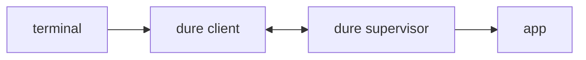

# dure design

`dure` keeps an interactive Windows console process running after the terminal
that started it goes away, and reattaches a later terminal to that same session.
It is a per-app supervisor, not a multiplexed server.

Closing a terminal window, dropping an SSH connection, and killing the
foreground process are one event to `dure`: the client is gone and the app keeps
running. SSH is the mainstream case, not a privileged one.

## Roles

* **App** — the command given to `dure run`.
* **Supervisor** — a hidden `dure` process that owns the app and its console and
  outlives the terminal. The user never launches this role directly.
* **Client** — the foreground `dure` in the terminal (`run` or `resume`) that
  relays the user's console to the supervisor.
* **Session** — one app under one supervisor, named by a session id, together
  with whatever client is attached to it at the moment.

`dure run -- copilot.exe` starts a supervisor, starts the app under it, and
attaches this client. When the terminal goes away the client dies with it; the
supervisor and app do not.

## Tenets

* **Survive losing the terminal, not logoff.** A closed window, a dropped SSH
  connection, or a killed client does not stop the app. A Windows logoff or
  reboot does.
* **One supervisor per app.** There is no shared daemon. Sessions belong to one
  user on one machine and are never reachable from another.
* **Transparent once attached.** After attach, keyboard and console I/O are a
  direct funnel, and so are the terminal attributes around them: window size and
  control sequences pass through in both directions rather than being
  interpreted. No prefix key, no in-band detach, no `dure` UI inside the app.
* **Detach is losing the client.** Anything that kills the foreground `dure`
  process leaves the supervisor and app running.
* **Resume is not a replay.** Attach does not reconstruct prior screen contents.
  The new client sees an empty screen, then live bytes. The exception is the
  app's opening output, which is held for the first client.
* **Latest client wins.** A new completed attach becomes the sole live console
  and disconnects any older client. That is how a wedged client is displaced.
  There is no separate `--force` flag.

## Commands

`dure run [--] <command> [args...]` starts a new session in the current
directory and attaches immediately, even if another live session already exists
for that directory. Reconnect is `dure resume`, never an implicit side effect of
`run`. A leading `--` is optional and only needed to keep an argument that
starts with a hyphen away from `dure`'s own options.

The command is executed directly, not through a shell, so no quoting, globbing,
or operator is interpreted. The child's working directory and environment are
those of the `dure run` process at start time and do not update on a later
resume.

The command must name an executable image, because the supervisor owns and waits
on the app as a process. A path that contains a separator is resolved against
the launch directory, including the Windows drive-relative form `C:dir\app.exe`.
A bare name is looked up on the executable search path and completed with `.exe`
if it has no extension of its own; the launch directory is deliberately not part
of that lookup, so an executable that happens to sit in the current directory
cannot answer for a command the user meant to take from the search path. A
script wrapper is launched through its interpreter, as in
`dure run -- cmd /c tool.cmd`.

A session must be able to outlive the process that launched it. Some launchers
confine their children to a Windows job object that forbids breakaway and kills
everything in it when the launcher exits; `cargo run` is one. Started from such
a launcher, `dure run` fails outright, naming that cause, rather than starting a
session that would die with the launcher. Ordinary shells, including the one an
SSH session provides, permit breakaway.

Once the session is running, the supervisor inspects the job it landed in and
reports one of three things, which `dure run` passes on:

* a **confirmed tie**: a job that ends the session when the launcher's job
  closes. `dure run` warns, names that cause, and starts the session anyway.
* an **unknown** result: the job could not be inspected. `dure run` says so,
  without claiming a cause it did not establish.
* **no tie detected**: no job in the supervisor's immediate reach would end it.
  Windows exposes only that immediate job, so an outer one is never ruled out
  and no positive durability guarantee is offered.

An app that exits before `dure run` has finished attaching still reports its
output and exit status. Only if the `dure run` process itself goes away first is
such a session discarded unreported.

`run` distinguishes creating a session from attaching to it. A startup failure
leaves no live session behind. Once the supervisor and client confirm startup,
`run` reports the session id before it takes the terminal over, so an attach
failure from that point on still leaves the id needed for `list`, `resume`, and
`kill`.

`dure resume` attaches using auto-detect. `dure resume <id>` attaches to that
live session and skips auto-detect.

`dure list` prints live sessions: id, whether a client is currently attached,
supervisor pid, how long the session has been running, launch directory, and
command. A record is discarded only when the same supervisor process is gone;
reuse of its numeric process id by another process does not keep the record live.
Attached means the supervisor still has a client connection; a hung client may
still appear attached. Resume steals anyway.

`dure kill <id>` abruptly terminates the supervisor process for that session.
The app and its ordinary descendants die with it. An id is required; kill does
not auto-detect. Kill reaches the session even when its connection is wedged. An
attached client, if any, sees the relay end. Killing a missing or already-dead
id is a failure after stale-record cleanup.

## Auto-detect

Each session records the canonical absolute path of the directory from which
`dure run` was invoked (the launch directory). The app later changing its own
working directory does not change that record.

`dure resume` with no id:

* If there is no live session, it fails.
* If exactly one live session has a launch directory equal to the current
  directory, it attaches to that session.
* Otherwise it prints the live session list and reads a session id from the
  terminal. Unreadable stdin, empty input, or a non-terminal stdin is a failure;
  the caller passes the session id as an argument instead.

If several live sessions share the current directory, that is not a unique
match; the command lists and asks. It does not pick arbitrarily.

The chosen session is looked up again before the attach, because an id may have
been reused while the prompt was open.

Path comparison uses a canonicalized absolute path. Case folding follows the
actual filesystem for that path rather than an operating-system-wide assumption.

## Session identity

A session has a small positive integer id, unique among live sessions for this
user on this machine, stable until that session ends. New sessions take the
smallest unused positive integer, so ids stay short in `list` output. An id may
be reused after the session that had it has ended.

Sessions do not have names. The launch directory is the grouping key for
auto-detect.

## Attach, detach, steal

The supervisor always accepts a new client, independently of whether a client is
currently attached and independently of whether that client's connection still
looks healthy. A connection that does not go on to attach is dropped rather than
held.

When a new client completes attach, the previous client is disconnected and the
new client becomes the sole relay. Input already in flight from the displaced
client does not reach the app. The supervisor then applies the new client's
window size to the app console. Many TUIs redraw on resize. It does not restore
scrollback, and an app that does not redraw will show an empty or stale screen
until it paints on its own.

Concurrent attaches are ordered against each other, so the client that attaches
last is the one left holding the session.

A session is live while the same supervisor process is still running, whatever
that supervisor happens to be doing. A record is dropped only when that process
is gone. If the supervisor is running but does not accept a connection within a
bounded wait, resume fails and the session stays listed; `dure kill <id>` still
reaches it.

While detached, the app's console stays open. Input is not closed (end of stdin
would terminate many apps). Output is drained and discarded so the app cannot
block on a full pipe.

The supervisor holds a finite backlog of undelivered output per client. A client
that falls further behind than that backlog is disconnected, whether it stopped
reading or simply cannot keep up with a burst. Since `dure` keeps no screen
contents, nothing recoverable is lost; a fresh `dure resume` takes the session
back.

Closing the terminal window detaches. It does not stop the app. Ctrl+C while
attached is delivered to the app, not to the client.

An attached client learns why the relay ended: the app exited, with its status,
or another client took the session. A connection that simply closes means the
supervisor is gone — killed, crashed, or lost — and the client reports that as a
failure rather than as the app having finished.

## Console I/O

The app is attached to a Windows console owned by the supervisor, not to
stdin/stdout redirected onto anonymous pipes.

A console is a terminal device: it has a width and height, it can deliver
keystrokes such as Ctrl+C as input, and it accepts the control sequences a text
user interface (TUI) uses to move the cursor, set colors, and repaint the
screen. Anonymous pipes are only byte streams. Programs detect the difference
and, on pipes, disable the TUI, skip color, or refuse to run. Interactive tools
such as Copilot CLI need the console case.

From the app's side this is a console. From the supervisor's side it is bytes
plus window size, which the attached client relays to the user's terminal.
The app's stdout and stderr are one console stream.

The terminal the user sits at already presents the app with a console: Windows
Terminal through the console host, an SSH session through a pseudoconsole.
`dure` adds one more around the app. For a virtual-terminal (VT) TUI such as
Copilot CLI, that extra layer is not expected to remove features the same app
already has in that terminal without `dure`. What the terminal itself cannot
provide (a real console window, graphics protocols, console font and selection
chrome) stays unavailable.

`dure` writes diagnostics to stderr only while it is not attached. Before
attach, `run` and `resume` print the session id so the user can `kill` or
`resume <id>` later. After attach, the funnel is exclusive. A displaced client
writes one diagnostic once its relay has ended and exits with a failure status.
When the app exits, an attached client receives the app's remaining output
before the exit status, then exits with that status.

Attaching (`run`, `resume`) requires a console on both the input and the output
side, since the relay drives both. `list` and `kill` require neither. The resume
id prompt additionally requires a terminal stdin; without one, `resume` without
an id fails.

A console is the Windows console-host API: handles, modes, and window size. A
terminal is the visible emulator (Windows Terminal, an SSH client) that renders
VT. `dure` attaches to a console and relays bytes to whatever terminal the user
is already sitting at.

Attaching takes the console over as one operation and hands it back as one: the
modes, the encoding, and the suppression of local Ctrl+C handling all belong to
that takeover, and ending it restores exactly what was replaced and nothing
else. A shell that shares the console before or after a session is unaffected. A
console that cannot be handed back is reported: the app's exit status is still
forwarded, with a diagnostic beside it, and a command with no such status to
report fails.

Text keeps its meaning across the relay in both directions. Non-ASCII output —
the box-drawing characters a TUI frames itself with, accented letters, symbols —
reaches the terminal as the app wrote it, and non-ASCII input reaches the app as
the user typed it.

## Terminal pass-through

An app under `dure` behaves as though it were talking to the user's terminal
directly. The relay is transparent rather than interpretive: it carries the
terminal's state and the user's intent through to the app's console instead of
deciding what either of them means.

**Window size.** The app always sees the size of the terminal it is currently
being viewed through. The attaching client's size is applied to the app's
console before the relay starts, and a resize while attached converges to the
new size within a short interval, so an app that redraws on resize reflows
promptly. A resize is therefore not a detach-and-resume affair; it works in the
middle of a live session. While no client is attached the console keeps the size
the last client gave it, and the next attach replaces it. This is what makes a
session portable between terminals: resuming from a differently sized window is
a resize, not a broken layout.

**Keyboard.** Keys arrive at the app the way the terminal sent them, including
the ones that are sequences rather than characters — arrows, function keys, Home
and End, and modifier chords. Ctrl+C is delivered to the app rather than acted on
by the client.

**Control sequences.** The app's output is relayed byte for byte, so cursor
movement, colors and styling, the alternate screen buffer, scroll regions, and
window-title sequences all reach the terminal unchanged. `dure` does not parse,
rewrite, or filter this stream.

Mouse and focus reports are carried when the app enables their terminal
protocols and the local terminal stack provides them as VT input. The
byte-transparent relay handles those bytes without per-protocol support. Console
events with no byte representation, such as menu activity, are not carried;
window size is handled separately as described above.

Everything in this section follows from the relay being byte-transparent and
size-aware; none of it is per-application support, so an app that works in the
user's terminal is expected to work under `dure` without knowing `dure` exists.
The limits are the ones already stated under [Console I/O](#console-io): what
the terminal itself cannot provide stays unavailable, and screen contents from
before an attach are not replayed.

## Listing sessions

`list` prints a table: a heading row and one row per live session, columns
separated by a fixed gap and each column as wide as its widest cell, so a
heading sits above the values it names. Column order is the order given under
[Commands](#commands). Cells are never truncated; a long command widens its
column rather than losing text.

Column width is counted in characters rather than in terminal cells, which do
not always agree: a wide CJK character occupies two cells and a combining accent
none. Alignment is therefore exact for the paths and command lines people
actually have, and best effort beyond them.

Directories print in the form a user could type. Windows extended-length paths
carry a `\\?\` prefix that the shell does not use and that a user cannot paste
back; `list` and `--verbose` show the plain path instead. What is shown is the
stored canonical path made readable, not the spelling the user reached it
through: canonicalization has already resolved links and relative forms, and a
directory reached through a junction prints as its target. Matching uses the
canonical path, so the rendering never changes which session `resume` finds.

Commands print as the argv they were launched with, quoted by the same rule
Windows uses to split a command line, so an argument holding spaces stays one
argument on screen and two different launches never look alike.

Age is how long the session has been running, measured from when its supervisor
published the session and rendered to the two coarsest units that apply, so a
session started moments ago and one started days ago are told apart at a glance
without the column growing wide enough to push the directory around. It is a
display value: nothing selects, orders, or reaps a session by it, and a machine
whose clock has moved shows a misleading age rather than behaving differently.

The same table is printed when `resume` cannot auto-detect and has to ask which
session to take, so the id being typed is chosen from the same information
`list` gives. That table and its prompt go to stderr, because they are the
command asking a question rather than the command's result.

A session is described, never obeyed. A command may have been launched with
arguments carrying control characters, and a terminal would act on them, so they
print in escaped form: a session occupies one row whatever it was launched with,
and listing sessions cannot move the cursor or repaint the screen.

## Lifetime

| Event | App | Supervisor | Client |
| --- | --- | --- | --- |
| Terminal closed, SSH dropped, or client killed | running | running | dead |
| App exits | dead | exits after cleanup | app status if attached |
| Logoff or reboot | dead | dead | dead |
| New attach | running | running | previous client disconnected |
| `dure kill` | dies with supervisor | abruptly terminated | relay ends if attached |
| Supervisor dies | dead | dead | relay ends / resume fails |

The supervisor owns the app and its ordinary descendants. If the supervisor
dies, they die with it. Supervisors do not orphan apps.

Sessions are a flat list. A `dure run` issued from inside an attached session
(for example the app is a shell) starts another ordinary session. Killing or
detaching one does not cascade to the other: the inner supervisor has already
broken away, which is the same rule as losing a terminal, applied twice.

A machine configured to log the user off when their interactive session ends
makes the product impossible; `dure` cannot outlive a logoff.

A session belongs to the `dure` build that started it. Replacing `dure` while a
session is running leaves that session held by the supervisor already in
memory; the new build reports the session as one it cannot resume rather than
attaching to it. Detaching before upgrading and killing what is left afterwards
is the way through.

## Isolation

Sessions are per Windows user. The session store and the client-supervisor
connection are usable only by the creating user. Another user cannot list or
attach.

That isolation is a property of the per-user store the released tool always
uses; it has no way to be pointed at another one. Session records are trusted by
`list`, `resume`, and `kill`, so a store anyone else could write would be a
store anyone else could redirect an attach through.

Command lines appear in `list` output. Secrets do not belong on the app argv.

## Screen contents

Attach does not replay prior output. The new client sees an empty screen, then
live bytes. The window size is the attaching client's, so an app that redraws
on resize repaints itself at the right geometry without any replay.

The one exception is the app's opening output. `dure run` starts the app and
only then attaches, so an app that prints immediately would otherwise speak
before it has an audience. That opening output is held for the first client and
delivered to it. Later attaches begin on an empty screen.

The hold is bounded by the same measure as a live client's backlog, and it keeps
the earliest output: an app that writes more than that before the first client
arrives has the remainder dropped, because a first screen is worth more to an
arriving client than the tail of a burst it has no context for.

## Diagnostics

`--verbose` explains what the command is doing well enough that its decisions
can be reconstructed from the output: where the session store is, which session
records were read, why each was judged live or dead, and what each command then
did with them. For `resume` that includes auto-detect — which launch directories
were compared against the current one, and why a session was chosen or why the
command fell through to the list. For `run` it includes the launch directory,
which executable the command resolved to and by which rule, the connection the
supervisor was given, the command line it was spawned with, and what was
established about the session outliving its launcher.

Verbose output is explanatory, never a substitute for the command's own result,
and goes to stderr so it does not contaminate `list` output being read by
something else. It stops at attach: once the funnel is exclusive, the app owns
the screen. Failures before attach go to stderr with a non-zero status.

## Distribution

Crate and binary name: `dure`, published to crates.io and installed with
`cargo binstall dure`. Prebuilt archives exist for `x86_64-pc-windows-msvc` and
`aarch64-pc-windows-msvc`; every other target, Windows or not, falls back to
building from source.

`dure` is a Windows tool. On other targets the binary reports that it is
unsupported and exits with a failure status.

Internal architecture is documented in the
[implementation guide](implementation.md).
