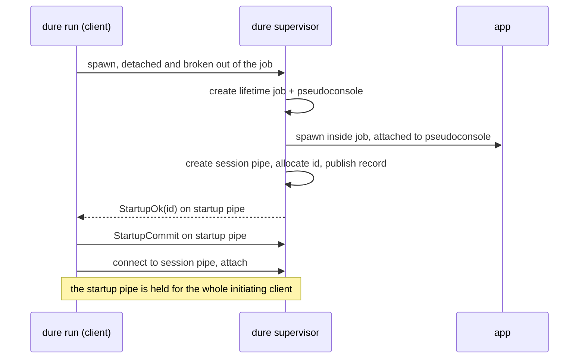
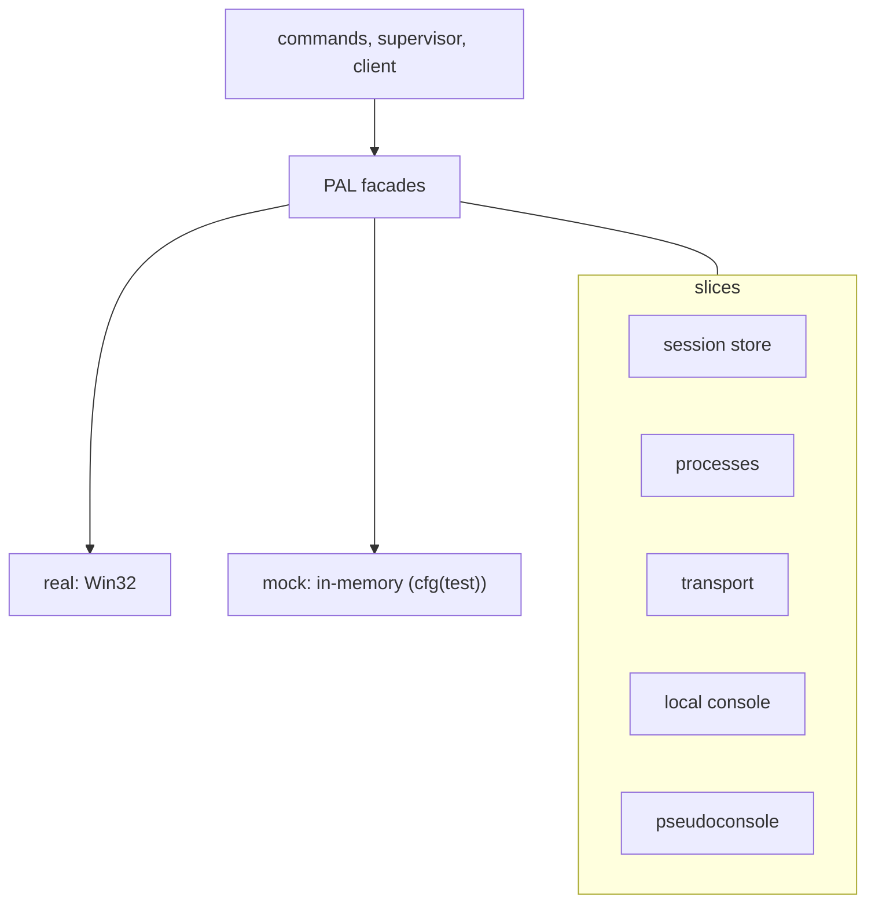

# dure implementation

The user-visible contract belongs in the package [design](design.md). This guide
is the package-level map: which parts exist, what each owns, and where the
boundaries between them run. Areas that need durable explanation of their own
have component guides, linked from the sections below.

This guide follows the workspace rules for
[implementation documentation](../../../docs/implementation.md).

## Terminology

* **PAL** — platform abstraction layer, the boundary all operating-system calls
  go through.
* **PTY** — the pseudoconsole a supervisor gives its app. Spelled `pty` in code
  and `pseudoconsole` in prose; `ConPTY` names the Windows facility itself.
* **TUI** — text user interface, an application that paints a screen rather
  than printing lines.
* **VT** — virtual terminal, the escape-sequence language a TUI paints with.

## Process split

The same binary implements both roles. `dure run` spawns the hidden
`dure supervisor` subcommand, then the original process stays the client and
attaches. Windows has no `exec`. The subcommand is hidden from help rather than
private: it is a real command path, and `dure run` composes the argv for it.

`run` gives the supervisor a private one-shot startup channel. The supervisor
creates the lifetime job and pseudoconsole, starts the app, creates the session
pipe, then allocates the session id and atomically publishes the session record.
It reports the id only after the pipe is accepting connections. An initialization
failure closes the lifetime job, removes any provisional state, reports a
startup error on that channel, and exits. The initiating client treats every
non-success response as a failed start, and losing either side of the exchange
rolls initialization back, so a client never reports a startup failure while
leaving a live session behind.

The startup channel stays open past that acknowledgement. The supervisor reads
its closure as the initiating client no longer intending to attach, which is one
of the two things that release the **first-attach lifetime gate**: an app that
exits immediately would otherwise be torn down before the client finishes
attaching, losing its output and its exit status.

The client holds that channel for its whole life rather than closing it when the
attach completes. The gate is one-shot, so the channel contributes nothing after
the first attach; keeping it costs one connection and removes the need for a
separate handshake-complete signal. It is owned by a guard, so an unwind closes
it too — a leaked channel would leave a session waiting for a client that has
already gone.

## Platform gate

`dure` builds only for Windows. `lib.rs` carries a crate-level `#![cfg(windows)]`
and `main.rs` compiles elsewhere to a `main` that reports the unsupported
platform and exits with a failure status, so a non-Windows build produces a
binary that refuses to run rather than a crate full of per-item platform
attributes. Nothing under the PAL needs a non-Windows implementation, and no
module needs to reason about a platform it never runs on. The integration test
helper follows the same rule for the same reason.

Workspace-wide commands therefore still build and lint the workspace on any
platform without `dure` contributing dead abstractions to satisfy them. The
consequence is that `dure` has no behavior to exercise off Windows, where a test
run narrowed to this package alone would otherwise find no tests and report that
as a failure. A single placeholder test compiled only off Windows keeps that
admission inside the package it concerns.

## PAL slicing

Windows APIs sit behind a PAL so logic does not depend on a real console host,
named pipe, or job object. The PAL is the only place that talks to the operating
system. Logic consumes it through facades that select the real implementation, or
a mock implementation in test builds, matching the workspace
[PAL](../../../docs/pal.md) pattern.

The PAL is sliced by responsibility, at a grain that tests can drive, not as a
1:1 wrap of each Win32 call:

* **Session store** — the lifecycle of session state: claim an id, publish a
  session, read one, list them, and remove one that still belongs to a named
  owner. See [session store](session-store.md).
* **Processes** — spawn a console-detached supervisor with job breakaway;
  identify it; report what the job it landed in says about its lifetime; own the
  app-lifetime job; resolve a command to an executable image; spawn the app; wait
  for it. See [job breakaway](job-breakaway.md).
* **Transport** — listen, accept, connect, exchange framed messages, disconnect.
  See [transport](transport.md).
* **Local console** — detect whether the client has a console, take it over for
  a relay, read input, write output, read window size. See [console](console.md).
* **Pseudoconsole** — create, resize, end, and close the console the app runs on,
  and the byte channels the supervisor relays. See [console](console.md).

Every slice keeps its concrete implementations inside itself: the Windows types
and the in-memory doubles are reachable through the slice's facade and trait,
not from the slice root, so nothing above the PAL can bind to one of them.

Handles issued by the PAL — listeners, connections, jobs, pseudoconsoles, apps,
console leases — are opaque outside it. The integer inside is the issuing
implementation's bookkeeping, so logic can hold a handle but cannot invent one.

`CONNECT_TIMEOUT` bounds local IPC connection attempts, the startup commit
acknowledgement, and how long a connected client may take to attach.
`STARTUP_TIMEOUT` separately bounds supervisor initialization after the startup
connection is established, so process launch receives its full budget instead of
sharing the shorter IPC deadline.

A PAL failure carries a kind that logic distinguishes plus, where the platform
gave one, the underlying error as its source. The semantic error the command
layer reports keeps that as its cause, so a store permission problem, a
console-mode failure, and a pipe problem do not read alike at the user boundary.

## Command layer

Above the PAL, one module per subcommand under `commands/`, a `dispatch` module
that routes an `Invocation` to one of them, and the client `attach` path they
share. The long-lived supervisor role is `supervisor`; `commands::supervise` is
only the thin subcommand that enters it.

The invocation boundary is where argv shape becomes the values the rest of the
crate relies on. A session always runs something, so the command is an
executable plus arguments (`AppCommand`) established there, not an argv every
later layer re-checks.

## Paths

A Windows path is a sequence of UTF-16 code units that need not be valid
Unicode, so narrowing one to Rust text can name a different file rather than
the same one spelled differently. Paths that only have to reach Win32 — the
executable to start, the directory to start it in — are encoded to UTF-16
straight from their `OsStr`, including the command line built for
`CreateProcessW`.

Two paths do have to travel as text: the launch directory, because the
supervisor is told it through argv and it is published in a JSON record that
`list` renders, and a `--store-root` override, because it likewise travels as
argv. Those are converted with a check, and a path that fails it stops the
command with an error naming it. Nothing is ever substituted.

## Output rendering

Everything the user reads before attach is assembled by pure functions that take
data and return text, so the wording and shape of the output are unit-testable
without a console:

* `list_fmt` builds the session table. It measures every cell, including the
  headings, and pads each column to the widest of them. The current time arrives
  as an argument rather than being read here, which keeps the whole table a pure
  function of its inputs.
* `AppCommand` renders itself for display: each token quoted by the Windows argv
  rule so boundaries survive, and control characters escaped so a command a user
  chose cannot drive the terminal it is listed on.
* `path_display` renders a stored canonical path for a human, dropping the
  Windows extended-length prefix. Only display goes through this; comparison
  always uses the canonical form.
* `trace` is the `--verbose` channel. `Trace` is a `Copy` value threaded into
  every command rather than a global, so a test can construct a quiet one by
  `Default` and the compiler enforces that new code paths decide what they
  explain. The `trace!` macro evaluates nothing when tracing is off, which
  matters because several call sites render paths and command lines.

Two policies govern writing to the user's streams, because the two kinds of
output want different answers to a stream that fails. Result output — the
session table, the resume prompt — is what the command was asked for, so a
stream that cannot take it fails the command. Diagnostics — verbose notes,
warnings, the session banner, the final error message — are best effort. Nothing
panics on a closed pipe, which matters most after a session has been committed.

### Session age

The wall clock is read in exactly two places, both for the age column: once by
the supervisor to stamp the record it publishes, and once per `list` or resume
prompt to age that stamp. Nothing else consults it. Session identity and
liveness deliberately do not: a process is alive or not regardless of what the
clock says, and a clock that jumps must not be able to resurrect or bury a
session.

An unreadable or pre-epoch clock reads as the epoch and an unrepresentable
elapsed time saturates, rather than either being an error. A user whose clock has
moved sees a wrong age; nothing else misbehaves, and no command fails over a
display value.

## Detached supervisor

A terminal typically confines what it launches. Windows OpenSSH places the remote
shell in a job object that is killed on disconnect, and a console process dies
with the console it is attached to. The supervisor is created with job breakaway
and as a detached console process, so it is in neither boundary. It does not
inherit handles; it reconnects to the startup named pipe by name. Breakaway does
not create a new Windows logon session and does not survive logoff.

How breakaway is requested, what it can and cannot establish, and how the result
reaches the user is covered in [job breakaway](job-breakaway.md).

## Session serving

Once initialized, a supervisor runs four things at once: an accept loop, a relay
for whichever client owns the console, a pump reading the app's output, and a
wait on the app. They meet in one shared value, and the ordering rules that make
attach, steal, and teardown safe against each other are the substance of
[supervising a session](supervisor.md).

The supervisor holds a listener, a job, a pseudoconsole and a published record,
all of which outlive it if not released, so teardown is owed rather than
conditional.

## Crates and concurrency

CLI and errors follow the other binaries: `clap`, `ohno` with `app-err`,
`mimalloc`. Windows APIs come from the workspace `windows` crate. There is no
Tokio and no PTY wrapper crate. The process is synchronous: dedicated blocking
threads service the pseudoconsole channels, while other threads accept and relay
client connections and wait for process exit. Session records on disk use a
serde format already in the workspace.

## Testing

Workspace testing rules in [docs/testing.md](../../../docs/testing.md) apply:
no real-time delays in unit tests, no hung tests, watchdogs on waits, and
production behavior that does not change under `cfg(test)` except by swapping
PAL implementations.

Logic above the PAL is unit-tested against mocks so it stays Miri-compatible.
Those tests cover command parsing, session discovery and garbage collection,
the supervisor steal loop, and the client attach handshake, including failure
paths that must not delete a live supervisor record.

The in-memory PAL doubles are held to the same rule as the code they stand in
for. The transport reads no clock: a test that wants a bounded wait to expire
arms that expiry on the pipe it means, so a regression fails its assertion at
once rather than spending a production timeout first, and an unrelated operation
cannot consume the injected failure.

### Integration tests

The real PAL is exercised on Windows by running `dure` as a child of a
test-owned pseudoconsole. A test runner has no interactive console of its own, so
the harness builds the console the client requires rather than assuming one.
The app under supervision is `dure-test-helper`, a separate unpublished package
so that a helper binary never ships inside the product crate; it reports whether
it has a console and can be told to print, wait, or exit with a chosen status.

That suite proves the app sees a console, `run` forwards exit status, the app is
given the attaching terminal's size and told when it changes, non-ASCII text
survives the relay in both directions, a session whose client dies outright is
still resumable and still interactive afterwards, a second client takes the
session from one that is still attached, a session pipe admits nobody but the
user who made it, `run` refuses a launcher whose job forbids breakaway, and
`run` warns when an ancestor job it cannot leave would end the session. Tests
wait on process and pipe events inside the workspace watchdog.

Where a scenario needs the session to be up, it waits for the app's own greeting
rather than for anything `dure` prints, and it releases an app parked on input
before examining the terminal. A regression in `dure`'s output then fails an
assertion that names it, instead of leaving the app waiting for input the test
never sent.

Ordinary session-record cleanup is not asserted there. The client exits when it
is handed the app's exit status, and the supervisor deletes the record after
sending it, so a store the client has outlived says nothing about whether
cleanup happened. Cleanup is covered where it is observable: the supervisor's
own tests for the normal path, and the breakaway-refusal test for rollback.

The helper's accepted modes and the bytes that release a waiting one live in one
fixture rather than being spelled out per test, so a change to the helper's
command line is a change in one place.

Assertions about console output ignore whitespace. A pseudoconsole wraps at the
window width and may break a line mid-word, so the exact spacing of relayed
output is a property of the console host rather than of `dure`.

Per-user isolation is checked by reading back what a live session pipe actually
permits, rather than by logging in as a second user. A second account in the
test environment would be a standing cost for a property the access control
list states outright.

Integration tests do not try to prove console-host cosmetics, nested
pseudoconsole rendering, or behavior when Windows logs the user off.

Non-Windows builds produce an empty binary, so there is nothing there to test.
