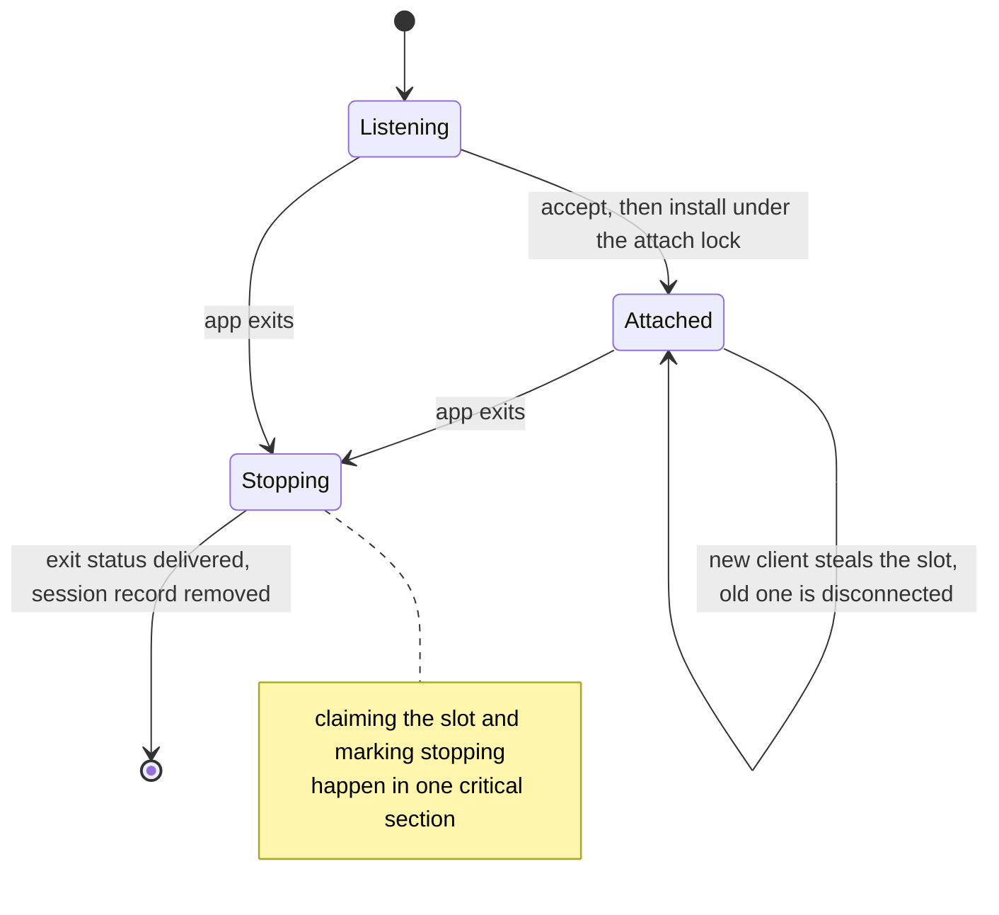

# Supervising a session

What a supervisor does: bring a session into existence, accept clients, hand the
console between them, and tear the session down in an order that loses nothing.
Part of the `dure` [implementation guide](implementation.md).

## Startup

Startup builds the session in an order that lets each step be undone: the
lifetime job, the pseudoconsole, the app, the pipe clients attach on, the
supervisor's own identity, a reserved session id, and finally the published
record. Anything created before a failure is released on the way out, and
teardown ends the job before it closes the pseudoconsole because descendants
stay attached to the console until the job that owns them is gone.

The supervisor has no console, so a failure reaches the user only through the
startup channel. What it reports there is which of those steps it stopped at:
the failing subsystem is the part the user can act on, and the message the
initiating `dure run` prints names it. The condition the supervisor's own exit
carries is separate and stays as detailed as the platform made it.

On success the supervisor reports the session id, whether it is tied to its
launcher, and the pipe to attach on. Naming the pipe there is what keeps first
attach from reading back the record just written: a store failure at that point
would come after the session already exists, so the run would be reporting a
lookup problem for a session that is up and running.

## What is shared

A live session runs four things at once — an accept loop, a relay reading
whichever client owns the console, a pump reading the app's output, and a wait
on the app — and they meet in one shared value. Three questions are decided
there, each with its own lock, because they are answered at different moments:

* **Who owns the console.** The client slot, serialized by the attach lock.
* **Whether anyone has come for the session yet.** The first-attach gate.
* **What the app has written.** The opening-output hold, and the flag that says
  nothing more will be relayed.

## Accept and steal

The supervisor listens for a new client even while it is busy reading and
writing the current one. Steal does not depend on the old connection still being
healthy. Connect attempts time out, and a connection that does not go on to
attach within the connect budget is dropped rather than left holding a relay
thread. A supervisor whose recorded process identity is still alive but never
accepts stays listed; resume fails and `kill <id>` still targets it.

An attach is one serialized transaction: acknowledgement, ownership transfer,
and displacement of the previous client happen under a single lock, so
concurrent attaches cannot acknowledge in one order and install in another. The
acknowledgement is queued on the new connection's outbox rather than written
inside that transaction: FIFO delivery is what still places it ahead of any
output or exit status, while a client that has stopped reading holds up only its
own delivery instead of the session's output, its steals, and its shutdown.

The size the attaching client asks for is applied to the pseudoconsole only once
that client owns the slot, because the app answers a size change with a redraw
and that redraw belongs to the client that asked. The relay checks ownership and
applies each message under the client-slot lock, so a client displaced while its
receive was in flight cannot reach the pseudoconsole afterwards. Pseudoconsole
input lands in the console host's buffer, which the host drains independently of
the app, so that hold is bounded.

`dure kill <id>` opens the recorded pid, verifies the process creation time and
running state, and terminates that process handle, then waits for the process to
signal before reporting success. It never needs the session connection. A
supervisor that exits between the liveness probe and the terminate leaves a
record this command reaps before reporting that the session is not live.

## The advisory attached flag

Installing the client slot and signaling the first-attach gate let the
supervisor finish delivering an already-exited app's output and status before
the advisory attached flag is written to the session store. The store update
happens after both ownership locks are released, so durable filesystem I/O
cannot block that supervisor progress or another attach.

Each client-slot change assigns a generation to its advisory update. Store
writes are serialized and skip updates that are already stale when they reach
that serialization boundary. If a write becomes stale inside filesystem I/O, the
newer update follows it through the same boundary and establishes the final
attached state.

## Teardown

Session teardown closes the pseudoconsole and joins the output pump before
queueing the app's exit status, which is what orders the app's final output
ahead of it. Nothing is torn down until the initiator has attached or given up,
so a session whose app exits immediately still reports.

Teardown then claims the client slot under the attach lock, marking the session
as stopping in the same critical section. An attach is therefore either complete
before the claim, in which case it owns the slot and is handed the exit status,
or it observes the stop and is refused before it acknowledges. Without that
ordering a client could install itself between the stop and the claim, and would
lose the supervisor without ever being told the app exited.

The supervisor holds a listener, a job, a pseudoconsole and a published record,
all of which outlive it if not released. Serving therefore treats teardown as
owed rather than conditional: the wait on the app is run for its result, the
result is set aside, and the listener, job, pseudoconsole and record are released
whatever it says. Only then is a failed wait reported, ahead of a failed delete,
because the wait is the cause and a record that outlives its session is only the
consequence. A wait that failed yields no exit status, so nothing is sent to the
attached client and the session does not linger waiting for one to arrive.

## Opening output

The app starts before its first client attaches, so the output pump has to hold
what it produces in that window rather than discard it (design.md, "Screen
contents"). The pump decides under the client-slot lock: with a client it hands
the bytes over, without one it appends them to the held buffer. Taking that
decision under the slot lock is what stops an attach from slipping between
"nobody is attached" and the append, which would strand the bytes behind a
buffer nobody will read again. Attach takes the buffer, permanently — a second
attach finds nothing, which is what makes later attaches start on an empty
screen.

What is held is bounded by the same measure as a live client's backlog, keeping
the earliest bytes, because an arriving client is served better by the app's
first screen than by the tail of a burst it has no context for.

That bound is several frames' worth, so the hold is relayed as a run of output
messages rather than one. A receiver rejects an oversized frame instead of
reassembling it, so a single message would fail the very attach it exists to
open, and it would fail precisely when the app had written the most. Chunk size
is one byte below the frame cap, because a frame's length prefix counts the
message kind byte as well as the data.

## Displacement

A displaced client is told why its screen went quiet before its connection is
dropped, so the notice is queued rather than written on the accept path. A
displaced client that is alive but has stopped draining leaves both its writer
blocked on that notice and its relay thread blocked reading, until its own
process exits and closes the pipe. Those two threads are accepted: finishing an
outbox deliberately does not disconnect, because disconnecting would be the very
thing that discards the notice, and a user who does not know their session was
taken has a worse problem than a supervisor holding two idle threads for a
terminal that is already gone.

The relay applies an input or resize message under the same lock that confirms
the sender still owns the session, so a message that was in flight when the
session was stolen cannot reach the app afterwards. That hold does not depend
on the app: the console host accepts input into its own queue whether or not
the app reads standard input, so an app that ignores input neither stalls the
relay nor delays a steal.
